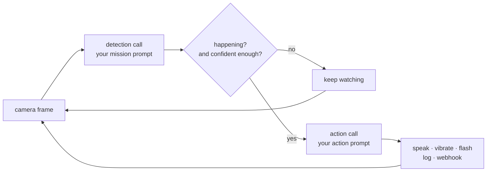

# Aura

**A visual monitor you write in English.**
Point a camera at something, say what to watch for, say what should happen when it
happens. Aura does the rest, in a browser tab, with whatever AI you want behind it.

**[Try it →](https://barakplasma.github.io/Aura/)** · no install, no account, no backend.

## What it is

Aura is a webcam monitor whose rules are prompts instead of code. You give it two
sentences:

- a **mission** — what it should be looking for ("a person at the front door",
  "the dog on the sofa", "the 3D print has come loose from the bed");
- an **action** — what it should say or send when that happens ("announce that
  someone is at the door", "roast whoever just walked past, briefly").

Then it watches. Every scan cycle it sends one camera frame to a vision model with
the mission prompt. If the model says the thing is happening — and is confident
enough — Aura runs the action prompt and delivers the result: spoken aloud, a
buzz, a screen flash, a line in the log, an HTTP call to anything you like.

That's the whole idea. Everything else is a knob on top of it.

Most cycles stop at "keep watching" — the second call only happens on a real alert.

## What people point it at

The same loop, different sentences. A few that work today:

| You want                               | Mission prompt                                                              | Action prompt                                                 |
|----------------------------------------|-----------------------------------------------------------------------------|---------------------------------------------------------------|
| **A security camera that understands** | "a person approaching the front door who is not carrying a delivery parcel" | "say who is at the door and what they appear to be doing"     |
| **Off-grid intrusion detection**       | "any person or vehicle in this field"                                       | "state what entered the frame and from which direction"       |
| **A delivery watcher**                 | "a parcel left on the doorstep"                                             | "announce that a package arrived"                             |
| **A process monitor**                  | "the pot is boiling over / the print has detached / the plant is wilting"   | "warn me about what went wrong"                               |
| **A pet or baby monitor**              | "the cat is on the kitchen counter"                                         | "tell the cat off, by name"                                   |
| **A toy that heckles**                 | "a person is standing in front of the camera"                               | "make one short affectionate joke about what they're wearing" |
| **An attendance chime**                | "someone new has entered the room"                                          | "greet them in a different way each time"                     |

Nothing in the app is specialised for any of these. A "security system" and a
robot that insults your hoodie are the *same program* with different prompts —
which is the point, and the reason the mission box is a free-text field and not a
dropdown of object classes.

The webhook is where it stops being a toy: any alert can `POST` a JSON body you
define to any URL, so Aura becomes a sensor for whatever you already run —
Home Assistant, n8n, ntfy, a Kubernetes job, your own API.

## Bring your own intelligence

Aura has no model of its own and no opinion about whose you use. Three sources,
switchable in Settings, all feeding the exact same loop:

| Source                             | What it is                                                                                                                               | Good for                                                                 |
|------------------------------------|------------------------------------------------------------------------------------------------------------------------------------------|--------------------------------------------------------------------------|
| **Any OpenAI-compatible provider** | Cerebras, OpenAI, Groq, Together, Fireworks, OpenRouter, your own gateway — anything that speaks `POST /v1/chat/completions` with vision | the strongest models, at a per-scan cost you can cap                     |
| **A local server**                 | Ollama, llama.cpp, LM Studio, vLLM on your own machine or homelab — same API, no key needed                                              | free, private, works on your LAN                                         |
| **In-browser**                     | a small vision-language model running inside the page itself on WebGPU (Transformers.js) — or, where the browser offers it, Chrome's built-in Gemini Nano | no key, no server, no network at all — the frame never leaves the device |

The provider is three fields: base URL, model, and an API key that is allowed to be
blank. Your key lives in your browser's `localStorage` and goes straight to the
provider you named; there is no Aura server in the middle, because there is no Aura
server at all. It's a static page.

Because all three sources return the same shape, you can compare them: the
**Evaluate** screen runs your own labelled frames through several models and prompts
and scores them, so "is the tiny local model good enough for this camera?" is a
measurement rather than a guess. The **Optimize** screen goes further and rewrites
your prompt against your own examples.

## Being honest about it

- It's an LLM looking at **one frame at a time**. It is excellent at "is there a
  person", good at "is that person carrying something", and unreliable at anything
  requiring memory of what happened ten seconds ago. Don't wire it to anything
  safety-critical.
- Cost and battery scale with how often it looks. Aura offers scan modes, budget
  caps, and (see [`docs/`](./docs)) gating work that only wakes the big model when
  the scene actually changes.
- **iOS Safari cannot background-monitor.** Safari suspends camera access for
  hidden pages, and no workaround exists. An Android phone or a plugged-in laptop
  with the tab in front works fine, and survives backgrounding, lock screens and
  reloads.
- Small in-browser models are coarse detectors, not scene analysts. That's what the
  Evaluate screen is for.

## Using it responsibly

Aura points a camera at people and reacts automatically. Use it only where you're
allowed to record, tell people they're being watched, and remember that a
best-effort judgement from a single frame is not evidence of anything.

## More

- **[CONTRIBUTING.md](./CONTRIBUTING.md)** — running it yourself, pointing it at a
  local model, hacking on it, deploying it.
- **[docs/](./docs)** — design documents for the bigger pieces (in-browser engine,
  local pre-filters, alert hygiene, scan modes).
- **[CLAUDE.md](./CLAUDE.md)** — architecture and conventions.

## License

GPL-3.0 — see [LICENSE](./LICENSE).
