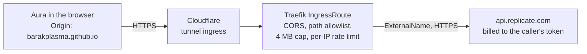

# aura-relay: BYOK CORS relay for the DECISION engine

A browser can't call Replicate directly: `api.replicate.com` sends no CORS
headers. This relay adds them and nothing else. Each Aura user sends **their
own** Replicate token, and the relay forwards it unchanged. It holds no
credential, runs no pods and stores nothing. See
[docs/PRD-decision-engine.md](../../docs/PRD-decision-engine.md) for the
design, the trust argument and the alternatives.



## What's here

| Path                                     | What it is                                                                                                                       |
|------------------------------------------|----------------------------------------------------------------------------------------------------------------------------------|
| `chart/`                                 | Self-contained Helm chart: two ExternalName Services, the cloudflare-tunnel Ingress, three Middlewares and one IngressRoute.     |
| `bootstrap/traefik/helmchartconfig.yaml` | Lets Traefik's `kubernetesCRD` provider route to ExternalName Services. k3s owns the Traefik HelmChart, so apply it out-of-band. |
| `traefik-local.yml`                      | File-provider twin of `chart/templates/traefik.yaml`, used by `scripts/dev-relay-local.mjs`. Change the two together.            |

The chart does not depend on the `charts/common` library in homelab-manifests,
so it can be linted and rendered on its own.

## Deploy (homelab-manifests, Argo CD)

1. Copy `chart/` to `apps/aura-relay/` and `bootstrap/traefik/helmchartconfig.yaml`
   to `bootstrap/traefik/`.
2. Out-of-band, like the repo's other apps:
   - `kubectl apply -f bootstrap/traefik/helmchartconfig.yaml`. k3s restarts Traefik with ExternalName routing allowed.
   - `kubectl create namespace aura-relay`.
   - Create the Argo CD `Application` for `apps/aura-relay`.
3. Don't put Cloudflare Access on this host. Aura calls it with a cross-origin
   `fetch()`, which can't complete an Access login. Each user's own token is
   the authentication.
4. Clear the Cloudflare challenge (next section).
5. Verify: `node scripts/relay-probe.mjs https://aura-relay.526462738.xyz`.

## Cloudflare challenge

On 2026-09-26, `https://aura-relay.526462738.xyz` answered even the CORS
preflight with a Cloudflare managed challenge (`HTTP 403`,
`cf-mitigated: challenge`). A challenge page is HTML meant for a person. A
`fetch()` can't solve it, so every Aura request fails as a CORS error before
it reaches Traefik. The probe was run from a datacenter IP, which is what Bot
Fight Mode and the default managed rules challenge first, so phones on home
or mobile networks may pass. Don't rely on that.

Fix: in the `526462738.xyz` zone, add a WAF custom rule:

- **Expression:** `(http.host eq "aura-relay.526462738.xyz")`
- **Action:** Skip
- **Skip:** all remaining custom rules, rate limiting rules, managed rules and Super Bot Fight Mode

If the zone uses the free plan's Bot Fight Mode, the skip rule can't exempt
it. Turn Bot Fight Mode off for the zone instead. The relay's own abuse
controls are the path allowlist, the `r8_` token shape, the 4 MB cap and
the per-`CF-Connecting-IP` rate limit.

## Verify

```sh
# The Traefik config, end to end, no cluster: a real Traefik v3 binary in
# front of a fake Replicate that echoes the bearer it received.
TRAEFIK=/path/to/traefik node scripts/dev-relay-local.mjs

# The deployed relay (or any relay template, e.g. a hosted proxy with --hosted).
node scripts/relay-probe.mjs https://aura-relay.526462738.xyz

# Go / no-go for the default: warm p95 < 3 s. This spends your own credit,
# about $0.00022 per run.
REPLICATE_API_TOKEN=r8_... node scripts/relay-probe.mjs https://aura-relay.526462738.xyz --measure 100
```

`scripts/dev-relay-local.mjs` with Traefik 3.5.3 passed every check on
2026-09-26:

- the preflight is answered by the middleware;
- the fake token reaches the upstream unchanged;
- the answer carries CORS headers;
- no token, another origin, or an off-path request gets `404`;
- a 5 MB body gets `413`;
- a burst from one `CF-Connecting-IP` gets `429` while a second IP still gets through.

## Hosted-proxy alternatives, probed 2026-09-26

| Relay template                            | Result                                                                                                                                                              |
|-------------------------------------------|---------------------------------------------------------------------------------------------------------------------------------------------------------------------|
| `https://proxy.corsfix.com/?{url}`        | Preflight passes (`authorization, content-type, prefer` allowed), but requests get `403 domain_not_registered` until the origin is registered in a Corsfix account. |
| `https://corsproxy.io/?url={url:encoded}` | Anonymous preflight answers `401`. Needs a paid key; whether it forwards `Authorization` is still unverified.                                                       |
| `https://proxy.cors.sh/{url}`             | `proxy.cors.sh` does not resolve (DNS `ENOTFOUND`).                                                                                                                 |
| `{url}` (direct)                          | Replicate sends no CORS headers, so a browser can't read the answer.                                                                                                |
