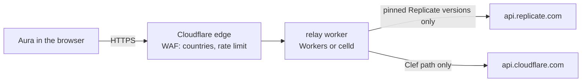

# relay-worker: Aura's BYOK CORS relay

A browser can't call `api.replicate.com` or `api.cloudflare.com` directly: neither
sends CORS headers. This relay adds them. Every Aura user sends their **own**
token, which the relay forwards unchanged. It holds no credential and stores
nothing.

It is one Workers-module `fetch` handler (`src/index.js`). The same code runs on
Cloudflare Workers and self-hosted on [celld](https://github.com/denoland/celld).



## What it forwards

| Request | Forwarded when |
| --- | --- |
| `POST /v1/predictions` | `Bearer r8_…` token, and the body's `version` is one Aura pins in `lib/decision-models.js` |
| `GET /v1/predictions/{id}`, `POST …/{id}/cancel` | `Bearer r8_…` token |
| `POST /client/v4/accounts/{32-hex}/ai/run/@cf/cloudflare/clef` | any bearer token (Cloudflare's have no prefix) |

Everything else is a `404` and never leaves the relay. Requests must come from
an `ALLOWED_ORIGINS` page, bodies are capped at 4 MB, and only `Authorization`,
`Content-Type` and `Prefer: wait=N` are passed upstream.

The allowlist is read from `lib/decision-models.js` at build time, so pinning a
new Replicate version or adding a Workers AI row updates the relay on its next
deploy. Until then, the relay refuses the new version with a `403`.

## What it deliberately does not do

Country filtering and rate limiting are not in the code. celld's `request.cf`
has no geolocation and it has no rate-limit binding, so both stay in the zone's
WAF, which sits in front of either runtime:

- custom rule "only for IL": challenge anything outside IL / FI / US
- rate-limit rule: 30 requests per 10 s per IP on `relay.526462738.xyz` (the
  free plan's single rule)

## Deploy

**Cloudflare Workers** (free plan, 100k requests a day). The config is
`wrangler.cloudflare.jsonc`: celld rejects Cloudflare-only keys (`routes`,
`workers_dev`, `env`), so it lives in its own file.

```sh
cd deploy/relay-worker
npx wrangler deploy -c wrangler.cloudflare.jsonc
```

It serves only on the custom domain `relay.526462738.xyz`. `workers_dev` is off
because the `*.workers.dev` address would skip the zone's WAF.

**Self-hosted with celld** (`wrangler.jsonc`, JSONC only; needs `esbuild` on
`PATH`):

```sh
curl -fsSL https://celld.dev/install.sh | sh
cd deploy/relay-worker
celld dev                      # http://127.0.0.1:9876
celld deploy . --bucket s3://… # fleet deploy, see celld's docs
```

Put it behind the Cloudflare tunnel so the zone's WAF still applies.

## Verify

```sh
node --test test/relay-worker.test.js                      # unit, no network
node scripts/relay-probe.mjs 'https://relay.526462738.xyz{path}'
node scripts/relay-probe.mjs 'http://127.0.0.1:9876{path}' # against celld dev
```

The probe runs 15 conformance checks with fake tokens. Run it from an allowed
country: elsewhere the WAF answers first with a challenge, and the probe says so.
