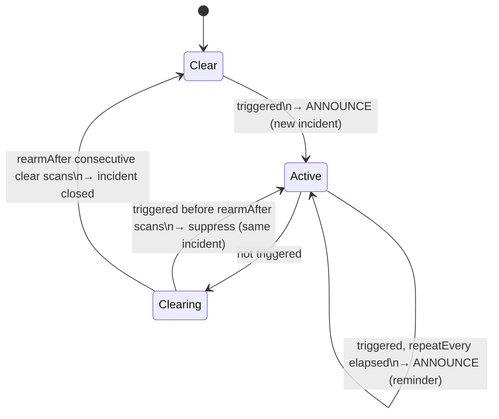
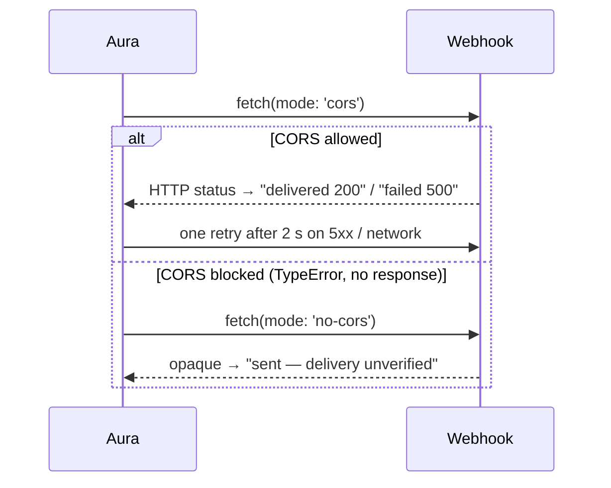

# PRD — Alert hygiene, provider backoff, webhook delivery status

Status: draft · Owner: barakplasma · Scope: `lib/` + `src/` + `test/`
Category: **reliability**

## Problem

Three behaviours make a running monitor either annoying or quietly useless:

1. **Every triggered scan is a full alert.** A person standing at the door for
   three minutes at a 5 s cadence produces ~36 spoken announcements, 36 vibration
   bursts and 36 webhook POSTs. There is no cooldown, no notion of "the same
   incident", and no way to be told again if it is *still* happening ten minutes
   later. Operators respond by turning speech off, which defeats the product.
2. **Errors don't slow the loop down.** `tick()` catches a scan error, sets the
   status text, and reschedules at the normal gap. A 429 from Cerebras, a 502
   from a local server that is restarting, or a phone that lost Wi-Fi keeps the
   loop hammering at 5 s (250 ms in MAX mode). A 401 from a wrong key retries
   forever with the same key. The operator sees only the last error string; no
   count, no "retrying in", no auto-stop.
3. **Webhook failures are invisible.** `sendWebhook()` sends with `mode:
   'no-cors'`, so the response is opaque: a 500, a 404, a typo in the URL and a
   perfect delivery all look identical. The Settings TEST button always says
   "Test sent." There is no retry.

## Goals

- One incident → one alert, then a configurable reminder cadence while it
  persists; a clear scene re-arms the alert.
- Provider errors back off exponentially, honour `Retry-After`, and stop the
  loop on errors that cannot fix themselves.
- The operator can see whether a webhook was actually delivered.

## Non-goals

- Changing what counts as a detection (prompts, thresholds) — see
  `PRD-local-prefilters.md`.
- Multi-recipient notification routing. One webhook URL, as today.

## Design

### 1. Alert policy — `lib/alerts.js` (pure)

Every scan still produces a detection result and is still **logged**; the
policy only decides which of those become **delivered** alerts (speech,
vibration, flash, webhook).



```text
decideAlert(state, detection, now, policy) → { state', deliver, kind, incidentId }

policy = {
  cooldownMs:      60_000,   // min gap between deliveries inside one incident
  repeatEveryMs:   0,        // 0 = never re-announce; else reminder cadence
  rearmAfterScans: 2,        // consecutive clear scans that close the incident
}
state  = { incidentId, startedAt, lastDeliveredAt, clearStreak, triggeredCount }
kind   ∈ 'new' | 'reminder' | 'suppressed' | 'none'
```

- `deliver` is true for `new` and `reminder`. `suppressed` still logs an alert
  row (with `suppressed: true` and the `incidentId`) so history is complete.
- `repeatEveryMs` is independent of `cooldownMs`: cooldown stops rapid-fire
  repeats, `repeatEvery` re-announces a condition that has *not gone away*
  ("the stove is still on").
- The webhook follows the same gate by default. A separate
  `webhookEvery` boolean (default off) sends the webhook on every triggered
  scan for integrations that do their own dedupe (Home Assistant, ntfy with
  its own rate limits).
- History: alert rows carry `incidentId`; `HistoryScreen` collapses
  consecutive rows of one incident into one card with a `×N` badge, first
  frame, peak confidence and duration. Expanding shows each scan. This is
  UI-only over the existing 20-row window; when `PRD-session-keepalive.md`'s
  IndexedDB store lands, the same fields persist unchanged.
- Demo mode runs through the same policy so TRY DEMO shows the cooldown
  working (demo fires every third cycle — with a 60 s cooldown at a 5 s
  cadence the operator hears one alert per minute, which is the point).

### 2. Provider error backoff — `lib/backoff.js` (pure) + `lib/aura.js`

`scanClient()` currently throws plain `Error`s with the status baked into the
message. It gains a typed error so the caller can decide:

```text
class ProviderError extends Error { status, retryAfterMs, kind }
kind ∈ 'auth' (401/403) | 'client' (other 4xx) | 'rate' (429) | 'server' (5xx)
     | 'network' (fetch TypeError) | 'timeout' | 'parse' (bad JSON from model)
```

`retryAfterMs` is parsed from a `Retry-After` header (seconds or HTTP-date)
when present. `isolateJsonObject` failures become `kind: 'parse'` — a model
that returns prose once is not an outage.

```text
nextErrorGapMs(kind, consecutiveErrors, baseGapMs, { retryAfterMs, maxMs, jitter })

rate      → max(retryAfterMs, baseGapMs × 2^n)  capped at maxMs (5 min)
server    → baseGapMs × 2^n                     capped at maxMs
network   → baseGapMs × 2^n                     capped at maxMs
timeout   → baseGapMs (the auto-tuned timeout already grew; don't double-punish)
parse     → baseGapMs (retry next cycle, count it)
auth      → STOP after 1 (a wrong key never fixes itself)
client    → STOP after 3 (bad model name, bad URL path)
```

- `jitter` adds ±20 % so several phones on one local server don't
  synchronise. `baseGapMs` is the scheduler's computed gap for the mode, so
  MAX mode backs off from 250 ms, interval mode from `scanEvery`.
- `useMonitor.tick()` keeps `consecutiveErrors` and `lastErrorKind` on the
  internal ref; a successful scan resets both. On STOP kinds it calls `stop()`
  and sets a status that names the fix: "Stopped: provider rejected the API
  key (401). Fix it in Settings and re-arm."
- Status text during backoff: "Provider 429 — retrying in 40 s (3 errors)".
  The existing progress bar's *waiting* phase shows the backoff countdown for
  free because the gap is what it animates.
- The eval engine (`lib/eval.js`) reuses `nextErrorGapMs` for its documented
  "single backoff retry on 429" follow-up — one retry per cell, `rate` kind
  only, so a full matrix doesn't stall on a transient limit.

### 3. Webhook delivery status — `useMonitor.sendWebhook()` + Settings



- Try `mode: 'cors'` first. A readable response gives a real status. If the
  fetch rejects with a `TypeError` (the endpoint sends no CORS headers), fall
  back to `no-cors` **once for this session** and remember the choice per
  webhook origin (same pattern as `jsonModeUnsupported` in `lib/aura.js`), so
  every later alert goes straight to the working mode.
- One retry after 2 s for 5xx and network errors in `cors` mode. Never retry
  4xx.
- Result surfaced as `lastWebhook = { at, status, ok, verified }` state from
  `useMonitor`; Settings WEBHOOK section shows it next to TEST ("delivered ·
  200 · 12:04:31" / "failed · 404" / "sent · unverified (no CORS)"), and the
  Monitor panel gains a WEBHOOK row with the same text.
- Webhook TEST in `SettingsScreen.jsx` uses the same function instead of its
  own copy, so what the test reports is what a real alert will do.
- Keep the 5 s timeout. Keep the never-from-demo guard.

## Settings

Mission screen (ALERT RESPONSES group — that is where speech/vibrate live):

| Control        | Key                   | Default | UI                                  |
|----------------|-----------------------|---------|-------------------------------------|
| ALERT COOLDOWN | `aura.alertCooldownS` | `60`    | number + unit select (s/m), 0 = off |
| REMIND EVERY   | `aura.alertRepeatS`   | `0`     | number + unit select, 0 = never     |
| RE-ARM AFTER   | `aura.rearmScans`     | `2`     | number, clear scans to close        |

Settings → WEBHOOK:

| Control            | Key                 | Default | UI                     |
|--------------------|---------------------|---------|------------------------|
| SEND ON EVERY SCAN | `aura.webhookEvery` | `false` | checkbox + hint        |
| last delivery      | (state, not stored) | —       | status line under TEST |

No new settings for backoff — like the auto-tuned timeout, it has no operator
knob. The 5 min cap and the STOP thresholds are constants in `lib/backoff.js`.

## Files

| Path                             | Change                                                      |
|----------------------------------|-------------------------------------------------------------|
| `lib/alerts.js`                  | new, pure: `decideAlert`, `initialAlertState`               |
| `lib/backoff.js`                 | new, pure: `nextErrorGapMs`, `shouldStop`                   |
| `lib/aura.js`                    | `ProviderError`, `Retry-After` parsing, `parse` kind        |
| `lib/monitor.js`                 | `parseRetryAfter(headerValue, now)`                         |
| `lib/eval.js`                    | one 429 retry per cell via `nextErrorGapMs`                 |
| `src/hooks/useMonitor.js`        | alert state machine, error counters, webhook cors/no-cors   |
| `src/screens/MissionScreen.jsx`  | cooldown / remind / re-arm controls                         |
| `src/screens/SettingsScreen.jsx` | webhook every-scan toggle, delivery status, shared test fn  |
| `src/screens/MonitorScreen.jsx`  | WEBHOOK row, ERRORS row                                     |
| `src/screens/HistoryScreen.jsx`  | incident grouping                                           |
| `test/alerts.test.js`            | every transition in the state diagram, cooldown/repeat math |
| `test/backoff.test.js`           | per-kind gaps, cap, jitter bounds, stop thresholds          |
| `test/monitor.test.js`           | `ProviderError` kinds, `Retry-After` seconds + HTTP-date    |

## Acceptance

- Stand in frame for 3 minutes at a 5 s cadence with the defaults: one
  announcement, one webhook, history shows one incident ×36. Leave frame for
  10 s, return: a second announcement.
- Set REMIND EVERY to 1 m and repeat: announcements at 0:00, 1:00, 2:00.
- Point the base URL at a stopped local server: status counts up "retrying in
  10 s / 20 s / 40 s…", capped at 5 min; start the server, next scan succeeds
  and the counter resets.
- Enter a wrong Cerebras key: the loop stops after the first 401 with a status
  that says so; no second request is sent (verify in devtools).
- Webhook to `https://ntfy.sh/<topic>`: Settings shows "delivered · 200".
  Webhook to a URL that 404s: "failed · 404". Webhook to an endpoint with no
  CORS headers: "sent · unverified".
- `npm test` green; `lib/alerts.js` and `lib/backoff.js` have no DOM imports.

## Out of scope / follow-ups

- Escalation (louder / different message after N reminders) — trivial to add
  on top of `kind: 'reminder'` once the state machine exists.
- Per-channel cooldowns (speak every time, webhook once) — `webhookEvery`
  covers the one real request seen so far.
