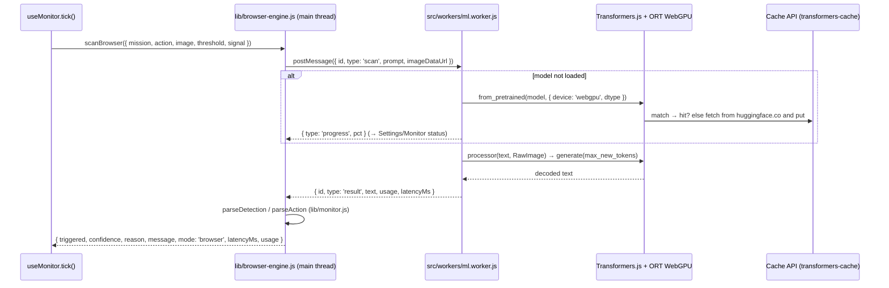

# PRD — BROWSER engine: in-page vision inference with SmolVLM

Status: draft · Owner: barakplasma · Scope: `lib/` + `src/` + `scripts/` + `test/`
Category: **in-browser inference**

## Problem

"Runs entirely in the browser" is true of the app shell, not of the inference.
Every scan still leaves the page: to a cloud provider (key, cost, latency,
someone else's servers seeing your camera) or to a local server the operator
has to install, keep running, and open CORS on. A phone — the device Aura is
designed around — cannot run Ollama at all, so the "fully offline" story in
the README is desktop-only.

Small vision-language models now run in the browser on WebGPU through
Transformers.js. SmolVLM-256M-Instruct is ~200 MB in 4-bit and answers a
yes/no question about a 640×480 frame in a few seconds on a laptop GPU and on
recent Android flagships. That is enough for a *third engine*: no key, no
server, no CORS, and the frame never leaves the device.

## Goals

- A `browser` engine that plugs into the existing scan loop with the **same
  result contract as `scanClient()`**, so `useMonitor`, telemetry, history,
  demo/live gating and the eval screen all keep working unchanged.
- Model weights downloaded once, cached by the browser, usable offline after.
- Zero impact on the main bundle for operators who never turn it on.

## Non-goals

- Matching cloud-model accuracy. SmolVLM-256M is a coarse detector; the eval
  screen exists so the operator can measure that trade-off on their own
  frames.
- Custom / fine-tuned model uploads. Two curated models in v1.
- Running the GEPA optimizer in-browser (it needs a strong model).

## Choices (researched)

| Option                                 | Verdict                                                                                                                         |
|----------------------------------------|---------------------------------------------------------------------------------------------------------------------------------|
| **Transformers.js 4.x + ONNX Runtime** | ✔ Vision-language support (SmolVLM/Idefics3, Florence-2, Moondream…), WebGPU + WASM fallback, Cache API weight caching, active. |
| WebLLM (MLC)                           | ✘ LLM-first; multimodal is not a supported path. Revisit only if it gains VLMs.                                                 |
| wllama / llama.cpp WASM                | ✘ CPU-only; a 256M VLM on WASM is 5–20× slower than WebGPU — unusable cadence on phones.                                        |
| MediaPipe LLM Inference                | ✘ Gemma-only, image input limited, heavier loader; no advantage over Transformers.js here.                                      |

Model candidates (ONNX repos on the Hub, sizes are the on-disk files that
would be fetched at the recommended dtypes):

| Model (`HuggingFaceTB/…`) | embed_tokens | vision_encoder | decoder (q4) | Total   | Notes                        |
|---------------------------|--------------|----------------|--------------|---------|------------------------------|
| `SmolVLM-256M-Instruct`   | fp16 57 MB   | q4 64 MB       | q4 87 MB     | ~208 MB | default; phones + laptops    |
| `SmolVLM-500M-Instruct`   | fp16 95 MB   | q4 67 MB       | q4 229 MB    | ~390 MB | "better" option for desktops |

The dtype split (`embed_tokens: fp16, vision_encoder: q4, decoder_model_merged:
q4`) is Hugging Face's own WebGPU demo recipe for SmolVLM; the implementer
should measure `q4f16` for the decoder (77 MB / 205 MB) on a real phone and
switch if accuracy holds.

## Design



### 1. Engine selection

- New setting `aura.engine`: `'provider'` (default, today's behaviour) |
  `'browser'`. Settings → PROVIDER gets an ENGINE segment control above the
  presets; choosing BROWSER hides BASE URL / API KEY / MODEL / FETCH MODELS
  and shows the BROWSER MODEL section (below).
- "Configured" for the browser engine means a model is selected; base URL and
  API key are irrelevant. `providerReady` in `App.jsx` becomes
  `engine === 'browser' ? Boolean(browserModel) : Boolean(baseUrl && model)`.
- `useMonitor.tick()` dispatches: `s.demo → demoScan`, `s.engine === 'browser'
  → scanBrowser`, else `scanClient`. Everything downstream reads
  `result.mode` (`'browser'` shows as ENGINE on the Monitor panel, and the
  status dot gets a third colour).
- Cost rate is forced to `0` while the browser engine is active (same as the
  local presets); budget mode falls back to interval cadence because there is
  no spend to cap.

### 2. Worker — `src/workers/ml.worker.js`

One module worker owns Transformers.js for the whole app. It is shared with
`PRD-local-prefilters.md` (CLIP gate), so the message protocol is generic:

```text
→ { id, type: 'load',   task: 'vlm' | 'clip', model, dtype, device }
← { id, type: 'progress', file, loaded, total, pct }        (repeated)
← { id, type: 'ready',  device: 'webgpu' | 'wasm' }
→ { id, type: 'scan',   prompt, imageDataUrl, maxNewTokens }
← { id, type: 'result', text, usage: { prompt_tokens, completion_tokens, total_tokens }, latencyMs }
→ { id, type: 'abort' }                                      (cancel a running generate)
→ { id, type: 'unload', task }
← { id, type: 'error',  message }
```

- Generation runs with an `InterruptableStoppingCriteria` so `abort` (wired
  from the scan's `AbortController` in `useMonitor`) stops decoding within one
  token instead of at the end.
- Device: `navigator.gpu ? 'webgpu' : 'wasm'`. On WASM the worker reports it
  and the UI warns "No WebGPU — expect 10–30 s per scan". WASM multithreading
  needs cross-origin isolation headers that GitHub Pages cannot send, so the
  fallback is single-threaded; that is acceptable for a fallback.
- Image input: the existing 640×480 JPEG data URL from `captureFrame()`.
  `RawImage.fromURL(dataUrl)` handles data URLs. Call the processor with
  `do_image_splitting: false` — SmolVLM's default splits the frame into up to
  a dozen crops, which multiplies vision-encoder work for no benefit at this
  resolution. This single flag is the difference between ~2 s and ~15 s on a
  phone.
- `max_new_tokens`: 48 for detection, 40 for action.
- Usage is real: prompt tokens from `input_ids.dims`, completion tokens from
  the generated sequence length. The TOKENS telemetry keeps working; cost is
  zero.

### 3. Main-thread facade — `lib/browser-engine.js`

- `scanBrowser({ mission, action, image, threshold, examples,
  optimizedInstruction, webhookAction, webhookSchema, signal, onProgress })`
  → the exact `scanClient()` result shape, `mode: 'browser'`.
- Lazy: the worker is created on first use via a second esbuild entry point
  (`src/workers/ml.worker.js` → `public/assets/ml.worker.js`, plain script
  URL, no `new URL(import.meta.url)` tricks). `@huggingface/transformers` is
  imported **only** in the worker file. The build's precache list already
  picks up every `assets/*.js`, so the worker script itself works offline.
- Request/response correlation by `id`; a rejected worker (crash, OOM) rejects
  every in-flight promise with a `ProviderError`-compatible error so
  `useMonitor`'s existing catch path shows it.
- Prompts: reuse `buildDetectionPrompt` / `buildActionPrompt` from
  `lib/monitor.js` as the *system* text, but a 256M model does not reliably
  emit JSON. Add `buildCompactDetectionPrompt(mission)` — "Answer on one line:
  YES or NO, then a confidence 0–100, then a short reason." — and
  `parseLooseDetection(text)` in `lib/monitor.js` that accepts either the
  JSON schema (via `isolateJsonObject`) or the `YES 80 someone at the door`
  line. Both are pure and unit-tested. The action call uses the normal action
  prompt; `parseAction` already tolerates prose because it falls back to
  "Attention please." — tighten that to "use the whole reply as the message
  when no JSON is present".
- Timeouts: the self-tuning timeout's 4 s floor is wrong for a model that
  takes 3–20 s. `TIMEOUT_FLOOR_MS` becomes engine-dependent (4 s provider /
  30 s browser); MAX mode's "no timeout" still applies.

### 4. ONNX Runtime WASM + offline

Transformers.js loads the ONNX Runtime `.wasm`/`.mjs` from a CDN by default,
which breaks the offline promise. The build copies the two WebGPU/JSEP runtime
files from `node_modules/onnxruntime-web/dist/` to `public/ort/`, the worker
sets `env.backends.onnx.wasm.wasmPaths = new URL('../ort/', self.location)`,
and `scripts/sw-template.js` gains one runtime rule: same-origin `GET` under
`ort/` is cache-first with put-on-fetch (they are ~20 MB, too big to precache
on every install; cached the first time the engine is used). Model weights
come from `huggingface.co` and are cached by Transformers.js itself in the
Cache API bucket `transformers-cache` — the service worker must keep ignoring
cross-origin requests exactly as it does today.

### 5. Settings → BROWSER MODEL

| Control               | Behaviour                                                                                   |
|-----------------------|---------------------------------------------------------------------------------------------|
| MODEL                 | segment: `SMOLVLM 256M` (default) / `SMOLVLM 500M`; hint shows download size + RAM guidance |
| status line           | NOT DOWNLOADED · DOWNLOADING 43 % (progress bar) · READY (cached) · NO WEBGPU (wasm)        |
| DOWNLOAD / LOAD       | loads the model now (progress via `onProgress`) so the first ARM isn't a 200 MB surprise    |
| TEST ON CURRENT FRAME | one detection on the live frame; shows text + latency (reuses `captureFrame`)               |
| CLEAR MODEL CACHE     | `caches.delete('transformers-cache')` + unload; shows freed size                            |

ARM with a model that is not yet loaded triggers the load with the progress
shown in the monitor status bar ("Loading SmolVLM 256M — 61 %"); the first
scan starts when ready.

### 6. Eval screen tie-in

The eval matrix takes a `scanFn`; `EvalScreen` lists `browser:smolvlm-256m`
and `browser:smolvlm-500m` alongside the provider's models when the engine
supports it (WebGPU present). The runner routes those model ids to
`scanBrowser`, everything else to `scanClient`. This is how an operator
decides whether the browser engine is good enough for *their* mission.

## Settings keys

| Key                 | Default          | Notes                                               |
|---------------------|------------------|-----------------------------------------------------|
| `aura.engine`       | `'provider'`     | `'provider'` \| `'browser'`                         |
| `aura.browserModel` | `'smolvlm-256m'` | id into `BROWSER_MODELS` in `lib/browser-engine.js` |

## Files

| Path                             | Change                                                                |
|----------------------------------|-----------------------------------------------------------------------|
| `src/workers/ml.worker.js`       | new — the only file importing `@huggingface/transformers`             |
| `lib/browser-engine.js`          | new — facade, `BROWSER_MODELS`, worker lifecycle                      |
| `lib/monitor.js`                 | `buildCompactDetectionPrompt`, `parseLooseDetection`, action fallback |
| `scripts/build-react.js`         | second entry point; copy ORT wasm to `public/ort/`                    |
| `scripts/sw-template.js`         | runtime cache rule for `ort/`                                         |
| `src/hooks/useMonitor.js`        | engine dispatch, engine-dependent timeout floor, progress status      |
| `src/App.jsx`                    | `engine` / `browserModel` settings, `providerReady`                   |
| `src/screens/SettingsScreen.jsx` | ENGINE control, BROWSER MODEL section                                 |
| `src/screens/EvalScreen.jsx`     | browser model rows                                                    |
| `test/monitor.test.js`           | loose parser (YES/NO line, JSON, garbage), compact prompt             |
| `test/browser-engine.test.js`    | facade with a fake worker: id correlation, abort, crash rejection     |
| `package.json`                   | `@huggingface/transformers` (~9.5 MB unpacked, worker-only)           |
| `CLAUDE.md` / `README.md`        | bundle rule (worker-only import), "Run in the browser" section        |
| `.gitignore`                     | `public/ort/` (build output)                                          |

## Acceptance

- Fresh profile, Chrome on a laptop with WebGPU: pick BROWSER, DOWNLOAD shows
  progress and ends READY; ARM with mission "a person is visible"; wave at the
  camera → alert in ≤ 5 s; leave frame → "Watching".
- Airplane mode after that: reload, ARM, scans keep working (shell + worker +
  ORT + weights all served from cache; verify zero network in devtools).
- Pixel 7-class phone: 256M model loads and scans in ≤ 8 s each on WebGPU.
- Safari without WebGPU: WASM fallback runs (slowly) and the UI says why.
- `npm run build` output: `assets/app.js` size unchanged within 5 KB (no
  Transformers.js leak into the main bundle — assert in a test that reads the
  build output).
- `npm test` green; no test spawns a real worker.

## Out of scope / follow-ups

- Moondream / Florence-2 / Qwen2-VL-2B as extra model options once the
  plumbing exists — only the `BROWSER_MODELS` table and prompt style change.
- Streaming partial output to the status bar (the worker protocol already
  allows a `token` message).
- The CLIP gate in `PRD-local-prefilters.md` reuses this worker and its
  build/offline plumbing — land this PRD first.
