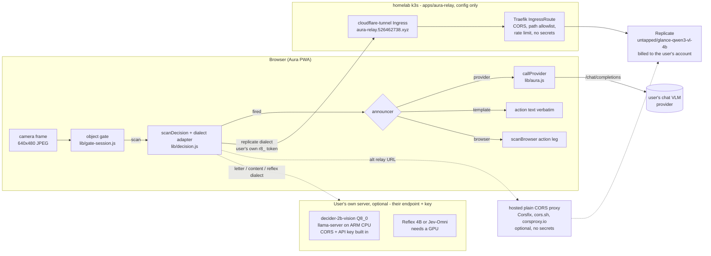
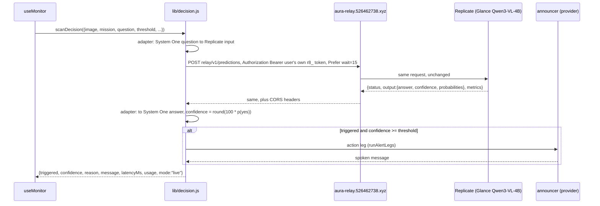

# PRD — DECISION engine: Image JevBench models as Aura's detector, remote first

Status: **proposed** · Owner: barakplasma · Scope: `lib/` + `src/` + `test/` + a
CORS pass-through relay (Traefik config, no secrets); no application server of our own
Category: **remote inference**
Sources (read 2026-09-26): [Image JevBench v0.1](https://benchmarkheaven.com/image-jev-bench)
(frozen split 228 public / 456 sealed); [Glance](https://github.com/yoheinakajima/glance)
and its latency study [Glance Speedlab](https://github.com/yoheinakajima/glance-speedlab)
([report](https://glance.yohei.me/speed/))

## Problem

Every Aura scan asks one question: *does this frame satisfy the mission, and
how sure are you?* Today that question goes to a general chat VLM, which
**writes** its answer as JSON — including a confidence number it invents. That
has three costs:

1. **Latency.** Hosted VLMs answer in 1.4–4.8 s p50, with p95 tails up to 27 s
   (Image JevBench, hosted rows). The scan cadence and image freshness are
   bounded by that.
2. **Price.** A chat VLM costs $0.08–$2.06 per 1,000 decisions on the benchmark.
   Budget mode (`PRD-scan-modes.md`) converts every cent into slower scanning.
3. **Calibration.** The sensitivity slider (`threshold`) compares against a
   number the model wrote. The BROWSER engine already fixed this for itself
   with a logit margin (`lib/logprob.js`); the PROVIDER engine has no fix.

Image JevBench measures a different class of model — **typed-decision models**:
image + question + bounded options in, a *probability per option* out, from
one forward pass, no generation. That is exactly Aura's detection leg.

## What the benchmark says, filtered for Aura

Aura's scenes are closest to the benchmark's **Everyday photo** track (184
synthetic household photos, yes/no questions like *"Is the parcel visibly
damaged?"*). The core track (UI screenshots, charts, documents) matters less.

| System                         | Kind                         | Everyday sealed acc. | Overall composite | p50 / p95         | USD / 1K decisions | Weights / access                                                                                                                                                                  |
|--------------------------------|------------------------------|----------------------|-------------------|-------------------|--------------------|-----------------------------------------------------------------------------------------------------------------------------------------------------------------------------------|
| **Jev-Omni**                   | Gemma 4 12B + 256-way head   | 96.8 %               | **73.10** (#1)    | 0.076 s / 0.103 s | 0.0224             | [akhilaaa3/Jev-Omni](https://huggingface.co/akhilaaa3/Jev-Omni), Apache-2.0, ~24 GB bf16, CUDA                                                                                    |
| **Mapika decider-2b-vision**   | Qwen3.5-2B VL, letter logits | 89.5 %               | 66.77 (#2)        | 0.091 s / 0.154 s | 0.0259             | [Mapika/decider-2b-vision](https://huggingface.co/Mapika/decider-2b-vision), Apache-2.0, 4.4 GB bf16; [GGUF + mmproj](https://huggingface.co/mradermacher/decider-2b-vision-GGUF) |
| Reflex 4B                      | Qwen3.5-4B + LoRA            | 88.4 %               | 65.38 (#3)        | 0.154 s / 0.191 s | 0.0488             | [kshetrajna12/reflex](https://github.com/kshetrajna12/reflex)                                                                                                                     |
| Gemma 4 31B IT (hosted)        | chat VLM                     | 96.8 %               | 47.14             | 1.425 s / 2.868 s | 0.0816             | already reachable via the PROVIDER engine (e.g. Cerebras `gemma-4-31b`)                                                                                                           |
| Gemini 3.1 Flash Lite (hosted) | chat VLM                     | 100 %                | 9.58              | 1.799 s / 19.8 s  | 0.3888             | already reachable via the PROVIDER engine (Gemini preset)                                                                                                                         |

Readings that shape this design:

- **Jev-Omni matches the best hosted chat VLMs on everyday photos** (96.8 % vs
  96.8–100 %) at ~1/20th the latency and ~1/4–1/17th the price, with
  calibration 87.7 (vs 87.9–92.9). This is the target model.
- **decider-2b-vision is the cheap-to-host runner-up.** 2 B parameters, a
  community GGUF with a vision projector exists, so it can run under
  `llama-server` — including on CPU. It has no hosted endpoint, so it belongs
  to the self-hosted path.
- **Benchmark latency and price are warm, GPU-local numbers.** Local latency
  was adjusted (2× + 0.15 s), not measured over the internet; local price is
  GPU-seconds × a GPU-hour rate, which assumes the GPU is busy. A single Aura
  camera scanning every few seconds leaves a GPU idle >95 % of the time — see
  [Cost reality](#cost-reality).
- **The everyday-photo items are synthetic** and scored as a curated yes/no set.
  Aura's eval screen (`lib/eval.js`) is how an operator confirms any of this on
  *their* camera before trusting it.

## Glance and Speedlab: a zero-shot backend, and measured latency rules

[Glance](https://github.com/yoheinakajima/glance) (Apache-2.0) is not a trained
model. It reads yes/no, pick-one and rating answers from the answer-token
logits of a **stock, frozen** open VLM (Qwen3-VL 2B/4B/8B by default), in one
pass, and serves them over `POST /v1/decide` in TypeSafe's request shape with
an image extension. Qwen3-VL is not in the Image JevBench ranking, but Glance
publishes its own zero-shot comparison on fresh, human-labelled photos (541
yes/no questions, three sets):

| System                              | yes/no | pick-one | s / yes-no (full-size photo) | USD / 1K answers     |
|-------------------------------------|--------|----------|------------------------------|----------------------|
| Qwen3-VL-4B read by Glance (laptop) | 0.939  | 0.933    | 1.1 (0.33 on a small image)  | 0.07–0.32 rented GPU |
| Qwen3-VL-2B read by Glance          | 0.904  | 0.907    | 0.66                         | lower                |
| same 4B model writing JSON          | 0.945  | 0.930    | 1.6                          | 0.13–0.42            |
| Gemini 3.1 Flash-Lite               | 0.961  | 0.933    | 1.6–1.9                      | 0.31–0.34            |

This is the same mechanism the BROWSER engine already uses for its own
confidence (`lib/logprob.js`), just on a bigger model, on a server. It is also
the **only one of these readouts with a hosted, pay-per-run endpoint**:
[untapped/glance-qwen3-vl-4b](https://replicate.com/untapped/glance-qwen3-vl-4b)
on Replicate (T4, ~1 s, $0.00022 per run). That makes Glance on Replicate the
**default model** of this PRD: no training, stock Apache-2.0 weights, nothing
to host. Self-running it is harder: its CPU tier is dual-encoder only (the VLM
path wants CUDA ≥ 12 GB or Apple silicon ≥ 16 GB), and `glance serve` is a
single-threaded, loopback-only Flask server with no CORS or auth.

[Glance Speedlab](https://glance.yohei.me/speed/) is 21 preregistered latency
experiments on exactly Aura's loop (camera → resize → proxy → VLM readout →
scheduler), on one Apple M5. The results that change this design:

| Speedlab result                                                               | Rule for Aura                                                                                                          |
|-------------------------------------------------------------------------------|------------------------------------------------------------------------------------------------------------------------|
| Model compute dominates; base64 + JSON cost ≤ 0.1 ms p95 at 320 px            | Don't build binary transport or a custom codec. JSON + base64 through a proxy is fine.                                 |
| Several questions in one request: 2.405× faster than sequential requests      | One scan = one request carrying *all* questions about the frame (see fan-out below). Never one call per question.      |
| 8-bit: 1.381× faster, 84/84 decisions, max drift 0.039. 4-bit: drift 0.361    | A self-hosted GGUF is **Q8_0**. Q4/IQ4 variants are rejected up front, not left for the eval to find.                  |
| Fewer vision tokens / 224 px / early decoder exits: faster but change answers | No uniform token caps or truncation knobs. Frame size is an eval-screen experiment, not a default change.              |
| 2B is 2.994× faster than 4B but agrees on only 83.3 % of decisions            | A 2B model is a **fast tier with escalation**, never a silent drop-in (see cascade below).                             |
| Letter-choice scoring on a zero-shot VLM: no faster, less stable              | Zero-shot VLM backends (Glance) score options independently. Letter slots only for models trained on them (decider).   |
| Latest frame, one request in flight                                           | Already Aura's scheduler (`PRD-scan-modes.md`). Keep it; single-slot servers answer `429`/`503` and Aura never queues. |
| Temporal reuse: 95.1 % fewer inferences (synthetic)                           | Aura's object gate + stage-0 pixel diff already do this, engine-agnostically. Nothing new to build.                    |
| Timing split into capture / request / prefix / score / answer age             | Aura records any backend `timing_ms` / Replicate `metrics` next to `latencyMs`.                                        |

### What these models cannot do

They are classifiers, not chat models. They produce **no text**: no `reason`,
no spoken announcement, no webhook payload. Aura's action and webhook legs
still need a generator. That is the central design constraint: **split
*decide* from *announce*.**

## Goals

1. A new engine, `aura.engine = 'decision'`, whose detection leg calls a
   typed-decision model over HTTP and returns the same result shape as
   `scanClient()` / `scanBrowser()` — `useMonitor`, telemetry, history and the
   eval screen don't change.
2. **Remote first, BYOK, config not code.** Every user brings their own
   provider token and pays their own inference; the only server-side piece
   is a CORS pass-through relay that stores no credential — the Traefik k3s
   already runs, configured, not programmed, in front of an inference server
   someone else maintains. A
   backend of our own is written only where no server exists at all, and
   the trade-off is stated where it happens.
3. Confidence comes from the model's own probability of the positive option,
   so the sensitivity slider means *probability*, not a vibe.
4. The announcement leg is pluggable: PROVIDER (chat VLM, only when fired),
   BROWSER, or a plain template — so a fired alert still speaks.
5. One internal contract for every decision model: TypeSafe's System One
   request/response shape. Because no gateway normalises backends, Aura holds
   a small, pure adapter per backend dialect (see [Wire protocol](#the-wire-protocol)).

## Non-goals

- Running these models in the browser. Jev-Omni is 24 GB; decider-2b-vision in
  WebGPU is a possible later row in `lib/browser-models.js` (its readout is a
  first-step logit — the same thing `lib/logprob.js` already reads), but not
  here.
- Calling TypeSafe's hosted Jev: its documented `state` is **text only**
  ("Images, audio, and video are not supported (yet)"), which is why the
  benchmark excluded it from the image ranking.
- Replacing PROVIDER. Hosted chat VLMs stay the default and the most accurate
  option on hard scenes.
- Changing the object gate. It runs before any engine and gates this one the
  same way (`lib/gate-session.js` is engine-agnostic).

## Architecture



### Scan sequence (default path)



## The wire protocol

Inside Aura every decision is **TypeSafe's System One shape** (`docs.typesafe.ai`):
`state` + typed `questions` in, `answers` with per-option `probabilities` out.
No server translates for us — a config-only proxy can't rewrite bodies — so
`lib/decision.js` converts that shape to and from each backend's own dialect.
Each adapter is a pair of pure functions, `toRequest(row, decision)` and
`fromResponse(row, json)`, chosen by a `dialect` field on the model's row in
`lib/decision-models.js` (a row, not a branch):

| Dialect     | Backends                                          | Where the image goes                                                             | Questions per call      |
|-------------|---------------------------------------------------|----------------------------------------------------------------------------------|-------------------------|
| `replicate` | Glance Qwen3-VL-4B on Replicate                   | `input.image_base64` (plain base64); `question`, `question_type`, `options_json` | one — Aura fans out     |
| `content`   | Bonsai-Llama-Jev (`llama-server` fork)            | `state.content[{type: "image_url", image_url: {url: "data:…"}}]`                 | many, one request       |
| `reflex`    | Reflex 4B                                         | `{"type": "image", "source": "data:…"}` anywhere in `state`                      | many, one request       |
| `glance`    | a self-run `glance serve`                         | `state.images[{id: "img0", base64}]`, referenced as `` `img0` ``                 | many, one request       |
| `letter`    | decider-2b-vision GGUF on upstream `llama-server` | raw `/completion` prompt + `multimodal_data`, `n_probs`                          | one prompt per question |

The internal request, before an adapter touches it:

```json
{
  "state": { "image": "data:image/jpeg;base64,/9j/...", "context": "Front porch camera, daytime." },
  "questions": {
    "alert": {
      "type": "choice",
      "instructions": "Is a package on the doormat?",
      "criteria": { "yes": "A package is visible on the doormat", "no": "No package on the doormat" }
    }
  }
}
```

and the internal answer every adapter must produce:

```json
{
  "answers": {
    "alert": { "type": "choice", "choice": "yes", "confidence": 0.86, "probabilities": { "yes": 0.93, "no": 0.07 } }
  },
  "usage": { "decisions": 1, "predict_s": 1.05 },
  "timing_ms": { "predict": 1045, "total": 1190 }
}
```

Choices:

- **`choice` with `{yes, no}`, not `noul`.** It returns the full distribution
  and keeps multi-option missions open (below). The `replicate` adapter maps
  it to `question_type: "yes_no"` when the labels are exactly yes/no.
- **Aura's confidence is `p(yes)`, not the response's `confidence`.** TypeSafe
  distinguishes *confidence* from *probability*; the slider compares against
  `p(yes)` so `threshold = 60` means "alert when the model gives ≥ 60 % to
  yes". The reported `confidence` is kept as telemetry.
- **`reason` is synthesised**: `"p(yes) 0.93 — Is a package on the doormat?"`,
  feeding the action leg like a VLM's reason does today.
- **Adapters are where drift is caught.** Each gets golden request/response
  fixtures copied from the backend's own docs and tests, run under `node --test`.

## Mission → question

A mission is free text ("tell me when the delivery guy leaves something"). A
decision model wants one crisp yes/no question plus two option descriptions.
Three layers, first hit wins:

1. **Explicit.** A new optional `aura.decisionQuestion` field on the Mission
   screen, shown only when the engine is DECISION.
2. **Compiled once.** If a PROVIDER is configured, one chat call turns the
   mission into `{question, yes, no}` JSON; cached in localStorage keyed by a
   hash of the mission text, editable in the same field, never re-run per scan.
   Cost: one call per mission edit.
3. **Template.** `"Does the image show the following? " + mission`, with
   `yes`/`no` criteria. Always available, no network.

`lib/decision.js` exposes `buildDecisionRequest()` and
`parseDecisionResponse()` as pure functions so all three paths and the
response parsing are unit-tested under `node --test`.

## Serving: BYOK, config not code

The browser needs two things from whatever it calls: **HTTPS** and **CORS
headers** for the Aura origin. Credentials are not the server's business:
each user brings their own key, as with every provider in Aura today.
Off-the-shelf proxies provide HTTPS and CORS by configuration.

### Which benchmark backends work without a new gateway

Checked 2026-09-26 against each project's own server code and docs.

| System (Image JevBench rank)          | Server that exists today                                                                                        | Images in the request?              | CORS + auth built in?                                     | What Aura needs in front                                                     | New code? |
|---------------------------------------|-----------------------------------------------------------------------------------------------------------------|-------------------------------------|-----------------------------------------------------------|------------------------------------------------------------------------------|-----------|
| Jev-Omni (#1)                         | **none** — a Python `predict()` helper, CUDA, 24 GB                                                             | —                                   | —                                                         | a server has to be written                                                   | **yes**   |
| Mapika decider-2b-vision (#2)         | decider's `serve.py` is **text-only**; a community GGUF runs under upstream `llama-server`                      | via `/completion` `multimodal_data` | `llama-server`: `--cors-origins`, `--api-key`             | TLS only (Traefik ingress); Aura renders decider's prompt (`letter` dialect) | no        |
| Reflex 4B (#3)                        | `reflex-serve` (FastAPI, Docker image), `/v1/systemone`, CUDA 16 GB                                             | yes (`reflex`)                      | bearer key yes (`--api-key`), **CORS no**                 | CORS headers: a Traefik `Headers` middleware                                 | no        |
| djev-spark / djev-dev (#4, #6)        | hosted `api.djev.dev` **paused**; 26B DiffusionGemma custom runtime                                             | —                                   | —                                                         | not viable today                                                             | —         |
| Gemma 4 31B, GPT, Gemini (#5, #8–#11) | hosted chat APIs                                                                                                | yes                                 | yes                                                       | nothing — already the PROVIDER engine                                        | no        |
| Bonsai-2-27B v2 (#7)                  | [Bonsai-Llama-Jev](https://github.com/kyr0/Bonsai-Llama-Jev), a `llama-server` fork with native `/v1/systemone` | yes (`content`)                     | **both** (`--cors-origins`, `--api-key`)                  | TLS only (Traefik ingress)                                                   | no        |
| OpenJev 4B NLI v2 (#12)               | NLI scores, not probabilities (calibration 0, composite 0)                                                      | —                                   | —                                                         | not useful for a threshold                                                   | —         |
| *Glance Qwen3-VL-4B (not ranked)*     | hosted on Replicate (T4, $0.00022/run); `glance serve` self-run                                                 | yes                                 | Replicate: auth yes, **CORS no**; `glance serve`: neither | a hosted CORS proxy, or Traefik (below)                                      | no        |

Two findings reshape the plan:

- **The Go gateway is unnecessary.** Every viable backend except Jev-Omni is
  reachable with configuration alone.
- **Bonsai-Llama-Jev is a general `/v1/systemone` server for any GGUF VLM.**
  Its scorer is OpenJev's letter readout over the model's chat template, with
  image input, CORS and API keys built in and CPU supported. So the same
  binary can serve Bonsai-2-27B (97.9 % on the benchmark's sealed everyday
  photos, ~10 GB) or a small Qwen3-VL GGUF on the VPS CPU. It is one
  person's fork (last commit 2026-09-24): pin a commit.

### Where each benchmarked model can run: your k3s or Replicate

"Self-hosted" here means the operator's Hetzner ARM k3s node: CPU only, no
GPU. Replicate was searched by name and topic on 2026-09-26: **none of the
twelve ranked systems is published there.** The only typed-decision image
model on Replicate is Glance's `untapped/glance-qwen3-vl-4b`, which the
benchmark didn't rank.

| System (rank)                         | On the ARM k3s (CPU)                                                                                                                                                                      | On Replicate                                                                                     | Likely home                 |
|---------------------------------------|-------------------------------------------------------------------------------------------------------------------------------------------------------------------------------------------|--------------------------------------------------------------------------------------------------|-----------------------------|
| **Mapika decider-2b-vision (#2)**     | **Yes, most likely.** 2B; community GGUF at Q8_0 is 2.0 GB + 0.36 GB projector; upstream `llama-server` builds on arm64 and has CORS + API keys built in. Latency on ARM cores unmeasured | not published; would fit a T4 as a Cog push                                                      | **self-hosted**             |
| Bonsai-2-27B v2 (#7)                  | server runs on CPU, but a 27B model on ARM cores is likely far too slow (its 0.8 s p50 was on a GPU); ~7.6 GB of weights                                                                  | not published; ~10 GB VRAM with llama.cpp CUDA fits a T4/L4 Cog image                            | Replicate, if pushed        |
| Reflex 4B (#3)                        | no — CUDA-only server (16 GB GPU), Triton kernels                                                                                                                                         | not published; already ships a Dockerfile + FastAPI server, the easiest GPU model to port to Cog | Replicate, if pushed        |
| Jev-Omni (#1)                         | no — CUDA-only, 24 GB bf16                                                                                                                                                                | **being published** as public `barakplasma/jev-omni` (L40S), from `deploy/replicate/jev-omni/`   | **Replicate**               |
| djev-spark / djev-dev (#4, #6)        | no — 26B DiffusionGemma custom runtime                                                                                                                                                    | not published; its own hosted API is paused                                                      | neither today               |
| OpenJev 4B NLI v2 (#12)               | not useful — no probabilities for the threshold                                                                                                                                           | —                                                                                                | neither                     |
| Gemma 4 31B, GPT, Gemini (#5, #8–#11) | —                                                                                                                                                                                         | — (already hosted APIs)                                                                          | PROVIDER engine, BYOK today |
| *Glance Qwen3-VL-4B (unranked)*       | no — Glance's VLM path needs CUDA or Apple silicon                                                                                                                                        | **published**: T4, ~1 s, $0.00022/run                                                            | **Replicate, today**        |

So: **decider-2b-vision is the benchmarked model most likely to run
self-hosted**, and it is the only one that plausibly runs on the ARM node at
all. **No benchmarked model runs on Replicate today.** Glance 4B is the
Replicate default until one is pushed. Jev-Omni, the #1 system and the most
accurate on everyday photos (96.8 %), is being published as
`barakplasma/jev-omni` (below); Reflex is the next easiest to push, since it
already ships a container.

A push must be a **public** Replicate model to stay BYOK. Each Aura user then
runs it with their own token and pays only predict time. A private model or
deployment bills its owner for uptime: one account paying for everyone.

A self-hosted decider on the operator's k3s is the operator's own endpoint and
key, the same as a local Ollama. Other Aura users bring their own server, or
use Replicate with their own token.

### BYOK: every user brings their own Replicate token

Aura is BYOK: each user's provider key lives in their own localStorage and
their own account pays (`CLAUDE.md`: "The API key stays in the user's
localStorage"). Replicate is just another provider key. So whatever sits
between the browser and Replicate must **forward the user's `Authorization`
header unchanged and store no credential of its own**.

That rules out every design that holds a token server-side — Corsfix
secrets, corsproxy.dev managed headers, a proxy that injects a token, a Space
or Worker with a secret. Each of those is *one key for everyone*: every Aura
user's scans would bill the operator's Replicate account. What is left is a
**CORS pass-through relay**, and the only question is who runs it.

It also changes what "safe" means. The relay can't spend anyone's money: a
request only works with the caller's own token, on the caller's own account.
The model version is chosen by Aura's row table in the browser; pinning it
server-side protects nobody but the user, who already controls their token.
The relay's real risks are **seeing tokens in transit** and **being abused as
a free bandwidth relay** — which is what the configs below address.

### Who runs the relay

|                            | Aura's operator: Traefik pass-through (default)                                               | Hosted plain CORS proxy (Corsfix, cors.sh, corsproxy.io — no secrets stored)                                                                                                        | The user's own relay (bring your own proxy URL)            |
|----------------------------|-----------------------------------------------------------------------------------------------|-------------------------------------------------------------------------------------------------------------------------------------------------------------------------------------|------------------------------------------------------------|
| What runs                  | two routes + three middlewares on the Traefik k3s already runs; no secrets at all             | nothing for the operator; a vendor account                                                                                                                                          | whatever the user chooses (the same Traefik snippet works) |
| Who sees each user's token | the operator — **who already serves the JavaScript that reads localStorage**, so no new party | a new third party, for every user                                                                                                                                                   | the user                                                   |
| Who pays for the relay     | the operator: bandwidth only (~50–100 KB per scan)                                            | the operator, priced by users/requests: Corsfix Hobby allows 3 concurrent users (Scale: 100 for $19/month); cors.sh Pro 500,000 requests; corsproxy.io Hobby 250,000 requests/month | the user                                                   |
| Who pays for inference     | each user, on their own Replicate account                                                     | same                                                                                                                                                                                | same                                                       |
| Abuse control              | exact `Origin` match, prediction paths only, `Bearer r8_…` shape, 4 MB cap, per-IP rate limit | the vendor's origin allowlist and plan limits                                                                                                                                       | the user's                                                 |
| Availability               | the operator's VPS                                                                            | the vendor's                                                                                                                                                                        | the user's                                                 |

**Default: the operator's Traefik pass-through**, with a **proxy URL field in
Settings** so any user can switch to a hosted proxy or their own relay (or to
none, for a backend that sends CORS headers itself). The trust argument
decides it: the operator can already read every user's localStorage through
the code it serves, so routing requests through the operator's own relay adds
no party, while a hosted proxy adds one for everyone. Hosted proxies remain
the choice for an operator without a server — then Corsfix in plain mode
(allowlisted origin, no secrets; its preflight is the one verified to pass
`authorization, content-type, prefer`), bearing in mind its per-user pricing
scales with Aura's audience.

### Default relay: `aura-relay.526462738.xyz` in homelab-manifests

The relay lives in the operator's
`barakplasma/homelab-manifests` (private) repo
as one more Argo CD-reconciled chart, `apps/aura-relay/`, following the
repo's existing conventions:

- **Public path** is the same as `convertx` and `babybuddy`: the STRRL
  `cloudflare-tunnel` Ingress (which manages DNS and TLS) fronts Traefik
  through an ExternalName `traefik-proxy` Service, and a Traefik
  `IngressRoute` on the `web` entryPoint does the routing. TLS ends at
  Cloudflare.
- **No Deployment, no PVC, no Secret.** The chart renders two ExternalName
  Services, the Ingress, three Middlewares and one IngressRoute — seven
  objects, all in namespace `aura-relay`. It uses the repo's `charts/common`
  library for the Services and the Ingress.
- **No Cloudflare Access** on this host, unlike the repo's other apps: Aura
  calls it with cross-origin `fetch()`, which can't complete an Access
  login. Each user's own Replicate token is the authentication.
- **Rate limit keyed on `CF-Connecting-IP`.** Behind the tunnel every
  request reaches Traefik from `cloudflared`, so a per-source-IP limit would
  be one bucket for all users.
- **Out-of-band, like the repo's PVCs:** the `aura-relay` namespace, the Argo
  CD `Application`, and one k3s `HelmChartConfig` that sets
  `allowExternalNameServices: true` on Traefik's `kubernetesCRD` provider,
  so an IngressRoute may target `api.replicate.com` (kept in
  `bootstrap/traefik/`).

`apps/aura-relay/values.yaml`:

```yaml
# BYOK relay for Aura's DECISION engine (Aura docs/PRD-decision-engine.md).
# Every Aura user sends their OWN Replicate token; this chart forwards it
# unchanged and holds no credential. Never add a token here - a stored or
# injected key would bill one account for every Aura user.
#
# No Deployment: Traefik (k3s-bundled, kube-system) does all the work.
# Needs allowExternalNameServices on Traefik's kubernetesCRD provider -
# see bootstrap/traefik/helmchartconfig.yaml.
namespaceOverride: aura-relay
nameOverride: aura-relay

host: aura-relay.526462738.xyz
# Aura is served from GitHub Pages; the Origin header is scheme+host only.
auraOrigin: https://barakplasma.github.io

rateLimit:
  average: 2   # requests/second per end-user IP
  burst: 10

maxRequestBodyBytes: 4000000   # a 640x480 JPEG as base64 is ~100 KB

# Additional Services (rendered via common.serviceSpec).
services:
  # Upstream: Replicate's API, reached through Traefik as an ExternalName.
  replicate-api:
    type: ExternalName
    externalName: api.replicate.com
    ports:
      - name: https
        port: 443
  # Same pattern as convertx/babybuddy: the cloudflare-tunnel Ingress
  # fronts Traefik, which owns routing and the middlewares below.
  traefik-proxy:
    type: ExternalName
    externalName: traefik.kube-system.svc.cluster.local
    ports:
      - name: web
        port: 80

# Public entry: STRRL cloudflare-tunnel Ingress (manages DNS + TLS).
# NO Cloudflare Access on this host - the browser calls it cross-origin
# with fetch(), which can't complete an Access login; the per-user
# Replicate token is the authentication.
ingress:
  nameOverride: cloudflare-tunnel
  host: aura-relay.526462738.xyz
  serviceName: traefik-proxy
  servicePort: 80
```

`apps/aura-relay/templates/resources.yaml`:

```yaml
{{- $ns := .Values.namespaceOverride | default .Release.Namespace }}
{{- range $name, $svc := .Values.services }}
{{ include "common.serviceSpec" (merge (dict "name" $name "svc" $svc) $) }}
---
{{- end }}
{{ include "common.ingress" . }}
---
apiVersion: traefik.io/v1alpha1
kind: Middleware
metadata:
  name: aura-relay-cors
  namespace: {{ $ns }}
spec:
  headers:  # also answers CORS preflights itself
    accessControlAllowOriginList: [{{ .Values.auraOrigin | quote }}]
    accessControlAllowMethods: [GET, POST]
    accessControlAllowHeaders: [authorization, content-type, prefer]
    accessControlMaxAge: 600
    addVaryHeader: true
---
apiVersion: traefik.io/v1alpha1
kind: Middleware
metadata:
  name: aura-relay-body-limit
  namespace: {{ $ns }}
spec:
  buffering:
    maxRequestBodyBytes: {{ .Values.maxRequestBodyBytes }}
---
apiVersion: traefik.io/v1alpha1
kind: Middleware
metadata:
  name: aura-relay-ratelimit
  namespace: {{ $ns }}
spec:
  rateLimit:
    average: {{ .Values.rateLimit.average }}
    burst: {{ .Values.rateLimit.burst }}
    sourceCriterion:
      # Behind Cloudflare Tunnel every request arrives from cloudflared;
      # the end user's IP is only in this header.
      requestHeaderName: CF-Connecting-IP
---
apiVersion: traefik.io/v1alpha1
kind: IngressRoute
metadata:
  name: aura-relay
  namespace: {{ $ns }}
spec:
  entryPoints: [web]  # TLS terminates at Cloudflare
  routes:
    - kind: Rule
      match: Host(`{{ .Values.host }}`) && Method(`OPTIONS`) && Header(`Origin`, `{{ .Values.auraOrigin }}`)
      middlewares:
        - name: aura-relay-cors
      services:
        - name: replicate-api
          port: 443
          scheme: https
          passHostHeader: false
    - kind: Rule
      match: Host(`{{ .Values.host }}`) && Header(`Origin`, `{{ .Values.auraOrigin }}`) && (Path(`/v1/predictions`) || PathPrefix(`/v1/predictions/`)) && HeaderRegexp(`Authorization`, `^Bearer r8_[A-Za-z0-9]+$`)
      middlewares:
        - name: aura-relay-cors
        - name: aura-relay-body-limit
        - name: aura-relay-ratelimit
      services:
        - name: replicate-api
          port: 443
          scheme: https
          passHostHeader: false
```

`bootstrap/traefik/helmchartconfig.yaml`:

```yaml
# Applied out-of-band (k3s owns the Traefik HelmChart in kube-system).
# Lets IngressRoutes target ExternalName Services - needed by
# apps/aura-relay to reach api.replicate.com.
apiVersion: helm.cattle.io/v1
kind: HelmChartConfig
metadata:
  name: traefik
  namespace: kube-system
spec:
  valuesContent: |-
    providers:
      kubernetesCRD:
        allowExternalNameServices: true
```

Verified so far:

- **The chart:** in a scratch copy of the repo, `helm lint apps/aura-relay`
  passes and `helm template` renders the seven objects above in `aura-relay`.
- **The routing and middlewares:** the same routers and middlewares, as
  Traefik file-provider config, ran on Traefik v3.5.3 against the real API.
  - The preflight got `200` with the CORS headers, answered by the middleware.
  - A user's (fake) `r8_…` token was forwarded unchanged; Replicate itself
    rejected it.
  - No token, another origin, or another path (e.g. `/v1/account`) got `404`.
  - A 5 MB body got `413`.
  - A burst from one `CF-Connecting-IP` got `429` while a second
    `CF-Connecting-IP` from the same connection still went through.

The in-cluster pieces — ExternalName upstream via the HelmChartConfig,
Cloudflare's tunnel in front — are Phase 0. The `Origin` match is not
security (any script can send it); it keeps other websites from using the
relay from their visitors' browsers. The path allowlist and the rate limit
bound abuse, and an abuser can only spend their own Replicate token.

### What Aura sends

The user pastes their Replicate token into Settings (`aura.decisionKey`,
stored like every provider key). Aura then calls:

```text
POST {relay}/v1/predictions
  Authorization: Bearer <the user's own r8_ token>
  Prefer: wait=15
  {"version": "65c82d4f…", "input": {"question": …, "question_type": "yes_no", "image_base64": …}}
```

If the prediction isn't finished within the wait (a cold start), Aura polls
`GET {relay}/v1/predictions/{id}`. It reads `output` and
`metrics.predict_time`. A `401` from Replicate becomes the same actionable
"this provider requires an API key" message `lib/aura.js` gives today.

The relay is a **URL template** in Settings, defaulting to the operator's:

| Relay                    | URL template                              | Extra header                                                                         |
|--------------------------|-------------------------------------------|--------------------------------------------------------------------------------------|
| Operator's Traefik       | `https://aura-relay.526462738.xyz{path}`  | —                                                                                    |
| Corsfix, plain mode      | `https://proxy.corsfix.com/?{url}`        | — (origin allowlist; no secrets configured)                                          |
| cors.sh                  | `https://proxy.cors.sh/{url}`             | `x-cors-api-key: <operator's live_ key>` — public by design, pinned to Aura's origin |
| corsproxy.io             | `https://corsproxy.io/?url={url:encoded}` | its key; whether it forwards `Authorization` is undocumented                         |
| User's own relay or none | anything, or `{url}`                      | —                                                                                    |

The hosted proxies' own keys are not credentials for anyone's money — they
only buy the operator CORS service — so shipping them in Aura's config is
fine (cors.sh calls its key "public by design"). cors.sh couldn't be probed
from this sandbox (its egress policy blocks `proxy.cors.sh`); corsproxy.io
answered the anonymous preflight `401`. Phase 0 checks both with keys.

Per the Replicate model page: an Nvidia T4, ~1 s predict (the default example:
1.05 s predict, 1.07 s total), **$0.00022 per run — $0.22 per 1,000
decisions** — and, as a public model, only predict time is billed: an idle
camera costs nothing. Cheaper than Gemini 3.1 Flash-Lite ($0.31–0.39 / 1K on
both benchmarks), with probabilities read from logits instead of written.

Costs of this path for each user, stated up front:

- **Cold starts.** A public model scales to zero; the first scan after idle
  waits for a T4 boot (unbilled but slow; Phase 0 measures it). Aura's
  fallback-to-provider keeps the monitor alive meanwhile.
- **One run per question.** Fan-out costs one run each; the demo Space's batch
  model is no longer public. Speedlab's 2.4× batching gain doesn't apply.
- **Frames and the user's token transit the relay**, then reach Replicate.
  Settings says so next to the token field, the same way it flags a remote
  chat provider.
- **Short waits.** Aura sends `Prefer: wait=15` and polls, so no relay (or
  hosted proxy with a 20 s cap) ever holds a request open for a minute.

**Why not a backend of our own:** an HF Space or Cloudflare Worker could
pass the user's token through too, but that is code doing what four CRDs do.
The public [demo Space](https://huggingface.co/spaces/yoheinakajima/glance-qwen3-vl-4b-demo)
already takes the caller's own Replicate token as an input — BYOK in spirit —
but it routes that token through a third party's Space and targets a
`-batch-test` model that now returns `404`.

**Cloudflare:** a Cloudflare Tunnel (`cloudflared` in k3s) can replace the
public ingress, config only. For a pass-through relay on Cloudflare itself,
there is no verified config-only route (AI Gateway's CORS behaviour isn't
documented and a probe got `401` without CORS headers); the native route is a
~20-line Worker, i.e. code.

### Self-hosted, config only: Bonsai-Llama-Jev on the VPS

For frames that must stay on the operator's own infrastructure, or for $0
marginal cost: build the fork (pinned commit) as a multi-arch image, run it as
a k3s Deployment with these server flags:

```text
--mmproj <projector.gguf> --cors-origins $AURA_ORIGIN --api-key-file /secrets/keys
```

Then expose it through a plain Traefik Ingress for TLS. No proxy logic at all:
the server already speaks `/v1/systemone` with images, CORS and bearer keys.
Aura uses the `content` dialect.

Which GGUF to load is a Phase 0 measurement on the ARM CPU, not a guess:

- **Qwen3-VL-2B or -4B Instruct, Q8_0.** The same models Glance reads;
  Speedlab's rule applies (8-bit held within 0.039 probability drift, 4-bit
  drifted 0.361). Glance measured the 4B zero-shot at 0.939 on yes/no with
  its own prompt; this fork's prompt differs, so re-measure.
- **Bonsai-2-27B v2** (the benchmarked configuration, ~10 GB). Strongest on
  everyday photos, but its 0.8 s p50 was on a GPU; on ARM cores it may be
  far slower.

decider-2b-vision also runs here, config only, but on **upstream**
`llama-server` rather than the fork: the fork's readout applies the chat
template, while decider was trained on a plain layout. Aura's `letter`
adapter renders that layout (`decider/prompt.py` `build()`) itself:

```text
<__media__>Context:
{state}

Question: {instructions}
Options:
(A) {criteria.yes}
(B) {criteria.no}
Answer: (
```

and calls `POST /completion` with
`{"prompt": {"prompt_string": ..., "multimodal_data": [<base64>]}, "n_predict": 1, "n_probs": 20, "post_sampling_probs": false}`,
then renormalises the `A`/`B` logprobs from the first step. A softmax
restricted to a subset of the vocabulary equals the softmax over that
subset's logits, so this matches `VisionDecisionModel.slot_logits()` up to
quantisation.

### GPU, config only: Reflex 4B

`reflex-serve` ships a Docker image and bearer-key auth; only CORS is missing,
which a Traefik `Headers` middleware (`accessControlAllowOriginList`,
`accessControlAllowHeaders: [authorization, content-type]`) adds. It needs a
16 GB CUDA GPU, so it only makes sense on a GPU box you already have or rent
by the hour.

### The one backend that needs code: Jev-Omni on Replicate

Jev-Omni has no server of any kind, so it is the one model that needs code: a
Cog predictor, `deploy/replicate/jev-omni/`, published as the **public**
Replicate model [`barakplasma/jev-omni`](https://replicate.com/barakplasma/jev-omni)
on an L40S (48 GB; the model is 24 GB in bf16). Public keeps it BYOK: every
caller runs it with their own Replicate token and pays only for their own
predict time. The owner is billed only for their own runs, never for other
users' runs or for idle time.

- **Same dialect as Glance.** Inputs are `question`, `question_type`
  (`yes_no` | `choice`), `options_json`, and `image` or `image_base64`
  (plus an optional `state` text context). The output is `{answer,
  confidence, probabilities: [{label, probability}]}`. So Aura's `replicate`
  adapter serves both; a model row differs only in its version id and price.
- **Pinned and checked.** `setup()` downloads `akhilaaa3/Jev-Omni` at revision
  `5addda86…`, checks the sha256 of the two files it executes or
  deserialises (`jev_omni.py`, `head.pt`) against the repo's own
  `sha256.json`, and loads the head with `weights_only=True`. The upstream
  loader always fetches the latest revision, so the predictor assembles the
  same pieces from the pinned snapshot itself.
- **Refuses to serve a wrong stack.** After loading, it runs the model's own
  `verification.json` cases and fails setup if any probability drifts more
  than 0.05 from the published reference.
- **Weights are fetched at boot, not baked in.** That keeps the image small
  enough to build on a GitHub runner, at the price of a slow cold boot:
  ~24 GB downloaded, not billed to anyone for a public model. Aura's
  fallback-to-provider covers it.
- **Built by CI.** `.github/workflows/replicate-jev-omni.yml` runs the
  predictor's unit tests, then `cog push` (Cog 0.23.0) whenever
  `deploy/replicate/jev-omni/**` changes. It needs the repository secret
  `REPLICATE_CLI_AUTH_TOKEN`; without it, the job stops green with a notice.

### Cost reality

The benchmark's $0.02 / 1K for Jev-Omni assumes a saturated GPU. Per user,
for one camera, worst case — a scan every 5 s, nothing skipped by the gate
(the user pays inference; the operator pays only relay bandwidth):

| Setup                                          | Scans / hour | Hourly cost          | Effective $ / 1K |
|------------------------------------------------|--------------|----------------------|------------------|
| **Default: relay → Replicate Glance 4B**       | 720          | ~$0.16, $0 when idle | 0.22             |
| Self-hosted: Bonsai-Llama-Jev on VPS CPU       | 720          | $0 marginal          | ~0               |
| Own GPU kept warm (~$0.8–2/h), Reflex/Jev-Omni | 720          | $0.8–2               | $1.1–2.8         |
| Hosted Gemma 4 31B chat VLM (benchmark rate)   | 720          | ~$0.06               | 0.08             |
| Hosted Gemini 3.1 Flash-Lite (benchmark rate)  | 720          | ~$0.28               | 0.39             |

The object gate calls the engine only on scene changes and heartbeats, so
real spend is a fraction of the worst case on every row.

A cold start or outage must never silence the monitor: a `503`/timeout is a
scan failure, surfaced like any provider outage, and
`aura.decisionFallback = 'provider'` (default on when a provider is
configured) re-runs that scan on the PROVIDER engine.

## Aura changes

| File                                                   | Change                                                                                                                                                                                                                                                         |
|--------------------------------------------------------|----------------------------------------------------------------------------------------------------------------------------------------------------------------------------------------------------------------------------------------------------------------|
| `lib/decision.js` (new)                                | `scanDecision()`, `missionToQuestion()`, and the dialect adapters (`replicate`, `content`, `reflex`, `glance`, `letter`) as pure `toRequest` / `fromResponse` pairs, plus polling for `replicate`. Plain `fetch` + `AbortController`. Reuses `runAlertLegs()`. |
| `lib/decision-models.js` (new)                         | One row per model: id, label, `dialect`, endpoint path, pinned version where one exists, max options, per-run price, benchmark snapshot with source URL + read date. A row, not a branch — same rule as `browser-models.js`.                                   |
| `lib/aura.js`                                          | Export a `callProvider`-based `runProviderLeg()` so the DECISION engine can announce through the configured provider.                                                                                                                                          |
| `lib/pricing.js`                                       | `perDecision` rate from the row (Replicate: $0.00022 / run) or manual; `costForUsage()` handles `usage.decisions`.                                                                                                                                             |
| `lib/eval.js`                                          | Accept `engine: 'decision'` in the matrix — decision models run beside chat VLMs on the same images.                                                                                                                                                           |
| `src/hooks/useMonitor.js`                              | Dispatch on `engine === 'decision'`; fallback-to-provider on transport error when enabled.                                                                                                                                                                     |
| `src/screens/SettingsScreen.jsx`                       | DECISION card: the user's own key (Replicate token or self-hosted server key), relay URL template (defaults to the operator's), model row, announcer, fallback toggle, and a notice that the key and frames pass through the relay.                            |
| `src/screens/MissionScreen.jsx`                        | Decision question field + "Compile from mission" button.                                                                                                                                                                                                       |
| `src/App.jsx`                                          | `providerReady` for DECISION = endpoint URL + model row; OPTIMIZE hidden (GEPA drives chat prompts, not classifiers).                                                                                                                                          |
| `src/screens/HistoryScreen.jsx`                        | Show backend timing (`timing_ms` or Replicate `metrics`) next to latency when present.                                                                                                                                                                         |
| `deploy/replicate/jev-omni/` (new)                     | Cog predictor for the public `barakplasma/jev-omni` model (pinned revision, hash checks, self-verification), its unit tests, and `.github/workflows/replicate-jev-omni.yml` that pushes it.                                                                    |
| `test/decision.test.js` (new)                          | Golden fixtures per dialect, the three question paths, threshold semantics, fan-out, polling, fallback, CORS/401 errors.                                                                                                                                       |
| homelab-manifests `apps/aura-relay/` (new, other repo) | The chart above (no secrets, no pods) plus `bootstrap/traefik/helmchartconfig.yaml`; the namespace and Argo CD `Application` are created out-of-band like the repo's other apps. Configuration only.                                                           |
| `deploy/bonsai-llama-jev/` (later)                     | k8s manifests for the self-hosted server (image build from a pinned commit, `--cors-origins`, `--api-key-file`, Ingress). Configuration only.                                                                                                                  |

Settings keys, following the existing `aura.*` localStorage pattern:
`aura.decisionUrl` (the relay URL template, defaulting to the operator's
relay), `aura.decisionKey` (the **user's own** key: their Replicate token, or
their self-hosted server's key; blank allowed for an unauthenticated local
server), `aura.decisionModel` (a row id, which fixes the dialect), `aura.decisionAnnouncer` (`provider` | `browser` |
`template`), `aura.decisionFallback`, `aura.decisionQuestion`.

Invariants carried over from `CLAUDE.md`: no silent mock (an unreachable
endpoint throws), blank key is valid, the service worker never intercepts the
endpoint, demo mode never touches it, and the endpoint URL + model — not the
key — are what "configured" means. The key is only ever the user's own and
only ever sent from their browser: no server-side component holds one.

## Beyond yes/no (later)

The protocol already allows what chat VLMs do badly:

- **Multi-option missions.** "Who is at the door?" → `{courier, family,
  stranger, nobody}`; the alert fires on a configured subset. Jev-Omni takes
  up to 20 options well, decider ≤ 8 in its narrow layout.
- **Speculative fan-out.** One call, several questions: the mission plus
  "is the lens obstructed?" and "is the scene too dark to judge?", feeding the
  existing alert-hygiene rules (`PRD-alert-hygiene.md`). On a Glance server
  or batch model this is nearly free (Speedlab: 2.4× faster than separate
  calls, the image prefix is computed once); on the default Replicate path
  each extra question is one more $0.00022 run, sent concurrently by Aura.
- **Uncertainty cascade.** Speedlab's 2B-vs-4B result (3× faster, 83 %
  agreement) says a small model should answer the easy frames and hand off the
  rest, not replace the big one. The cascade: a small self-hosted model (a
  2B GGUF or decider-2b) → Glance 4B on Replicate → a PROVIDER chat VLM,
  each step taken only
  when `p(yes)` lands in an uncertain band (say 0.2–0.8). TypeSafe documents
  the same idea as confidence-gated routing. The band is tuned on the eval
  screen, per tier.

## Rollout

1. **Phase 0 — spike, no Aura code.** Merge `apps/aura-relay/` into
   homelab-manifests, apply the HelmChartConfig, create the namespace and
   Argo CD `Application`, and confirm `aura-relay.526462738.xyz` behaves like
   the tested file-provider config through Cloudflare (ExternalName upstream,
   `404` off-path, `413`, `429` per `CF-Connecting-IP`). Probe cors.sh and
   corsproxy.io with keys (preflight, and whether `Authorization` is
   forwarded) so the alternative relay rows are verified. Then, from a
   browser on the Aura origin with a personal Replicate token, measure
   through the relay: warm p50/p95 over
   ~100 scans of 640×480 frames, cold-start time after an idle hour, and
   per-run cost from Replicate's dashboard; run the same frames through the
   current PROVIDER model for an accuracy comparison. In parallel, build the
   pinned Bonsai-Llama-Jev image and time Qwen3-VL-2B/4B Q8_0 on the VPS CPU.
   **Go / no-go for the default: warm p95 < 3 s and accuracy within 3 points
   of the current provider on a user's own frames.** Also add benchmark
   notes to `PROVIDER_PRESETS` for the hosted chat VLMs Image JevBench
   measured (Gemma 4 31B, Gemini 3.1 Flash-Lite).
2. **Phase 1 — DECISION engine.** `lib/decision.js` with the `replicate` and
   `content` adapters + golden tests, Settings/Mission UI, fallback-to-provider,
   per-decision pricing, eval matrix support. Verify with
   `scripts/dev-gate-e2e.mjs` pointed at a counting fake endpoint.
3. **Phase 2.** `reflex` / `glance` / `letter` adapters as rows are added;
   multi-option missions, fan-out health questions, the uncertainty cascade.
4. **Only if the eval says the cheaper paths miss:** Jev-Omni, the one
   backend that needs code.

## Risks and open questions

- **Benchmark transfer.** Everyday-photo items are synthetic, curated and
  unambiguous; a porch camera at dusk is not. Mitigation: the eval screen on
  the operator's own images before switching engines.
- **Adapters drift.** With no gateway, a backend changing its dialect breaks
  Aura directly. Golden fixtures per dialect, and a row's pinned version or
  commit, keep that visible and local to one adapter.
- **Tokens in transit through the relay.** Every user's Replicate token and
  frames pass through whoever runs the relay. With the operator's Traefik
  that adds no new party (the operator already serves the code that reads
  localStorage); with a hosted proxy it adds one. Traefik access logs must
  not record the `Authorization` header (its default access log doesn't), and
  users who trust neither can set their own relay URL.
- **Relay abuse.** The relay can only ever spend the caller's own token, so
  abuse is bandwidth: bounded by the prediction-path allowlist, the 4 MB cap
  and the per-IP rate limit.
- **No shared key, ever.** A future change that stores a Replicate (or any
  provider) token server-side — a proxy secret, an injected header — would
  make one account pay for every user. Review against this explicitly.
- **Model availability.** `untapped/glance-qwen3-vl-4b` is a community model
  (918 runs when read); its owner can change or delete it, as already
  happened to the demo's `-batch-test` model. Pin the version id; the Glance
  repo is Apache-2.0, so a self-pushed copy of the same Cog model is the
  fallback.
- **One-person fork.** Bonsai-Llama-Jev carries `/v1/systemone` outside
  upstream llama.cpp. Pin a commit; the `letter` path on upstream
  `llama-server` is the fallback for self-hosting.
- **GGUF and prompt fidelity** (self-hosted only). Quantisation and llama.cpp's
  image preprocessing can move probabilities; decider's layout must match its
  training byte for byte (golden test copied from `decider/prompt.py`).
- **CPU latency on ARM** is unmeasured for every self-hosted option.
- **Privacy.** On the default path frames go through the relay to Replicate —
  no worse than today's PROVIDER engine, and flagged in Settings the same
  way. A self-hosted backend (the user's own endpoint and key, like Ollama
  today) keeps them on infrastructure the user controls.
- **Speedlab evidence is narrow.** One Apple M5, a fixed 84-decision suite,
  Qwen3-VL only. Its rules are defaults; Phase 0 and the eval screen re-check
  them on the VPS and on real frames.
- **Model churn.** The leaderboard is days old with ~20 requested-but-
  unmeasured candidates. Adding one is a row (and at worst a new adapter),
  never a new server.
