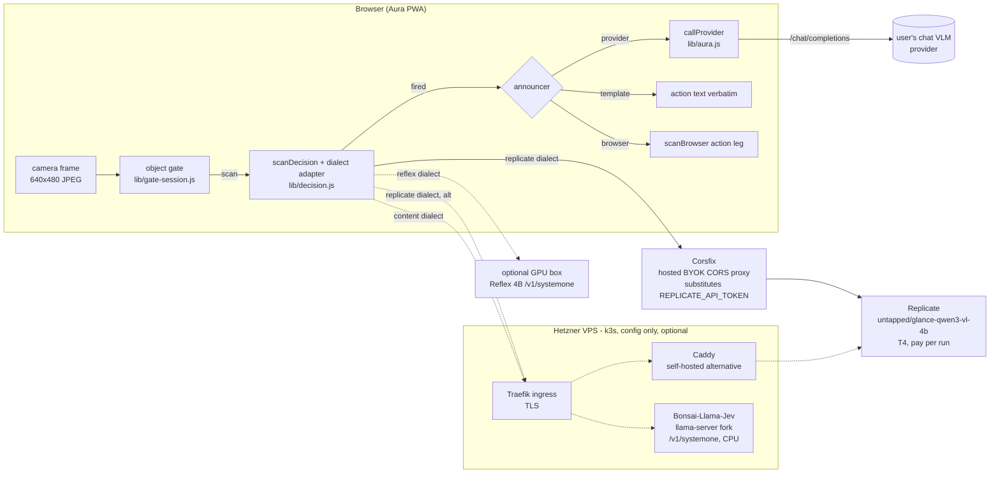
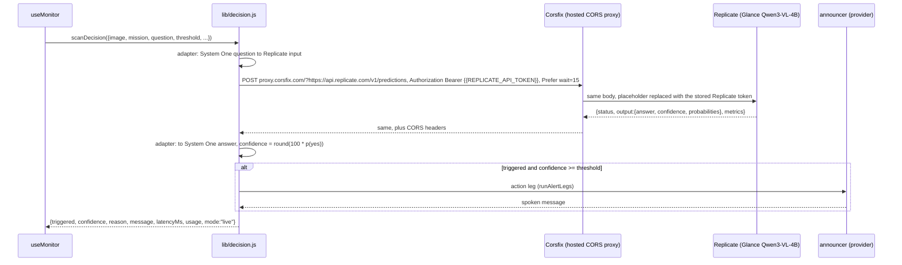

# PRD — DECISION engine: Image JevBench models as Aura's detector, remote first

Status: **proposed** · Owner: barakplasma · Scope: `lib/` + `src/` + `test/` + a
hosted BYOK CORS proxy (dashboard config); no application server of our own
Category: **remote inference**
Sources (read 2026-09-26): [Image JevBench v0.1](https://benchmarkheaven.com/image-jev-bench)
(frozen split 228 public / 456 sealed); [Glance](https://github.com/yoheinakajima/glance)
and its latency study [Glance Speedlab](https://github.com/yoheinakajima/glance-speedlab)
([report](https://glance.yohei.me/speed/))

## Problem

Every Aura scan asks one question: *does this frame satisfy the mission, and
how sure are you?* Today that question goes to a general chat VLM, which
**writes** its answer as JSON — including a confidence number it invents. That
has three costs:

1. **Latency.** Hosted VLMs answer in 1.4–4.8 s p50, with p95 tails up to 27 s
   (Image JevBench, hosted rows). The scan cadence and image freshness are
   bounded by that.
2. **Price.** A chat VLM costs $0.08–$2.06 per 1,000 decisions on the benchmark.
   Budget mode (`PRD-scan-modes.md`) converts every cent into slower scanning.
3. **Calibration.** The sensitivity slider (`threshold`) compares against a
   number the model wrote. The BROWSER engine already fixed this for itself
   with a logit margin (`lib/logprob.js`); the PROVIDER engine has no fix.

Image JevBench measures a different class of model — **typed-decision models**:
image + question + bounded options in, a *probability per option* out, from
one forward pass, no generation. That is exactly Aura's detection leg.

## What the benchmark says, filtered for Aura

Aura's scenes are closest to the benchmark's **Everyday photo** track (184
synthetic household photos, yes/no questions like *"Is the parcel visibly
damaged?"*). The core track (UI screenshots, charts, documents) matters less.

| System                         | Kind                         | Everyday sealed acc. | Overall composite | p50 / p95         | USD / 1K decisions | Weights / access                                                                                                                                                                  |
|--------------------------------|------------------------------|----------------------|-------------------|-------------------|--------------------|-----------------------------------------------------------------------------------------------------------------------------------------------------------------------------------|
| **Jev-Omni**                   | Gemma 4 12B + 256-way head   | 96.8 %               | **73.10** (#1)    | 0.076 s / 0.103 s | 0.0224             | [akhilaaa3/Jev-Omni](https://huggingface.co/akhilaaa3/Jev-Omni), Apache-2.0, ~24 GB bf16, CUDA                                                                                    |
| **Mapika decider-2b-vision**   | Qwen3.5-2B VL, letter logits | 89.5 %               | 66.77 (#2)        | 0.091 s / 0.154 s | 0.0259             | [Mapika/decider-2b-vision](https://huggingface.co/Mapika/decider-2b-vision), Apache-2.0, 4.4 GB bf16; [GGUF + mmproj](https://huggingface.co/mradermacher/decider-2b-vision-GGUF) |
| Reflex 4B                      | Qwen3.5-4B + LoRA            | 88.4 %               | 65.38 (#3)        | 0.154 s / 0.191 s | 0.0488             | [kshetrajna12/reflex](https://github.com/kshetrajna12/reflex)                                                                                                                     |
| Gemma 4 31B IT (hosted)        | chat VLM                     | 96.8 %               | 47.14             | 1.425 s / 2.868 s | 0.0816             | already reachable via the PROVIDER engine (e.g. Cerebras `gemma-4-31b`)                                                                                                           |
| Gemini 3.1 Flash Lite (hosted) | chat VLM                     | 100 %                | 9.58              | 1.799 s / 19.8 s  | 0.3888             | already reachable via the PROVIDER engine (Gemini preset)                                                                                                                         |

Readings that shape this design:

- **Jev-Omni matches the best hosted chat VLMs on everyday photos** (96.8 % vs
  96.8–100 %) at ~1/20th the latency and ~1/4–1/17th the price, with
  calibration 87.7 (vs 87.9–92.9). This is the target model.
- **decider-2b-vision is the cheap-to-host runner-up.** 2 B parameters, a
  community GGUF with a vision projector exists, so it can run under
  `llama-server` — including on CPU. It has no hosted endpoint, so it belongs
  to the self-hosted path.
- **Benchmark latency and price are warm, GPU-local numbers.** Local latency
  was adjusted (2× + 0.15 s), not measured over the internet; local price is
  GPU-seconds × a GPU-hour rate, which assumes the GPU is busy. A single Aura
  camera scanning every few seconds leaves a GPU idle >95 % of the time — see
  [Cost reality](#cost-reality).
- **The everyday-photo items are synthetic** and scored as a curated yes/no set.
  Aura's eval screen (`lib/eval.js`) is how an operator confirms any of this on
  *their* camera before trusting it.

## Glance and Speedlab: a zero-shot backend, and measured latency rules

[Glance](https://github.com/yoheinakajima/glance) (Apache-2.0) is not a trained
model. It reads yes/no, pick-one and rating answers from the answer-token
logits of a **stock, frozen** open VLM (Qwen3-VL 2B/4B/8B by default), in one
pass, and serves them over `POST /v1/decide` in TypeSafe's request shape with
an image extension. Qwen3-VL is not in the Image JevBench ranking, but Glance
publishes its own zero-shot comparison on fresh, human-labelled photos (541
yes/no questions, three sets):

| System                              | yes/no | pick-one | s / yes-no (full-size photo) | USD / 1K answers     |
|-------------------------------------|--------|----------|------------------------------|----------------------|
| Qwen3-VL-4B read by Glance (laptop) | 0.939  | 0.933    | 1.1 (0.33 on a small image)  | 0.07–0.32 rented GPU |
| Qwen3-VL-2B read by Glance          | 0.904  | 0.907    | 0.66                         | lower                |
| same 4B model writing JSON          | 0.945  | 0.930    | 1.6                          | 0.13–0.42            |
| Gemini 3.1 Flash-Lite               | 0.961  | 0.933    | 1.6–1.9                      | 0.31–0.34            |

This is the same mechanism the BROWSER engine already uses for its own
confidence (`lib/logprob.js`), just on a bigger model, on a server. It is also
the **only one of these readouts with a hosted, pay-per-run endpoint**:
[untapped/glance-qwen3-vl-4b](https://replicate.com/untapped/glance-qwen3-vl-4b)
on Replicate (T4, ~1 s, $0.00022 per run). That makes Glance on Replicate the
**default model** of this PRD: no training, stock Apache-2.0 weights, nothing
to host. Self-running it is harder: its CPU tier is dual-encoder only (the VLM
path wants CUDA ≥ 12 GB or Apple silicon ≥ 16 GB), and `glance serve` is a
single-threaded, loopback-only Flask server with no CORS or auth.

[Glance Speedlab](https://glance.yohei.me/speed/) is 21 preregistered latency
experiments on exactly Aura's loop (camera → resize → proxy → VLM readout →
scheduler), on one Apple M5. The results that change this design:

| Speedlab result                                                               | Rule for Aura                                                                                                          |
|-------------------------------------------------------------------------------|------------------------------------------------------------------------------------------------------------------------|
| Model compute dominates; base64 + JSON cost ≤ 0.1 ms p95 at 320 px            | Don't build binary transport or a custom codec. JSON + base64 through a proxy is fine.                                 |
| Several questions in one request: 2.405× faster than sequential requests      | One scan = one request carrying *all* questions about the frame (see fan-out below). Never one call per question.      |
| 8-bit: 1.381× faster, 84/84 decisions, max drift 0.039. 4-bit: drift 0.361    | A self-hosted GGUF is **Q8_0**. Q4/IQ4 variants are rejected up front, not left for the eval to find.                  |
| Fewer vision tokens / 224 px / early decoder exits: faster but change answers | No uniform token caps or truncation knobs. Frame size is an eval-screen experiment, not a default change.              |
| 2B is 2.994× faster than 4B but agrees on only 83.3 % of decisions            | A 2B model is a **fast tier with escalation**, never a silent drop-in (see cascade below).                             |
| Letter-choice scoring on a zero-shot VLM: no faster, less stable              | Zero-shot VLM backends (Glance) score options independently. Letter slots only for models trained on them (decider).   |
| Latest frame, one request in flight                                           | Already Aura's scheduler (`PRD-scan-modes.md`). Keep it; single-slot servers answer `429`/`503` and Aura never queues. |
| Temporal reuse: 95.1 % fewer inferences (synthetic)                           | Aura's object gate + stage-0 pixel diff already do this, engine-agnostically. Nothing new to build.                    |
| Timing split into capture / request / prefix / score / answer age             | Aura records any backend `timing_ms` / Replicate `metrics` next to `latencyMs`.                                        |

### What these models cannot do

They are classifiers, not chat models. They produce **no text**: no `reason`,
no spoken announcement, no webhook payload. Aura's action and webhook legs
still need a generator. That is the central design constraint: **split
*decide* from *announce*.**

## Goals

1. A new engine, `aura.engine = 'decision'`, whose detection leg calls a
   typed-decision model over HTTP and returns the same result shape as
   `scanClient()` / `scanBrowser()` — `useMonitor`, telemetry, history and the
   eval screen don't change.
2. **Remote first, config not code.** Every server-side piece is a hosted
   BYOK CORS proxy or an off-the-shelf proxy (Caddy, nginx, Traefik,
   Cloudflare) configured, not programmed, in front of an inference server
   someone else maintains. A
   backend of our own is written only where no server exists at all, and
   the trade-off is stated where it happens.
3. Confidence comes from the model's own probability of the positive option,
   so the sensitivity slider means *probability*, not a vibe.
4. The announcement leg is pluggable: PROVIDER (chat VLM, only when fired),
   BROWSER, or a plain template — so a fired alert still speaks.
5. One internal contract for every decision model: TypeSafe's System One
   request/response shape. Because no gateway normalises backends, Aura holds
   a small, pure adapter per backend dialect (see [Wire protocol](#the-wire-protocol)).

## Non-goals

- Running these models in the browser. Jev-Omni is 24 GB; decider-2b-vision in
  WebGPU is a possible later row in `lib/browser-models.js` (its readout is a
  first-step logit — the same thing `lib/logprob.js` already reads), but not
  here.
- Calling TypeSafe's hosted Jev: its documented `state` is **text only**
  ("Images, audio, and video are not supported (yet)"), which is why the
  benchmark excluded it from the image ranking.
- Replacing PROVIDER. Hosted chat VLMs stay the default and the most accurate
  option on hard scenes.
- Changing the object gate. It runs before any engine and gates this one the
  same way (`lib/gate-session.js` is engine-agnostic).

## Architecture



### Scan sequence (default path)



## The wire protocol

Inside Aura every decision is **TypeSafe's System One shape** (`docs.typesafe.ai`):
`state` + typed `questions` in, `answers` with per-option `probabilities` out.
No server translates for us — a config-only proxy can't rewrite bodies — so
`lib/decision.js` converts that shape to and from each backend's own dialect.
Each adapter is a pair of pure functions, `toRequest(row, decision)` and
`fromResponse(row, json)`, chosen by a `dialect` field on the model's row in
`lib/decision-models.js` (a row, not a branch):

| Dialect     | Backends                                          | Where the image goes                                                             | Questions per call      |
|-------------|---------------------------------------------------|----------------------------------------------------------------------------------|-------------------------|
| `replicate` | Glance Qwen3-VL-4B on Replicate                   | `input.image_base64` (plain base64); `question`, `question_type`, `options_json` | one — Aura fans out     |
| `content`   | Bonsai-Llama-Jev (`llama-server` fork)            | `state.content[{type: "image_url", image_url: {url: "data:…"}}]`                 | many, one request       |
| `reflex`    | Reflex 4B                                         | `{"type": "image", "source": "data:…"}` anywhere in `state`                      | many, one request       |
| `glance`    | a self-run `glance serve`                         | `state.images[{id: "img0", base64}]`, referenced as `` `img0` ``                 | many, one request       |
| `letter`    | decider-2b-vision GGUF on upstream `llama-server` | raw `/completion` prompt + `multimodal_data`, `n_probs`                          | one prompt per question |

The internal request, before an adapter touches it:

```json
{
  "state": { "image": "data:image/jpeg;base64,/9j/...", "context": "Front porch camera, daytime." },
  "questions": {
    "alert": {
      "type": "choice",
      "instructions": "Is a package on the doormat?",
      "criteria": { "yes": "A package is visible on the doormat", "no": "No package on the doormat" }
    }
  }
}
```

and the internal answer every adapter must produce:

```json
{
  "answers": {
    "alert": { "type": "choice", "choice": "yes", "confidence": 0.86, "probabilities": { "yes": 0.93, "no": 0.07 } }
  },
  "usage": { "decisions": 1, "predict_s": 1.05 },
  "timing_ms": { "predict": 1045, "total": 1190 }
}
```

Choices:

- **`choice` with `{yes, no}`, not `noul`.** It returns the full distribution
  and keeps multi-option missions open (below). The `replicate` adapter maps
  it to `question_type: "yes_no"` when the labels are exactly yes/no.
- **Aura's confidence is `p(yes)`, not the response's `confidence`.** TypeSafe
  distinguishes *confidence* from *probability*; the slider compares against
  `p(yes)` so `threshold = 60` means "alert when the model gives ≥ 60 % to
  yes". The reported `confidence` is kept as telemetry.
- **`reason` is synthesised**: `"p(yes) 0.93 — Is a package on the doormat?"`,
  feeding the action leg like a VLM's reason does today.
- **Adapters are where drift is caught.** Each gets golden request/response
  fixtures copied from the backend's own docs and tests, run under `node --test`.

## Mission → question

A mission is free text ("tell me when the delivery guy leaves something"). A
decision model wants one crisp yes/no question plus two option descriptions.
Three layers, first hit wins:

1. **Explicit.** A new optional `aura.decisionQuestion` field on the Mission
   screen, shown only when the engine is DECISION.
2. **Compiled once.** If a PROVIDER is configured, one chat call turns the
   mission into `{question, yes, no}` JSON; cached in localStorage keyed by a
   hash of the mission text, editable in the same field, never re-run per scan.
   Cost: one call per mission edit.
3. **Template.** `"Does the image show the following? " + mission`, with
   `yes`/`no` criteria. Always available, no network.

`lib/decision.js` exposes `buildDecisionRequest()` and
`parseDecisionResponse()` as pure functions so all three paths and the
response parsing are unit-tested under `node --test`.

## Serving: config, not code

The browser needs three things from whatever it calls: **HTTPS**, **CORS
headers** for the Aura origin, and **a secret the page doesn't hold** when
the upstream bills someone. Off-the-shelf proxies provide all three by
configuration. What they can't do is read or rewrite a request body.

### Which benchmark backends work without a new gateway

Checked 2026-09-26 against each project's own server code and docs.

| System (Image JevBench rank)          | Server that exists today                                                                                        | Images in the request?              | CORS + auth built in?                                     | What Aura needs in front                                                     | New code? |
|---------------------------------------|-----------------------------------------------------------------------------------------------------------------|-------------------------------------|-----------------------------------------------------------|------------------------------------------------------------------------------|-----------|
| Jev-Omni (#1)                         | **none** — a Python `predict()` helper, CUDA, 24 GB                                                             | —                                   | —                                                         | a server has to be written                                                   | **yes**   |
| Mapika decider-2b-vision (#2)         | decider's `serve.py` is **text-only**; a community GGUF runs under upstream `llama-server`                      | via `/completion` `multimodal_data` | `llama-server`: `--cors-origins`, `--api-key`             | TLS only (Traefik ingress); Aura renders decider's prompt (`letter` dialect) | no        |
| Reflex 4B (#3)                        | `reflex-serve` (FastAPI, Docker image), `/v1/systemone`, CUDA 16 GB                                             | yes (`reflex`)                      | bearer key yes (`--api-key`), **CORS no**                 | CORS headers: Traefik `Headers` middleware or Caddy                          | no        |
| djev-spark / djev-dev (#4, #6)        | hosted `api.djev.dev` **paused**; 26B DiffusionGemma custom runtime                                             | —                                   | —                                                         | not viable today                                                             | —         |
| Gemma 4 31B, GPT, Gemini (#5, #8–#11) | hosted chat APIs                                                                                                | yes                                 | yes                                                       | nothing — already the PROVIDER engine                                        | no        |
| Bonsai-2-27B v2 (#7)                  | [Bonsai-Llama-Jev](https://github.com/kyr0/Bonsai-Llama-Jev), a `llama-server` fork with native `/v1/systemone` | yes (`content`)                     | **both** (`--cors-origins`, `--api-key`)                  | TLS only (Traefik ingress)                                                   | no        |
| OpenJev 4B NLI v2 (#12)               | NLI scores, not probabilities (calibration 0, composite 0)                                                      | —                                   | —                                                         | not useful for a threshold                                                   | —         |
| *Glance Qwen3-VL-4B (not ranked)*     | hosted on Replicate (T4, $0.00022/run); `glance serve` self-run                                                 | yes                                 | Replicate: auth yes, **CORS no**; `glance serve`: neither | hosted BYOK CORS proxy, or Caddy/nginx (below)                               | no        |

Two findings reshape the plan:

- **The Go gateway is unnecessary.** Every viable backend except Jev-Omni is
  reachable with configuration alone.
- **Bonsai-Llama-Jev is a general `/v1/systemone` server for any GGUF VLM.**
  Its scorer is OpenJev's letter readout over the model's chat template, with
  image input, CORS and API keys built in and CPU supported. So the same
  binary can serve Bonsai-2-27B (97.9 % on the benchmark's sealed everyday
  photos, ~10 GB) or a small Qwen3-VL GGUF on the VPS CPU. It is one
  person's fork (last commit 2026-09-24): pin a commit.

### Trade-off: hosted CORS proxy vs self-hosted proxy vs a backend of our own

A hosted **BYOK CORS proxy** is a paid service that adds CORS headers and
substitutes a secret you stored with it (your Replicate token) into the
outgoing request, so the browser never holds that secret. Configured in a
dashboard, not programmed.

|                               | Hosted BYOK CORS proxy (Corsfix, corsproxy.dev, …)                                                              | Self-hosted config proxy (Caddy / nginx on k3s) | Backend of our own (HF Space ~80 lines, CF Worker ~40 lines) |
|-------------------------------|-----------------------------------------------------------------------------------------------------------------|-------------------------------------------------|--------------------------------------------------------------|
| What you run                  | **nothing** — a dashboard entry and ~$5/month                                                                   | a Caddy pod and its config on your k3s          | code: tests, dependency updates, deploys, a runtime to watch |
| Who holds the Replicate token | the vendor (encrypted at rest, per its docs) — a new custodian                                                  | a k8s Secret on your VPS                        | the Space / Worker platform                                  |
| Request bodies                | passed through                                                                                                  | passed through                                  | can validate, rewrite, aggregate                             |
| Replicate model pinning       | **no** — the version is in the body                                                                             | **no** — same reason                            | yes                                                          |
| Who can spend through it      | requests from your origin (+ a proxy key if enabled); `Origin` is forgeable outside browsers, so enable the key | holders of Aura's bearer token                  | holders of Aura's bearer token, pinned model only            |
| Secret exfiltration           | blocked only if the secret is **scoped to `api.replicate.com`** — must be configured                            | impossible — the upstream is fixed in config    | impossible                                                   |
| Limits                        | vendor's: e.g. Corsfix 20 s timeout, 5 MB body, 60 RPM on Hobby                                                 | yours                                           | platform's                                                   |
| Frames pass through           | the vendor + Replicate                                                                                          | your VPS + Replicate                            | HF or Cloudflare + Replicate                                 |
| Availability                  | the vendor's; nothing of yours to go down                                                                       | your VPS                                        | the platform's                                               |
| Switching cost                | change a URL template in Aura settings                                                                          | same                                            | same                                                         |

Verdict: **a hosted BYOK CORS proxy is the default** — it is the only option
with nothing to run, and it gives up nothing the Caddy path had (neither can
pin the model; both keep the token out of the browser). The price is a
second vendor holding the Replicate token and seeing frames in transit, which
is why the self-hosted Caddy config stays in the PRD as the fallback. Code
remains reserved for Jev-Omni (no server exists) and, optionally, for
server-side model pinning. Replicate's own pinning alternative is a
*deployment*, whose URL names one model so a path rule pins it, but
deployments bill for instance uptime, giving up $0-when-idle.

### Default: Replicate Glance 4B through a hosted BYOK CORS proxy

Replicate's API sends no CORS headers (checked: the preflight answers `200`
with no `Access-Control-Allow-*`), so the page can't call it directly.
Candidates, checked 2026-09-26:

| Service                                | Secret injection                                                                         | Scoping                                                                                   | Browser preflight for `POST` + `authorization, content-type, prefer` (anonymous probe) | Price                                                                 |
|----------------------------------------|------------------------------------------------------------------------------------------|-------------------------------------------------------------------------------------------|----------------------------------------------------------------------------------------|-----------------------------------------------------------------------|
| **[Corsfix](https://corsfix.com)**     | `{{SECRET_NAME}}` in request headers or query, substituted server-side                   | per "application": exact-match origins **and target domains** (default all — must narrow) | **passes**: `204`, echoes the origin, allows all three headers                         | Hobby $5/month (60 RPM/user, 25 GB); 20 s timeout, 5 MB body          |
| [corsproxy.dev](https://corsproxy.dev) | managed upstream headers per key, injected only when `target_host` + `path_prefix` match | key locked to allowed origins; header rules bound to host/path by design                  | `405` on `OPTIONS` — a JSON `POST` may not survive preflight; verify with a key        | free tier 100 requests/day; paid tiers not published on the docs page |
| [corsproxy.io](https://corsproxy.io)   | header rewrites on the Production plan; secret handling not documented                   | production domains per plan                                                               | `401` without a key — verify with one                                                  | Hobby $5/month, Production $29/month                                  |
| cors.sh                                | none (its key is public by design)                                                       | origin-pinned keys                                                                        | —                                                                                      | — cannot hide the Replicate token                                     |

**Recommended: Corsfix**, the only one verified to pass the browser preflight
Aura needs, with secrets and target-domain scoping documented. Setup, all in
its dashboard:

1. Create an application: origin `https://barakplasma.github.io` (plus
   `http://localhost:3000` for `npm run dev`), target domain
   **`api.replicate.com` only**. Leaving "all domains" would let anyone who can
   send your origin header route `{{REPLICATE_API_TOKEN}}` to their own server.
2. Add the secret `REPLICATE_API_TOKEN`.
3. The origin check is Corsfix's default gate, and an `Origin` header is
   trivially forged outside a browser. Its docs describe an `x-corsfix-key`
   header as an *alternative* to origin allowlisting; Phase 0 must confirm
   whether an application can *require* that key in addition to the origin.
   If it can, store it in Aura's `aura.decisionKey`. If it can't, the gate is
   the origin alone, and the realistic abuse is someone spending on your
   Replicate account — never reading the token, given step 1.

Aura then calls, with no server of ours anywhere:

```text
POST https://proxy.corsfix.com/?https://api.replicate.com/v1/predictions
  Authorization: Bearer {{REPLICATE_API_TOKEN}}   <- literal placeholder; Corsfix substitutes it
  x-corsfix-key: <aura.decisionKey>             <- only if step 3 confirms it can be required
  Prefer: wait=15                                  <- under Corsfix's 20 s timeout
  {"version": "65c82d4f…", "input": {"question": …, "question_type": "yes_no", "image_base64": …}}
```

If the prediction is not finished within the wait, Aura polls
`GET …/?https://api.replicate.com/v1/predictions/{id}` through the same proxy
until it is (cold starts). It reads `output` and `metrics.predict_time`.

In Aura this is just a **URL template plus a header template** on the
`replicate` dialect — `https://proxy.corsfix.com/?{url}` and
`Authorization: Bearer {{REPLICATE_API_TOKEN}}` — so moving to another
vendor, or to the self-hosted Caddy below (`https://decide.example.com{path}`
with the real bearer), is a settings change, not a code change.

Per the Replicate model page: an Nvidia T4, ~1 s predict (the default example:
1.05 s predict, 1.07 s total), **$0.00022 per run — $0.22 per 1,000
decisions** — and, as a public model, only predict time is billed: an idle
camera costs nothing. Cheaper than Gemini 3.1 Flash-Lite ($0.31–0.39 / 1K on
both benchmarks), with probabilities read from logits instead of written.

Costs of this path, stated up front:

- **Cold starts.** A public model scales to zero; the first scan after idle
  waits for a T4 boot (unbilled but slow; Phase 0 measures it). Aura's
  fallback-to-provider keeps the monitor alive meanwhile.
- **One run per question.** Fan-out costs one run each; the demo Space's batch
  model is no longer public. Speedlab's 2.4× batching gain doesn't apply.
- **Frames reach two third parties**: the proxy vendor in transit (Corsfix
  states it doesn't log bodies) and Replicate. Settings flags this the same
  way it flags a remote chat provider.
- **The proxy vendor holds your Replicate token.** Use a dedicated Replicate
  account or token for Aura, set a spend limit if Replicate offers one, and
  rotate the token and the proxy key like any API key.
- **Unpinned model.** See the trade-off above.
- **Vendor timeouts.** Corsfix cuts requests at 20 s, so Aura uses
  `Prefer: wait=15` and polls instead of one long wait.

### Self-hosted alternative: Caddy on k3s

For when the token and frames should not pass through a proxy vendor. Caddy,
behind the existing k3s Traefik ingress, adds CORS, checks Aura's bearer
token, allows only the prediction endpoints, caps the body size, and swaps in
the Replicate token from a k8s Secret. This file was validated with
`caddy validate` (v2.10.2) and exercised locally: preflight `204` with CORS
headers, `401` without the token or on any other path, and allowed calls
reaching Replicate with the injected token.

```caddyfile
# deploy/decision-proxy/Caddyfile. Env from a k8s Secret:
#   AURA_ORIGIN (e.g. https://barakplasma.github.io), AURA_PROXY_TOKEN
#   (what Aura sends as aura.decisionKey), REPLICATE_API_TOKEN (never leaves the pod)
:8080 {
    header Access-Control-Allow-Origin {$AURA_ORIGIN}
    header Vary Origin

    @preflight method OPTIONS
    handle @preflight {
        header Access-Control-Allow-Methods "GET, POST"
        header Access-Control-Allow-Headers "authorization, content-type, prefer"
        header Access-Control-Max-Age 600
        respond 204
    }

    @replicate {
        path /v1/predictions /v1/predictions/*
        header Authorization "Bearer {$AURA_PROXY_TOKEN}"
    }
    handle @replicate {
        request_body {
            max_size 4MB
        }
        reverse_proxy https://api.replicate.com {
            header_up Host {upstream_hostport}
            header_up Authorization "Bearer {$REPLICATE_API_TOKEN}"
        }
    }

    handle {
        respond 401
    }
}
```

The nginx equivalent is the stock image's `templates/` envsubst plus
`proxy_set_header Authorization "Bearer ${REPLICATE_API_TOKEN}"`, an
`if ($http_authorization != ...)` check and `add_header ... always` for
CORS — also config only. Traefik alone can do the CORS part (`Headers`
middleware) but can't read the Replicate token from a Secret into a header,
so Caddy stays in the chain for this path.

**Alternative with no infrastructure at all:** an operator-owned private
Hugging Face Space (~80 lines, derived from the
[demo Space](https://huggingface.co/spaces/yoheinakajima/glance-qwen3-vl-4b-demo))
that holds the Replicate token as a Space secret. Gradio's API sends CORS
headers and accepts `Authorization` cross-origin (checked). It is code, and
it adds Hugging Face as a hop and a third party — but it can pin the version
and fan out server-side. The public demo Space itself is not an option: it
takes the caller's Replicate token as an input and targets a `-batch-test`
model that now returns `404`.

**Cloudflare:** a Cloudflare Tunnel (`cloudflared` in k3s) can replace the
public ingress for any path here, config only. For Replicate specifically,
Cloudflare offers no verified config-only route: AI Gateway has a Replicate
endpoint and stored provider keys, but its CORS behaviour isn't documented and
a preflight to it returned `401` without CORS headers in a probe. The
Cloudflare-native route is a ~40-line Worker, i.e. code.

### Self-hosted, config only: Bonsai-Llama-Jev on the VPS

For frames that must stay on the operator's own infrastructure, or for $0
marginal cost: build the fork (pinned commit) as a multi-arch image, run it as
a k3s Deployment with these server flags:

```text
--mmproj <projector.gguf> --cors-origins $AURA_ORIGIN --api-key-file /secrets/keys
```

Then expose it through a plain Traefik Ingress for TLS. No proxy logic at all:
the server already speaks `/v1/systemone` with images, CORS and bearer keys.
Aura uses the `content` dialect.

Which GGUF to load is a Phase 0 measurement on the ARM CPU, not a guess:

- **Qwen3-VL-2B or -4B Instruct, Q8_0.** The same models Glance reads;
  Speedlab's rule applies (8-bit held within 0.039 probability drift, 4-bit
  drifted 0.361). Glance measured the 4B zero-shot at 0.939 on yes/no with
  its own prompt; this fork's prompt differs, so re-measure.
- **Bonsai-2-27B v2** (the benchmarked configuration, ~10 GB). Strongest on
  everyday photos, but its 0.8 s p50 was on a GPU; on ARM cores it may be
  far slower.

decider-2b-vision also runs here, config only, but on **upstream**
`llama-server` rather than the fork: the fork's readout applies the chat
template, while decider was trained on a plain layout. Aura's `letter`
adapter renders that layout (`decider/prompt.py` `build()`) itself:

```text
<__media__>Context:
{state}

Question: {instructions}
Options:
(A) {criteria.yes}
(B) {criteria.no}
Answer: (
```

and calls `POST /completion` with
`{"prompt": {"prompt_string": ..., "multimodal_data": [<base64>]}, "n_predict": 1, "n_probs": 20, "post_sampling_probs": false}`,
then renormalises the `A`/`B` logprobs from the first step. A softmax
restricted to a subset of the vocabulary equals the softmax over that
subset's logits, so this matches `VisionDecisionModel.slot_logits()` up to
quantisation.

### GPU, config only: Reflex 4B

`reflex-serve` ships a Docker image and bearer-key auth; only CORS is missing,
which a Traefik `Headers` middleware (`accessControlAllowOriginList`,
`accessControlAllowHeaders: [authorization, content-type]`) adds. It needs a
16 GB CUDA GPU, so it only makes sense on a GPU box you already have or rent
by the hour.

### The one backend that needs code: Jev-Omni

Jev-Omni has no server of any kind. Using it means writing and owning a
~100-line FastAPI wrapper around `load_jev_omni().predict(media=...,
modality="image")` that serves `/v1/systemone` (it could adopt the `reflex`
dialect so Aura needs no new adapter), plus a 24 GB+ GPU (L40S/A100 class).
That is the trade-off in its purest form: the most accurate open model on the
benchmark's everyday photos (96.8 %), bought with code, a GPU bill and
another runtime. Deferred until the eval screen shows the cheaper paths miss.

### Cost reality

The benchmark's $0.02 / 1K for Jev-Omni assumes a saturated GPU. For one
camera, worst case — a scan every 5 s, nothing skipped by the gate:

| Setup                                          | Scans / hour | Hourly cost                              | Effective $ / 1K  |
|------------------------------------------------|--------------|------------------------------------------|-------------------|
| **Default: Corsfix → Replicate Glance 4B**     | 720          | ~$0.16 + $5/month flat, $0 per idle hour | 0.22 + proxy plan |
| Caddy on k3s → Replicate Glance 4B             | 720          | ~$0.16, $0 when idle                     | 0.22              |
| Self-hosted: Bonsai-Llama-Jev on VPS CPU       | 720          | $0 marginal                              | ~0                |
| Own GPU kept warm (~$0.8–2/h), Reflex/Jev-Omni | 720          | $0.8–2                                   | $1.1–2.8          |
| Hosted Gemma 4 31B chat VLM (benchmark rate)   | 720          | ~$0.06                                   | 0.08              |
| Hosted Gemini 3.1 Flash-Lite (benchmark rate)  | 720          | ~$0.28                                   | 0.39              |

The object gate calls the engine only on scene changes and heartbeats, so
real spend is a fraction of the worst case on every row.

A cold start or outage must never silence the monitor: a `503`/timeout is a
scan failure, surfaced like any provider outage, and
`aura.decisionFallback = 'provider'` (default on when a provider is
configured) re-runs that scan on the PROVIDER engine.

## Aura changes

| File                                | Change                                                                                                                                                                                                                                                         |
|-------------------------------------|----------------------------------------------------------------------------------------------------------------------------------------------------------------------------------------------------------------------------------------------------------------|
| `lib/decision.js` (new)             | `scanDecision()`, `missionToQuestion()`, and the dialect adapters (`replicate`, `content`, `reflex`, `glance`, `letter`) as pure `toRequest` / `fromResponse` pairs, plus polling for `replicate`. Plain `fetch` + `AbortController`. Reuses `runAlertLegs()`. |
| `lib/decision-models.js` (new)      | One row per model: id, label, `dialect`, endpoint path, pinned version where one exists, max options, per-run price, benchmark snapshot with source URL + read date. A row, not a branch — same rule as `browser-models.js`.                                   |
| `lib/aura.js`                       | Export a `callProvider`-based `runProviderLeg()` so the DECISION engine can announce through the configured provider.                                                                                                                                          |
| `lib/pricing.js`                    | `perDecision` rate from the row (Replicate: $0.00022 / run) or manual; `costForUsage()` handles `usage.decisions`.                                                                                                                                             |
| `lib/eval.js`                       | Accept `engine: 'decision'` in the matrix — decision models run beside chat VLMs on the same images.                                                                                                                                                           |
| `src/hooks/useMonitor.js`           | Dispatch on `engine === 'decision'`; fallback-to-provider on transport error when enabled.                                                                                                                                                                     |
| `src/screens/SettingsScreen.jsx`    | DECISION card: endpoint URL, key, model row, announcer, fallback toggle, third-party notice when the row is hosted.                                                                                                                                            |
| `src/screens/MissionScreen.jsx`     | Decision question field + "Compile from mission" button.                                                                                                                                                                                                       |
| `src/App.jsx`                       | `providerReady` for DECISION = endpoint URL + model row; OPTIMIZE hidden (GEPA drives chat prompts, not classifiers).                                                                                                                                          |
| `src/screens/HistoryScreen.jsx`     | Show backend timing (`timing_ms` or Replicate `metrics`) next to latency when present.                                                                                                                                                                         |
| `test/decision.test.js` (new)       | Golden fixtures per dialect, the three question paths, threshold semantics, fan-out, polling, fallback, CORS/401 errors.                                                                                                                                       |
| `docs/decision-proxy.md` (new)      | Corsfix setup steps (application origins, target domain `api.replicate.com` only, secret, proxy key) and how to verify the scoping. Configuration only.                                                                                                        |
| `deploy/decision-proxy/` (optional) | The Caddyfile above, a k8s Deployment/Service/Secret/Ingress for it, and a README. Configuration only.                                                                                                                                                         |
| `deploy/bonsai-llama-jev/` (later)  | k8s manifests for the self-hosted server (image build from a pinned commit, `--cors-origins`, `--api-key-file`, Ingress). Configuration only.                                                                                                                  |

Settings keys, following the existing `aura.*` localStorage pattern:
`aura.decisionUrl`, `aura.decisionKey` (the proxy or server bearer; blank
allowed for an unauthenticated local server), `aura.decisionModel` (a row id,
which fixes the dialect), `aura.decisionAnnouncer` (`provider` | `browser` |
`template`), `aura.decisionFallback`, `aura.decisionQuestion`.

Invariants carried over from `CLAUDE.md`: no silent mock (an unreachable
endpoint throws), blank key is valid, the service worker never intercepts the
endpoint, demo mode never touches it, and the endpoint URL + model — not the
key — are what "configured" means. No Replicate token ever reaches the browser.

## Beyond yes/no (later)

The protocol already allows what chat VLMs do badly:

- **Multi-option missions.** "Who is at the door?" → `{courier, family,
  stranger, nobody}`; the alert fires on a configured subset. Jev-Omni takes
  up to 20 options well, decider ≤ 8 in its narrow layout.
- **Speculative fan-out.** One call, several questions: the mission plus
  "is the lens obstructed?" and "is the scene too dark to judge?", feeding the
  existing alert-hygiene rules (`PRD-alert-hygiene.md`). On a Glance server
  or batch model this is nearly free (Speedlab: 2.4× faster than separate
  calls, the image prefix is computed once); on the default Replicate path
  each extra question is one more $0.00022 run, sent concurrently by Aura.
- **Uncertainty cascade.** Speedlab's 2B-vs-4B result (3× faster, 83 %
  agreement) says a small model should answer the easy frames and hand off the
  rest, not replace the big one. The cascade: a small self-hosted model (a
  2B GGUF or decider-2b) → Glance 4B on Replicate → a PROVIDER chat VLM,
  each step taken only
  when `p(yes)` lands in an uncertain band (say 0.2–0.8). TypeSafe documents
  the same idea as confidence-gated routing. The band is tuned on the eval
  screen, per tier.

## Rollout

1. **Phase 0 — spike, no Aura code.** Configure Corsfix as above. First
   prove the scoping: a request through it to any host other than
   `api.replicate.com` carrying `{{REPLICATE_API_TOKEN}}` must be refused, and
   find out whether a request with a forged `Origin` but no proxy key is
   refused (step 3). Then, from a browser on the Aura
   origin, measure through it: warm p50/p95 over
   ~100 scans of 640×480 frames, cold-start time after an idle hour, and
   per-run cost from Replicate's dashboard; run the same frames through the
   current PROVIDER model for an accuracy comparison. In parallel, build the
   pinned Bonsai-Llama-Jev image and time Qwen3-VL-2B/4B Q8_0 on the VPS CPU.
   **Go / no-go for the default: warm p95 < 3 s and accuracy within 3 points
   of the current provider on the operator's own frames.** Also add benchmark
   notes to `PROVIDER_PRESETS` for the hosted chat VLMs Image JevBench
   measured (Gemma 4 31B, Gemini 3.1 Flash-Lite).
2. **Phase 1 — DECISION engine.** `lib/decision.js` with the `replicate` and
   `content` adapters + golden tests, Settings/Mission UI, fallback-to-provider,
   per-decision pricing, eval matrix support. Verify with
   `scripts/dev-gate-e2e.mjs` pointed at a counting fake endpoint.
3. **Phase 2.** `reflex` / `glance` / `letter` adapters as rows are added;
   multi-option missions, fan-out health questions, the uncertainty cascade.
4. **Only if the eval says the cheaper paths miss:** Jev-Omni, the one
   backend that needs code.

## Risks and open questions

- **Benchmark transfer.** Everyday-photo items are synthetic, curated and
  unambiguous; a porch camera at dusk is not. Mitigation: the eval screen on
  the operator's own images before switching engines.
- **Adapters drift.** With no gateway, a backend changing its dialect breaks
  Aura directly. Golden fixtures per dialect, and a row's pinned version or
  commit, keep that visible and local to one adapter.
- **Unpinned Replicate proxy.** Whoever gets past the proxy (a forged
  `Origin`, plus the proxy key if one can be required) can run any Replicate model on the operator's
  account until the key is rotated. Accepted for config-only; a Worker/Space
  or a Replicate deployment closes it at the costs listed above.
- **Proxy vendor custody.** The hosted proxy holds the Replicate token and sees
  frames. A misconfigured target domain ("all domains") turns it into a
  token-exfiltration relay — Phase 0 tests this before anything else. Small
  vendors come and go; switching is a URL template, and Caddy is the
  self-hosted fallback.
- **Model availability.** `untapped/glance-qwen3-vl-4b` is a community model
  (918 runs when read); its owner can change or delete it, as already
  happened to the demo's `-batch-test` model. Pin the version id; the Glance
  repo is Apache-2.0, so a self-pushed copy of the same Cog model is the
  fallback.
- **One-person fork.** Bonsai-Llama-Jev carries `/v1/systemone` outside
  upstream llama.cpp. Pin a commit; the `letter` path on upstream
  `llama-server` is the fallback for self-hosting.
- **GGUF and prompt fidelity** (self-hosted only). Quantisation and llama.cpp's
  image preprocessing can move probabilities; decider's layout must match its
  training byte for byte (golden test copied from `decider/prompt.py`).
- **CPU latency on ARM** is unmeasured for every self-hosted option.
- **Privacy.** On the default path frames go to Replicate — no worse than
  today's PROVIDER engine, and flagged in Settings the same way. The
  self-hosted path keeps them on the operator's own infrastructure.
- **Speedlab evidence is narrow.** One Apple M5, a fixed 84-decision suite,
  Qwen3-VL only. Its rules are defaults; Phase 0 and the eval screen re-check
  them on the VPS and on real frames.
- **Model churn.** The leaderboard is days old with ~20 requested-but-
  unmeasured candidates. Adding one is a row (and at worst a new adapter),
  never a new server.
