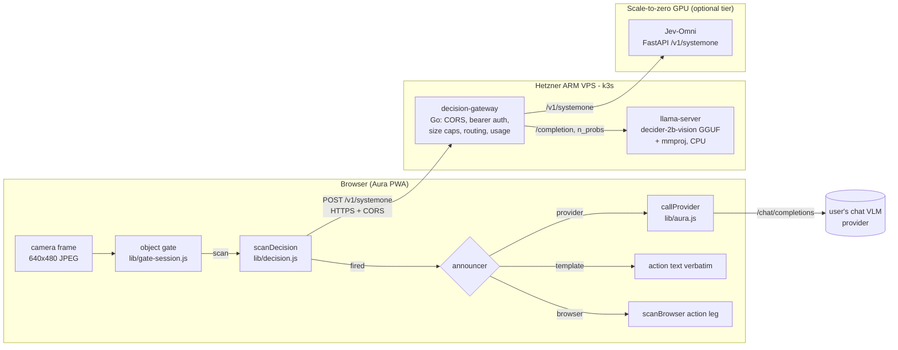
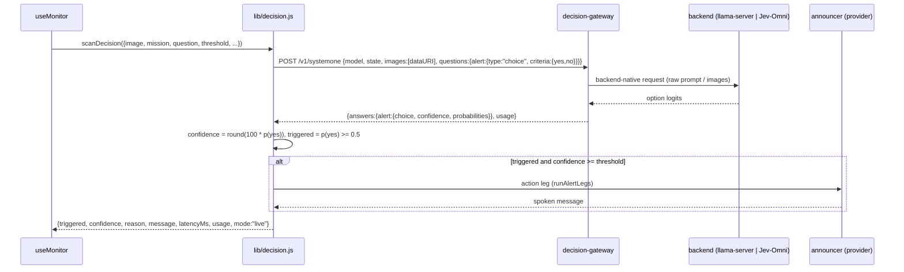

# PRD — DECISION engine: Image JevBench models as Aura's detector, remote first

Status: **proposed** · Owner: barakplasma · Scope: `lib/` + `src/` + `test/` + a
new self-hosted gateway (`deploy/decision-gateway/`)
Category: **remote inference**
Source: [Image JevBench v0.1](https://benchmarkheaven.com/image-jev-bench)
(read 2026-09-26; frozen split 228 public / 456 sealed)

## Problem

Every Aura scan asks one question: *does this frame satisfy the mission, and
how sure are you?* Today that question goes to a general chat VLM, which
**writes** its answer as JSON — including a confidence number it invents. That
has three costs:

1. **Latency.** Hosted VLMs answer in 1.4–4.8 s p50, with p95 tails up to 27 s
   (Image JevBench, hosted rows). The scan cadence and image freshness are
   bounded by that.
2. **Price.** A chat VLM costs $0.08–$2.06 per 1,000 decisions on the benchmark.
   Budget mode (`PRD-scan-modes.md`) converts every cent into slower scanning.
3. **Calibration.** The sensitivity slider (`threshold`) compares against a
   number the model wrote. The BROWSER engine already fixed this for itself
   with a logit margin (`lib/logprob.js`); the PROVIDER engine has no fix.

Image JevBench measures a different class of model — **typed-decision models**:
image + question + bounded options in, a *probability per option* out, from
one forward pass, no generation. That is exactly Aura's detection leg.

## What the benchmark says, filtered for Aura

Aura's scenes are closest to the benchmark's **Everyday photo** track (184
synthetic household photos, yes/no questions like *"Is the parcel visibly
damaged?"*). The core track (UI screenshots, charts, documents) matters less.

| System                         | Kind                          | Everyday sealed acc. | Overall composite | p50 / p95         | USD / 1K decisions | Weights / access                                                                |
|--------------------------------|-------------------------------|----------------------|-------------------|-------------------|--------------------|---------------------------------------------------------------------------------|
| **Jev-Omni**                   | Gemma 4 12B + 256-way head    | 96.8 %               | **73.10** (#1)    | 0.076 s / 0.103 s | 0.0224             | [akhilaaa3/Jev-Omni](https://huggingface.co/akhilaaa3/Jev-Omni), Apache-2.0, ~24 GB bf16, CUDA |
| **Mapika decider-2b-vision**   | Qwen3.5-2B VL, letter logits  | 89.5 %               | 66.77 (#2)        | 0.091 s / 0.154 s | 0.0259             | [Mapika/decider-2b-vision](https://huggingface.co/Mapika/decider-2b-vision), Apache-2.0, 4.4 GB bf16; [GGUF + mmproj](https://huggingface.co/mradermacher/decider-2b-vision-GGUF) |
| Reflex 4B                      | Qwen3.5-4B + LoRA             | 88.4 %               | 65.38 (#3)        | 0.154 s / 0.191 s | 0.0488             | [kshetrajna12/reflex](https://github.com/kshetrajna12/reflex)                  |
| Gemma 4 31B IT (hosted)        | chat VLM                      | 96.8 %               | 47.14             | 1.425 s / 2.868 s | 0.0816             | already reachable via the PROVIDER engine (e.g. Cerebras `gemma-4-31b`)        |
| Gemini 3.1 Flash Lite (hosted) | chat VLM                      | 100 %                | 9.58              | 1.799 s / 19.8 s  | 0.3888             | already reachable via the PROVIDER engine (Gemini preset)                      |

Readings that shape this design:

- **Jev-Omni matches the best hosted chat VLMs on everyday photos** (96.8 % vs
  96.8–100 %) at ~1/20th the latency and ~1/4–1/17th the price, with
  calibration 87.7 (vs 87.9–92.9). This is the target model.
- **decider-2b-vision is the cheap-to-host runner-up.** 2 B parameters, a
  community GGUF with a vision projector exists, so it can run under
  `llama-server` — including on CPU. This is the first model we ship against.
- **Benchmark latency and price are warm, GPU-local numbers.** Local latency
  was adjusted (2× + 0.15 s), not measured over the internet; local price is
  GPU-seconds × a GPU-hour rate, which assumes the GPU is busy. A single Aura
  camera scanning every few seconds leaves a GPU idle >95 % of the time — see
  [Cost reality](#cost-reality).
- **The everyday-photo items are synthetic** and scored as a curated yes/no set.
  Aura's eval screen (`lib/eval.js`) is how an operator confirms any of this on
  *their* camera before trusting it.

### What these models cannot do

They are classifiers, not chat models. They produce **no text**: no `reason`,
no spoken announcement, no webhook payload. Aura's action and webhook legs
still need a generator. That is the central design constraint: **split
*decide* from *announce*.**

## Goals

1. A new engine, `aura.engine = 'decision'`, whose detection leg calls a
   typed-decision model over HTTP and returns the same result shape as
   `scanClient()` / `scanBrowser()` — `useMonitor`, telemetry, history and the
   eval screen don't change.
2. **Remote first:** the model runs on a server the operator controls, reached
   over HTTPS with CORS, the same trust model as a local Ollama. The browser
   stays backend-free for everything else.
3. Confidence comes from the model's own probability of the positive option,
   so the sensitivity slider means *probability*, not a vibe.
4. The announcement leg is pluggable: PROVIDER (chat VLM, only when fired),
   BROWSER, or a plain template — so a fired alert still speaks.
5. One wire protocol for every decision model: TypeSafe's `POST /v1/systemone`
   format, which decider's own server already implements, plus an image field.

## Non-goals

- Running these models in the browser. Jev-Omni is 24 GB; decider-2b-vision in
  WebGPU is a possible later row in `lib/browser-models.js` (its readout is a
  first-step logit — the same thing `lib/logprob.js` already reads), but not
  here.
- Calling TypeSafe's hosted Jev: its documented `state` is **text only**
  ("Images, audio, and video are not supported (yet)"), which is why the
  benchmark excluded it from the image ranking.
- Replacing PROVIDER. Hosted chat VLMs stay the default and the most accurate
  option on hard scenes.
- Changing the object gate. It runs before any engine and gates this one the
  same way (`lib/gate-session.js` is engine-agnostic).

## Architecture



### Scan sequence



## The wire protocol

Aura speaks **TypeSafe's System One format** (`docs.typesafe.ai`), which
Mapika's `decider/serve.py` already serves for its text models, plus one
extension field for images. Every backend sits behind the gateway, so the
browser sees exactly one shape.

Request (what `lib/decision.js` sends):

```json
{
  "model": "decider-2b-vision",
  "state": "A home security camera frame. Operator context: front porch, daytime.",
  "images": ["data:image/jpeg;base64,/9j/..."],
  "questions": {
    "alert": {
      "type": "choice",
      "instructions": "Is a package on the doormat?",
      "criteria": { "yes": "A package is visible on the doormat", "no": "No package on the doormat" }
    }
  }
}
```

Response (TypeSafe's shape, unchanged):

```json
{
  "model": "decider-2b-vision@<sha>",
  "answers": {
    "alert": { "type": "choice", "choice": "yes", "confidence": 0.86, "probabilities": { "yes": 0.93, "no": 0.07 } }
  },
  "usage": { "input_tokens": 412, "output_tokens": 0, "decisions": 1, "gpu_ms": 0 }
}
```

Choices:

- **`choice` with `{yes, no}`, not `noul`.** Both measured models are option
  classifiers; a `choice` keeps the door open for multi-option missions later
  (below) and returns the full distribution.
- **`images` is a top-level array of data URIs.** Bonsai's System One path
  took the image inside `state`; AutoJev types it as `DecisionInput.images`.
  A top-level field is the cleaner of the two and the gateway normalises
  either.
- **Aura's confidence is `p(yes)`, not the response's `confidence`.** TypeSafe
  distinguishes *confidence* (certainty of the model) from *probability*; the
  slider compares against `p(yes)` so that `threshold = 60` means "alert when
  the model gives ≥ 60 % to yes". `answers.alert.confidence` is kept in the
  result as telemetry.
- **`reason` is synthesised**: `"p(yes) 0.93 — Is a package on the doormat?"`.
  It feeds the action leg the same way a VLM's reason does today.

## Mission → question

A mission is free text ("tell me when the delivery guy leaves something"). A
decision model wants one crisp yes/no question plus two option descriptions.
Three layers, first hit wins:

1. **Explicit.** A new optional `aura.decisionQuestion` field on the Mission
   screen, shown only when the engine is DECISION.
2. **Compiled once.** If a PROVIDER is configured, one chat call turns the
   mission into `{question, yes, no}` JSON; cached in localStorage keyed by a
   hash of the mission text, editable in the same field, never re-run per scan.
   Cost: one call per mission edit.
3. **Template.** `"Does the image show the following? " + mission`, with
   `yes`/`no` criteria. Always available, no network.

`lib/decision.js` exposes `buildDecisionRequest()` and
`parseDecisionResponse()` as pure functions so all three paths and the
response parsing are unit-tested under `node --test`.

## Serving, remote first

Aura is a static PWA, so the model has to be behind an HTTPS endpoint with
CORS open to the Aura origin. None of the measured systems ship that for
images: decider's HTTP server only serves its *text* models, Jev-Omni ships a
Python `predict()` helper and no server. So this PRD adds one small service.

### `decision-gateway` (Go)

A single static binary in `deploy/decision-gateway/`, deployed to the operator's
k3s. It is the only thing the browser talks to.

| Concern       | Behaviour                                                                                                                        |
|---------------|----------------------------------------------------------------------------------------------------------------------------------|
| CORS          | `Access-Control-Allow-Origin` = configured Aura origin(s); preflight answered locally                                             |
| Auth          | `Authorization: Bearer <token>` checked against a k8s Secret — the token lives in `aura.decisionKey`, same as a provider API key  |
| Limits        | ≤ 1 image, ≤ 2 MB decoded, ≤ 8 options, ≤ 4 questions per call; `413` / `400` otherwise                                           |
| Routing       | `model` → backend from a ConfigMap (`decider-2b-vision` → llama-server, `jev-omni` → GPU URL)                                    |
| Backends      | `llamacpp` adapter (below) and `systemone` passthrough (any server that already speaks `/v1/systemone` with `images`)            |
| Usage         | echoes backend token counts; adds `decisions` and measured backend wall-time so Aura can price per decision                     |
| `GET /v1/models` | lists routed models, so Aura's existing "Fetch models" UX works unchanged                                                     |
| Observability | Prometheus `/metrics` (latency histogram per model, errors) — no frames logged, ever                                              |

Go because the gateway is I/O glue with no ML in it; the ML stays in the
backends' own runtimes.

### Tier 1 — decider-2b-vision on llama.cpp (CPU, in k3s)

decider's readout is *the next-token logits over option letters after the
prompt*, softmaxed over the options. That is reproducible on stock
`llama-server` without Python:

1. The gateway renders decider's **plain layout** (`decider/prompt.py`
   `build()`, no chat template) with the image marker in front:

   ```text
   <__media__>Context:
   {state}

   Question: {instructions}
   Options:
   (A) {criteria.yes}
   (B) {criteria.no}
   Answer: (
   ```

2. It calls llama.cpp's native `POST /completion` with
   `{"prompt": {"prompt_string": ..., "multimodal_data": [<base64>]}, "n_predict": 1, "n_probs": 20, "post_sampling_probs": false, "temperature": 0}`.
3. From the first step's top-N it takes the logprobs of the tokens `A` and `B`
   and renormalises over just those two. A softmax restricted to a subset of
   the vocabulary is exactly the softmax over that subset's logits, so this
   matches `VisionDecisionModel.slot_logits()` bit for bit up to quantisation.
   A letter missing from the top-N gets probability ~0.

Why CPU first: the operator's VPS is an always-on ARM box that is already paid
for, so the marginal cost per decision is zero, and a 2 B model at Q8_0
(2.0 GB + 0.36 GB mmproj) fits comfortably. The open question is latency — a
640×480 frame is roughly 300 visual tokens of prefill on ARM cores; this has
to be measured, not assumed (see [Rollout](#rollout), phase 1).

### Tier 2 — Jev-Omni on scale-to-zero GPU

Jev-Omni's reference loader requires CUDA and 24 GB of bf16 weights, so it
needs an L40S/A100-class GPU. A ~100-line FastAPI wrapper around
`load_jev_omni().predict(media=..., modality="image")` exposes
`/v1/systemone` with `images`, and the gateway proxies to it with the
`systemone` adapter. Host: any scale-to-zero GPU platform that serves an HTTPS
container (Modal, RunPod serverless, Hugging Face Inference Endpoints, or a
GPU node joined to k3s). The loader already uses
`torch.load(..., weights_only=True)` for `head.pt`; the benchmark's safe-loader
concern applies to the *OmniJev* variants, not this repo — keep the pin.

### Cost reality

The benchmark's $0.02 / 1K for Jev-Omni assumes a saturated GPU. For one
camera:

| Setup                               | Scans / hour (5 s cadence) | Hourly cost                       | Effective $ / 1K |
|-------------------------------------|----------------------------|-----------------------------------|------------------|
| Tier 1, CPU on existing VPS         | 720                        | $0 marginal                       | ~0               |
| Tier 2, GPU kept warm (~$0.8–2/h)   | 720                        | $0.8–2                            | $1.1–2.8         |
| Tier 2, scale-to-zero, bursty       | depends on gate skip rate  | cold starts 30–90 s               | varies           |
| Hosted Gemma 4 31B (benchmark rate) | 720                        | ~$0.06                            | 0.08             |

So Tier 2 only pays off when **the object gate keeps it asleep** (the
DECISION engine is only called on scene changes and heartbeats) or when
several cameras share one GPU. That makes Tier 1 the default and Tier 2 a
measured upgrade — the eval screen decides, not the leaderboard.

A GPU cold start must never silence the monitor: a `503`/timeout from the
gateway is a scan failure, surfaced like any provider outage, and
`aura.decisionFallback = 'provider'` (default on when a provider is
configured) re-runs that scan on the PROVIDER engine.

## Aura changes

| File                                  | Change                                                                                                                                                                                   |
|---------------------------------------|------------------------------------------------------------------------------------------------------------------------------------------------------------------------------------------|
| `lib/decision.js` (new)               | `scanDecision()`, `fetchDecisionModels()`, pure `buildDecisionRequest()` / `parseDecisionResponse()` / `missionToQuestion()`. Browser-only APIs (`fetch`, `AbortController`). Reuses `runAlertLegs()` for announce/webhook. |
| `lib/decision-models.js` (new)        | Table of known decision models, one row each (id, label, backend hint, max options, benchmark snapshot with source URL + read date). A row, not a branch — same rule as `browser-models.js`. |
| `lib/aura.js`                         | Export `callProvider`-based `runProviderLeg()` so the DECISION engine can announce through the configured provider without duplicating request code.                                   |
| `lib/pricing.js`                      | `perDecision` rate source: gateway-reported, else the row's benchmark rate, else manual. `costForUsage()` handles `usage.decisions`.                                                  |
| `lib/eval.js`                         | Accept `engine: 'decision'` in the matrix — detection-only is already what eval runs, so decision models drop straight in beside chat VLMs on the same images.                            |
| `src/hooks/useMonitor.js`             | Dispatch on `engine === 'decision'`; fallback-to-provider on transport error when enabled.                                                                                               |
| `src/screens/SettingsScreen.jsx`      | DECISION engine card: gateway URL, token, model picker (via `/v1/models`), announcer choice, fallback toggle.                                                                             |
| `src/screens/MissionScreen.jsx`       | Decision question field + "Compile from mission" button.                                                                                                                                 |
| `src/App.jsx`                         | `providerReady` for DECISION = gateway URL + model; OPTIMIZE hidden (GEPA drives chat prompts, not classifiers).                                                                          |
| `test/decision.test.js` (new)         | Request building for all three question paths, response parsing (missing letters, malformed JSON, `choice` vs probability disagreement), threshold semantics, fallback, CORS/401 errors. |
| `deploy/decision-gateway/` (new)      | Go module, Dockerfile (multi-arch, `linux/arm64` first), k8s manifests (Deployment + Service + Ingress with TLS, ConfigMap routes, Secret token), llama-server Deployment for Tier 1.   |

Settings keys, following the existing `aura.*` localStorage pattern:
`aura.decisionUrl`, `aura.decisionKey` (blank allowed, like a local provider),
`aura.decisionModel`, `aura.decisionAnnouncer` (`provider` | `browser` |
`template`), `aura.decisionFallback`, `aura.decisionQuestion`.

Invariants carried over from `CLAUDE.md`: no silent mock (an unreachable
gateway throws), blank token is valid, the service worker never intercepts the
gateway, demo mode never touches it, and the gateway URL + model — not the
token — are what "configured" means.

## Beyond yes/no (later)

The protocol already allows what chat VLMs do badly:

- **Multi-option missions.** "Who is at the door?" → `{courier, family,
  stranger, nobody}`; the alert fires on a configured subset. Jev-Omni takes
  up to 20 options well, decider ≤ 8 in its narrow layout.
- **Speculative fan-out.** One call, several questions: the mission plus
  "is the lens obstructed?" and "is the scene too dark to judge?" — frame
  health for free, feeding the existing alert-hygiene rules
  (`PRD-alert-hygiene.md`).
- **Calibrated gating of the chat VLM.** DECISION as a cheap first pass; only
  scans with `p(yes)` in an uncertain band (say 0.2–0.8) escalate to the
  PROVIDER VLM. TypeSafe documents this as confidence-gated routing.

## Rollout

1. **Phase 0 — no code.** Add benchmark notes to `PROVIDER_PRESETS` defaults
   where a benchmarked hosted model is already reachable (Gemma 4 31B, Gemini
   3.1 Flash Lite). Spike: run decider-2b-vision Q8_0 under `llama-server` on
   the Hetzner box; record p50/p95 for 640×480 frames and check the letter
   renormalisation against the Python reference on ~50 images. **Go / no-go
   for Tier 1 is that latency** (target: p95 < 3 s).
2. **Phase 1 — Tier 1.** `lib/decision.js` + tests, gateway with `llamacpp`
   adapter, k3s manifests, Settings/Mission UI, eval matrix support. Verify
   with `scripts/dev-gate-e2e.mjs` pointed at a counting fake gateway.
3. **Phase 2 — Tier 2.** Jev-Omni FastAPI wrapper, `systemone` passthrough,
   fallback-to-provider, per-decision pricing.
4. **Phase 3.** Multi-option missions, fan-out health questions, confidence-
   gated escalation.

## Risks and open questions

- **Benchmark transfer.** Everyday-photo items are synthetic, curated and
  unambiguous; a porch camera at dusk is not. Mitigation: the eval screen on
  the operator's own images before switching engines.
- **GGUF fidelity.** Qwen3.5-VL support and image preprocessing in llama.cpp
  must match the reference processor; a quantised model can move probabilities.
  Phase 0 compares against the bf16 Python path.
- **Prompt fidelity.** decider was trained on one exact layout; any whitespace
  drift in the gateway's template changes the letter slot. The template lives
  in one Go function with a golden test copied from `decider/prompt.py`.
- **CPU latency on ARM** is unmeasured. If it misses the target, Tier 1 moves
  to a small GPU and the cost table above applies.
- **Privacy.** Frames leave the phone for the operator's own gateway, never a
  third party (Tier 1). Tier 2 on a hosted GPU platform is a third party —
  flag it in Settings the same way remote providers are flagged.
- **Model churn.** The leaderboard is days old and has ~20 requested-but-
  unmeasured candidates. The row table + passthrough adapter keeps adding one
  cheap.
