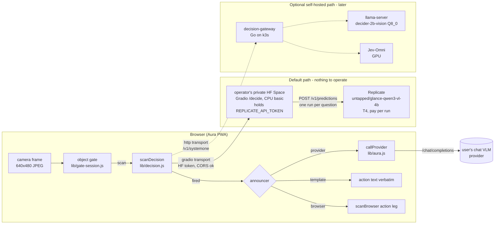
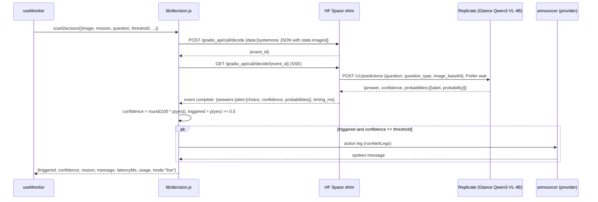

# PRD — DECISION engine: Image JevBench models as Aura's detector, remote first

Status: **proposed** · Owner: barakplasma · Scope: `lib/` + `src/` + `test/` + a
small Hugging Face Space shim (`deploy/hf-space/`); no server to operate
Category: **remote inference**
Sources (read 2026-09-26): [Image JevBench v0.1](https://benchmarkheaven.com/image-jev-bench)
(frozen split 228 public / 456 sealed); [Glance](https://github.com/yoheinakajima/glance)
and its latency study [Glance Speedlab](https://github.com/yoheinakajima/glance-speedlab)
([report](https://glance.yohei.me/speed/))

## Problem

Every Aura scan asks one question: *does this frame satisfy the mission, and
how sure are you?* Today that question goes to a general chat VLM, which
**writes** its answer as JSON — including a confidence number it invents. That
has three costs:

1. **Latency.** Hosted VLMs answer in 1.4–4.8 s p50, with p95 tails up to 27 s
   (Image JevBench, hosted rows). The scan cadence and image freshness are
   bounded by that.
2. **Price.** A chat VLM costs $0.08–$2.06 per 1,000 decisions on the benchmark.
   Budget mode (`PRD-scan-modes.md`) converts every cent into slower scanning.
3. **Calibration.** The sensitivity slider (`threshold`) compares against a
   number the model wrote. The BROWSER engine already fixed this for itself
   with a logit margin (`lib/logprob.js`); the PROVIDER engine has no fix.

Image JevBench measures a different class of model — **typed-decision models**:
image + question + bounded options in, a *probability per option* out, from
one forward pass, no generation. That is exactly Aura's detection leg.

## What the benchmark says, filtered for Aura

Aura's scenes are closest to the benchmark's **Everyday photo** track (184
synthetic household photos, yes/no questions like *"Is the parcel visibly
damaged?"*). The core track (UI screenshots, charts, documents) matters less.

| System                         | Kind                         | Everyday sealed acc. | Overall composite | p50 / p95         | USD / 1K decisions | Weights / access                                                                                                                                                                  |
|--------------------------------|------------------------------|----------------------|-------------------|-------------------|--------------------|-----------------------------------------------------------------------------------------------------------------------------------------------------------------------------------|
| **Jev-Omni**                   | Gemma 4 12B + 256-way head   | 96.8 %               | **73.10** (#1)    | 0.076 s / 0.103 s | 0.0224             | [akhilaaa3/Jev-Omni](https://huggingface.co/akhilaaa3/Jev-Omni), Apache-2.0, ~24 GB bf16, CUDA                                                                                    |
| **Mapika decider-2b-vision**   | Qwen3.5-2B VL, letter logits | 89.5 %               | 66.77 (#2)        | 0.091 s / 0.154 s | 0.0259             | [Mapika/decider-2b-vision](https://huggingface.co/Mapika/decider-2b-vision), Apache-2.0, 4.4 GB bf16; [GGUF + mmproj](https://huggingface.co/mradermacher/decider-2b-vision-GGUF) |
| Reflex 4B                      | Qwen3.5-4B + LoRA            | 88.4 %               | 65.38 (#3)        | 0.154 s / 0.191 s | 0.0488             | [kshetrajna12/reflex](https://github.com/kshetrajna12/reflex)                                                                                                                     |
| Gemma 4 31B IT (hosted)        | chat VLM                     | 96.8 %               | 47.14             | 1.425 s / 2.868 s | 0.0816             | already reachable via the PROVIDER engine (e.g. Cerebras `gemma-4-31b`)                                                                                                           |
| Gemini 3.1 Flash Lite (hosted) | chat VLM                     | 100 %                | 9.58              | 1.799 s / 19.8 s  | 0.3888             | already reachable via the PROVIDER engine (Gemini preset)                                                                                                                         |

Readings that shape this design:

- **Jev-Omni matches the best hosted chat VLMs on everyday photos** (96.8 % vs
  96.8–100 %) at ~1/20th the latency and ~1/4–1/17th the price, with
  calibration 87.7 (vs 87.9–92.9). This is the target model.
- **decider-2b-vision is the cheap-to-host runner-up.** 2 B parameters, a
  community GGUF with a vision projector exists, so it can run under
  `llama-server` — including on CPU. It has no hosted endpoint, so it belongs
  to the optional self-hosted path.
- **Benchmark latency and price are warm, GPU-local numbers.** Local latency
  was adjusted (2× + 0.15 s), not measured over the internet; local price is
  GPU-seconds × a GPU-hour rate, which assumes the GPU is busy. A single Aura
  camera scanning every few seconds leaves a GPU idle >95 % of the time — see
  [Cost reality](#cost-reality).
- **The everyday-photo items are synthetic** and scored as a curated yes/no set.
  Aura's eval screen (`lib/eval.js`) is how an operator confirms any of this on
  *their* camera before trusting it.

## Glance and Speedlab: a zero-shot backend, and measured latency rules

[Glance](https://github.com/yoheinakajima/glance) (Apache-2.0) is not a trained
model. It reads yes/no, pick-one and rating answers from the answer-token
logits of a **stock, frozen** open VLM (Qwen3-VL 2B/4B/8B by default), in one
pass, and serves them over `POST /v1/decide` in TypeSafe's request shape with
an image extension. Qwen3-VL is not in the Image JevBench ranking, but Glance
publishes its own zero-shot comparison on fresh, human-labelled photos (541
yes/no questions, three sets):

| System                              | yes/no | pick-one | s / yes-no (full-size photo) | USD / 1K answers     |
|-------------------------------------|--------|----------|------------------------------|----------------------|
| Qwen3-VL-4B read by Glance (laptop) | 0.939  | 0.933    | 1.1 (0.33 on a small image)  | 0.07–0.32 rented GPU |
| Qwen3-VL-2B read by Glance          | 0.904  | 0.907    | 0.66                         | lower                |
| same 4B model writing JSON          | 0.945  | 0.930    | 1.6                          | 0.13–0.42            |
| Gemini 3.1 Flash-Lite               | 0.961  | 0.933    | 1.6–1.9                      | 0.31–0.34            |

This is the same mechanism the BROWSER engine already uses for its own
confidence (`lib/logprob.js`), just on a bigger model, on a server. It is also
the **only one of these readouts with a hosted, pay-per-run endpoint**:
[untapped/glance-qwen3-vl-4b](https://replicate.com/untapped/glance-qwen3-vl-4b)
on Replicate (T4, ~1 s, $0.00022 per run). That makes Glance on Replicate the
**default model** of this PRD: no training, stock Apache-2.0 weights, nothing
to host. Self-running it is harder: its CPU tier is dual-encoder only (the VLM
path wants CUDA ≥ 12 GB or Apple silicon ≥ 16 GB), and `glance serve` is a
single-threaded, loopback-only Flask server with no CORS or auth.

[Glance Speedlab](https://glance.yohei.me/speed/) is 21 preregistered latency
experiments on exactly Aura's loop (camera → resize → gateway → VLM readout →
scheduler), on one Apple M5. The results that change this design:

| Speedlab result                                                               | Rule for Aura                                                                                                        |
|-------------------------------------------------------------------------------|----------------------------------------------------------------------------------------------------------------------|
| Model compute dominates; base64 + JSON cost ≤ 0.1 ms p95 at 320 px            | Don't build binary transport or a custom codec. JSON + base64 through the gateway is fine.                           |
| Several questions in one request: 2.405× faster than sequential requests      | One scan = one request carrying *all* questions about the frame (see fan-out below). Never one call per question.    |
| 8-bit: 1.381× faster, 84/84 decisions, max drift 0.039. 4-bit: drift 0.361    | A self-hosted GGUF is **Q8_0**. Q4/IQ4 variants are rejected up front, not left for the eval to find.                |
| Fewer vision tokens / 224 px / early decoder exits: faster but change answers | No uniform token caps or truncation knobs. Frame size is an eval-screen experiment, not a default change.            |
| 2B is 2.994× faster than 4B but agrees on only 83.3 % of decisions            | A 2B model is a **fast tier with escalation**, never a silent drop-in (see cascade below).                           |
| Letter-choice scoring on a zero-shot VLM: no faster, less stable              | Zero-shot VLM backends (Glance) score options independently. Letter slots only for models trained on them (decider). |
| Latest frame, one request in flight                                           | Already Aura's scheduler (`PRD-scan-modes.md`). Keep it; a self-hosted gateway returns `429` rather than queueing.   |
| Temporal reuse: 95.1 % fewer inferences (synthetic)                           | Aura's object gate + stage-0 pixel diff already do this, engine-agnostically. Nothing new to build.                  |
| Timing split into capture / request / prefix / score / answer age             | The Space (or gateway) returns `timing_ms`; Aura records it next to `latencyMs`.                                     |

### What these models cannot do

They are classifiers, not chat models. They produce **no text**: no `reason`,
no spoken announcement, no webhook payload. Aura's action and webhook legs
still need a generator. That is the central design constraint: **split
*decide* from *announce*.**

## Goals

1. A new engine, `aura.engine = 'decision'`, whose detection leg calls a
   typed-decision model over HTTP and returns the same result shape as
   `scanClient()` / `scanBrowser()` — `useMonitor`, telemetry, history and the
   eval screen don't change.
2. **Remote first, no backend to operate.** The default path uses hosted
   inference the operator already pays for per call (Replicate) and a managed
   shim (a Hugging Face Space) — nothing to deploy, patch or keep up. A
   self-hosted path stays possible for later, not required.
3. Confidence comes from the model's own probability of the positive option,
   so the sensitivity slider means *probability*, not a vibe.
4. The announcement leg is pluggable: PROVIDER (chat VLM, only when fired),
   BROWSER, or a plain template — so a fired alert still speaks.
5. One wire protocol for every decision model: TypeSafe's `POST /v1/systemone`
   format, which decider's own server already implements, plus Glance's `state.images` extension.

## Non-goals

- Running these models in the browser. Jev-Omni is 24 GB; decider-2b-vision in
  WebGPU is a possible later row in `lib/browser-models.js` (its readout is a
  first-step logit — the same thing `lib/logprob.js` already reads), but not
  here.
- Calling TypeSafe's hosted Jev: its documented `state` is **text only**
  ("Images, audio, and video are not supported (yet)"), which is why the
  benchmark excluded it from the image ranking.
- Replacing PROVIDER. Hosted chat VLMs stay the default and the most accurate
  option on hard scenes.
- Changing the object gate. It runs before any engine and gates this one the
  same way (`lib/gate-session.js` is engine-agnostic).

## Architecture



### Scan sequence



## The wire protocol

Aura speaks **TypeSafe's System One format** (`docs.typesafe.ai`), which
Mapika's `decider/serve.py` already serves for its text models, with the image
extension **Glance already publishes**: images live in `state.images` as
`{id, base64}` and questions refer to them as `` `img0` ``. Adopting an existing
extension instead of inventing one makes Glance a pure passthrough. This JSON
is Aura's internal contract whatever carries it: the default `gradio`
transport wraps it as the one string argument of a Space endpoint, and the
optional `http` transport POSTs it as-is to anything that serves
`/v1/systemone` or Glance's `/v1/decide` with CORS.

Request (what `lib/decision.js` sends):

```json
{
  "model": "glance-qwen3-vl-4b",
  "state": {
    "images": [{ "id": "img0", "base64": "/9j/..." }],
    "context": "A home security camera frame. Operator context: front porch, daytime."
  },
  "questions": {
    "alert": {
      "type": "choice",
      "instructions": "Is a package on the doormat in `img0`?",
      "criteria": { "yes": "A package is visible on the doormat", "no": "No package on the doormat" }
    }
  }
}
```

Response (TypeSafe's shape, unchanged):

```json
{
  "model": "untapped/glance-qwen3-vl-4b@65c82d4f",
  "answers": {
    "alert": { "type": "choice", "choice": "yes", "confidence": 0.86, "probabilities": { "yes": 0.93, "no": 0.07 } }
  },
  "usage": { "decisions": 1, "predict_s": 1.05 },
  "timing_ms": { "queue": 20, "predict": 1045, "total": 1190 }
}
```

Choices:

- **`choice` with `{yes, no}`, not `noul`.** It returns the full
  distribution and keeps the door open for multi-option missions later
  (below). The Space maps it to Replicate's `question_type: "yes_no"` when the
  labels are exactly yes/no, else `"choice"` with `options_json`.
- **Images follow Glance: `state.images[{id, base64}]`, referenced as
  `` `img0` ``.** Glance's `/v1/decide` accepts this unchanged. Bonsai's
  System One path put a data URI inside `state` and AutoJev types it as
  `DecisionInput.images`; the Space (or a later gateway) unpacks it for
  whatever it calls — the Replicate model takes plain `image_base64`.
- **`timing_ms` is passed through** when the backend reports it (Glance does),
  so the latency Aura shows can be split into image prefix and scoring.
- **Aura's confidence is `p(yes)`, not the response's `confidence`.** TypeSafe
  distinguishes *confidence* (certainty of the model) from *probability*; the
  slider compares against `p(yes)` so that `threshold = 60` means "alert when
  the model gives ≥ 60 % to yes". `answers.alert.confidence` is kept in the
  result as telemetry.
- **`reason` is synthesised**: `"p(yes) 0.93 — Is a package on the doormat?"`.
  It feeds the action leg the same way a VLM's reason does today.

## Mission → question

A mission is free text ("tell me when the delivery guy leaves something"). A
decision model wants one crisp yes/no question plus two option descriptions.
Three layers, first hit wins:

1. **Explicit.** A new optional `aura.decisionQuestion` field on the Mission
   screen, shown only when the engine is DECISION.
2. **Compiled once.** If a PROVIDER is configured, one chat call turns the
   mission into `{question, yes, no}` JSON; cached in localStorage keyed by a
   hash of the mission text, editable in the same field, never re-run per scan.
   Cost: one call per mission edit.
3. **Template.** `"Does the image show the following? " + mission`, with
   `yes`/`no` criteria. Always available, no network.

`lib/decision.js` exposes `buildDecisionRequest()` and
`parseDecisionResponse()` as pure functions so all three paths and the
response parsing are unit-tested under `node --test`.

## Serving, remote first, without a backend

Aura is a static PWA, so whatever it calls must answer the browser with CORS
headers. Three hosted options exist today for Glance's Qwen3-VL-4B readout,
checked 2026-09-26:

| Option                                                                                                                               | Browser can call it?                                                                                                                  | Verdict                                                                                                                                                                            |
|--------------------------------------------------------------------------------------------------------------------------------------|---------------------------------------------------------------------------------------------------------------------------------------|------------------------------------------------------------------------------------------------------------------------------------------------------------------------------------|
| Replicate API directly ([untapped/glance-qwen3-vl-4b](https://replicate.com/untapped/glance-qwen3-vl-4b))                            | **No.** `api.replicate.com` answers the CORS preflight with `200` and no `Access-Control-Allow-*` headers, so every browser blocks it | The model to call, but not from the page                                                                                                                                           |
| The public demo Space ([yoheinakajima/glance-qwen3-vl-4b-demo](https://huggingface.co/spaces/yoheinakajima/glance-qwen3-vl-4b-demo)) | Yes (Gradio echoes the origin, allows `authorization, content-type`)                                                                  | Template only: it takes the caller's Replicate token as an input (a third party would see it on every scan), and it targets a `-batch-test` model that is no longer public (`404`) |
| **A private copy of that Space, owned by the operator**                                                                              | Yes, same Gradio CORS; private Spaces take `Authorization: Bearer hf_…`                                                               | **Default.** The Replicate token is a Space secret, never in the browser                                                                                                           |

### Default: operator's private Space → Replicate

The operator duplicates a ~80-line Space that lives in this repo
(`deploy/hf-space/app.py`, derived from the demo's `app.py`) into their own
Hugging Face account, marks it private, and sets one secret,
`REPLICATE_API_TOKEN`. It runs on free CPU-basic hardware; the GPU is
Replicate's.

The Space exposes one Gradio API endpoint, `decide(request_json: str) -> dict`:

1. Parse Aura's System One JSON (above); reject > 1 image, > 5 MB, > 4
   questions, > 16 options.
2. For each question, `POST https://api.replicate.com/v1/predictions` with the
   pinned version (`65c82d4f…`, not "latest", so a model update can't move
   the probabilities under a tuned threshold), `Prefer: wait=60`, and input
   `{question, question_type, options_json, image_base64}`. Questions run
   concurrently.
3. Map each `{answer, confidence, probabilities: [{label, probability}]}` to
   the TypeSafe answer shape and return `answers`, `usage` (`decisions`,
   `predict_s` from the prediction's `metrics.predict_time`) and `timing_ms`.

Aura's `gradio` transport, with plain `fetch` (no `@gradio/client`
dependency):

```text
POST {space}/gradio_api/call/decide   {"data": ["<request JSON>"]}  -> {"event_id": "..."}
GET  {space}/gradio_api/call/decide/{event_id}                       -> SSE; take the "complete" event's data[0]
```

with `Authorization: Bearer <hf token>` on both when the Space is private.
The HF token (a fine-grained, read-only token scoped to that one Space) is
stored like a provider key, in `aura.decisionKey`.

What the operator gets, per the Replicate model page: an Nvidia T4, ~1 s
predict time (the default example: 1.05 s predict, 1.07 s total), **$0.00022
per run — $0.22 per 1,000 decisions**, and, because it is a public model, only
predict time is billed: an idle camera costs nothing. That is cheaper than
Gemini 3.1 Flash-Lite ($0.31–0.39 / 1K on both benchmarks) with calibrated
probabilities instead of written ones, at the price of Glance's ~2-point
zero-shot gap on yes/no.

Costs of this path, stated up front:

- **Cold starts.** A public Replicate model scales to zero; the first scan
  after an idle period waits for a T4 boot (unbilled, but slow — Phase 0
  measures it). `Prefer: wait=60` plus Aura's fallback-to-provider keeps the
  monitor alive meanwhile.
- **Two hops.** Browser → Space → Replicate adds network time on top of the
  ~1 s predict. Still inside the 1.4–4.8 s p50 of hosted chat VLMs; Phase 0
  measures the real p50/p95.
- **One run per question.** The public model takes one question per run, so
  fan-out (below) costs one run each; the batch variant the demo used is not
  public. Speedlab's 2.4× batching gain is not available on this path.
- **Third parties see frames.** Hugging Face (the Space) and Replicate both
  receive the image. Settings flags this exactly like a remote provider.
- **The Space sleeps** on free hardware after a long idle period (48 h); it
  wakes on the next request, slowly. An active monitor keeps it awake.

ZeroGPU (running Glance inside the Space on HF's shared GPUs) would remove
Replicate, but it needs a PRO account and is metered by a daily GPU quota —
a monitor that scans all day would exhaust it. Not the default.

### Optional, later: self-hosted path

Everything below is only needed if the hosted path fails on cost, latency or
privacy for a particular operator (for example frames that must not leave the
operator's own infrastructure). It is kept because it is the only way to run
decider-2b-vision or Jev-Omni, which have no hosted endpoint.

#### `decision-gateway` (Go)

A single static binary in `deploy/decision-gateway/`, deployed to the operator's
k3s. It is the only thing the browser talks to on this path, via the `http`
transport.

| Concern          | Behaviour                                                                                                                        |
|------------------|----------------------------------------------------------------------------------------------------------------------------------|
| CORS             | `Access-Control-Allow-Origin` = configured Aura origin(s); preflight answered locally                                            |
| Auth             | `Authorization: Bearer <token>` checked against a k8s Secret — the token lives in `aura.decisionKey`, same as a provider API key |
| Limits           | ≤ 1 image, ≤ 2 MB decoded, ≤ 8 options, ≤ 4 questions per call; `413` / `400` otherwise                                          |
| Routing          | `model` → backend from a ConfigMap (`decider-2b-vision` → llama-server, `jev-omni` / `glance-qwen3vl-4b` → GPU URL)              |
| Backends         | `llamacpp` adapter (below), `glance` passthrough (`/v1/decide`, same body), `systemone` passthrough for Jev-Omni's wrapper       |
| Concurrency      | one in-flight request per backend (Glance and llama-server slots are single-request); a second gets `429`, never a queue         |
| Usage            | echoes backend token counts; adds `decisions` and measured backend wall-time so Aura can price per decision                      |
| `GET /v1/models` | lists routed models, so Aura's existing "Fetch models" UX works unchanged                                                        |
| Observability    | Prometheus `/metrics` (latency histogram per model, errors) — no frames logged, ever                                             |

Go because the gateway is I/O glue with no ML in it; the ML stays in the
backends' own runtimes.

#### decider-2b-vision on llama.cpp (CPU, in k3s)

decider's readout is *the next-token logits over option letters after the
prompt*, softmaxed over the options. That is reproducible on stock
`llama-server` without Python:

1. The gateway renders decider's **plain layout** (`decider/prompt.py`
   `build()`, no chat template) with the image marker in front:

   ```text
   <__media__>Context:
   {state}

   Question: {instructions}
   Options:
   (A) {criteria.yes}
   (B) {criteria.no}
   Answer: (
   ```

2. It calls llama.cpp's native `POST /completion` with
   `{"prompt": {"prompt_string": ..., "multimodal_data": [<base64>]}, "n_predict": 1, "n_probs": 20, "post_sampling_probs": false, "temperature": 0}`.
3. From the first step's top-N it takes the logprobs of the tokens `A` and `B`
   and renormalises over just those two. A softmax restricted to a subset of
   the vocabulary is exactly the softmax over that subset's logits, so this
   matches `VisionDecisionModel.slot_logits()` bit for bit up to quantisation.
   A letter missing from the top-N gets probability ~0.

Why CPU first: the operator's VPS is an always-on ARM box that is already paid
for, so the marginal cost per decision is zero, and a 2 B model at Q8_0
(2.0 GB + 0.36 GB mmproj) fits comfortably. **Q8_0, not smaller:** Speedlab
measured 8-bit within 0.039 of full-precision probabilities and 4-bit at 0.361,
enough to flip decisions — and the slider reads these probabilities directly.
The open question is latency — a
640×480 frame is roughly 300 visual tokens of prefill on ARM cores; this has
to be measured, not assumed (see [Rollout](#rollout), phase 1).

#### Jev-Omni on a GPU

Jev-Omni is the accuracy target (96.8 % on the benchmark's everyday photos)
and has no hosted endpoint. Its reference loader requires CUDA and 24 GB of bf16 weights, so it
needs an L40S/A100-class GPU. A ~100-line FastAPI wrapper around
`load_jev_omni().predict(media=..., modality="image")` exposes
`/v1/systemone` with `state.images`, and the gateway proxies to it with the
`systemone` adapter. Host: any scale-to-zero GPU platform that serves an HTTPS
container (Modal, RunPod serverless, Hugging Face Inference Endpoints, or a
GPU node joined to k3s). The loader already uses
`torch.load(..., weights_only=True)` for `head.pt`; the benchmark's safe-loader
concern applies to the *OmniJev* variants, not this repo — keep the pin.

### Cost reality

The benchmark's $0.02 / 1K for Jev-Omni assumes a saturated GPU. For one
camera, at the worst case of a scan every 5 s with nothing skipped by the gate:

| Setup                                         | Scans / hour | Hourly cost          | Effective $ / 1K |
|-----------------------------------------------|--------------|----------------------|------------------|
| **Default: Space → Replicate Glance 4B**      | 720          | ~$0.16, $0 when idle | 0.22             |
| Self-hosted: decider on existing VPS CPU      | 720          | $0 marginal          | ~0               |
| Self-hosted: own GPU kept warm (~$0.8–2/h)    | 720          | $0.8–2               | $1.1–2.8         |
| Hosted Gemma 4 31B chat VLM (benchmark rate)  | 720          | ~$0.06               | 0.08             |
| Hosted Gemini 3.1 Flash-Lite (benchmark rate) | 720          | ~$0.28               | 0.39             |

The object gate calls the engine only on scene changes and heartbeats, so real
spend is a fraction of the worst case on every row. Per-run billing is what
makes the default path work without a backend: nobody pays for an idle GPU.

A cold start must never silence the monitor: a `503`/timeout from the Space
(or gateway) is a scan failure, surfaced like any provider outage, and
`aura.decisionFallback = 'provider'` (default on when a provider is
configured) re-runs that scan on the PROVIDER engine.

## Aura changes

| File                               | Change                                                                                                                                                                                                                  |
|------------------------------------|-------------------------------------------------------------------------------------------------------------------------------------------------------------------------------------------------------------------------|
| `lib/decision.js` (new)            | `scanDecision()`, pure `buildDecisionRequest()` / `parseDecisionResponse()` / `missionToQuestion()`, and two transports: `gradio` (call + SSE, plain `fetch`) and `http`. Reuses `runAlertLegs()` for announce/webhook. |
| `lib/decision-models.js` (new)     | Table of known decision models, one row each (id, label, backend hint, max options, benchmark snapshot with source URL + read date). A row, not a branch — same rule as `browser-models.js`.                            |
| `lib/aura.js`                      | Export `callProvider`-based `runProviderLeg()` so the DECISION engine can announce through the configured provider without duplicating request code.                                                                    |
| `lib/pricing.js`                   | `perDecision` rate source: the row's rate (Replicate: $0.00022 / run), else manual. `costForUsage()` handles `usage.decisions`.                                                                                         |
| `lib/eval.js`                      | Accept `engine: 'decision'` in the matrix — detection-only is already what eval runs, so decision models drop straight in beside chat VLMs on the same images.                                                          |
| `src/hooks/useMonitor.js`          | Dispatch on `engine === 'decision'`; fallback-to-provider on transport error when enabled.                                                                                                                              |
| `src/screens/SettingsScreen.jsx`   | DECISION engine card: Space URL (or `owner/space`), HF token, transport (`gradio` default, `http` for self-hosted), announcer choice, fallback toggle, third-party notice.                                              |
| `src/screens/MissionScreen.jsx`    | Decision question field + "Compile from mission" button.                                                                                                                                                                |
| `src/App.jsx`                      | `providerReady` for DECISION = endpoint URL set; OPTIMIZE hidden (GEPA drives chat prompts, not classifiers).                                                                                                           |
| `src/screens/HistoryScreen.jsx`    | Show the backend's `timing_ms` split (prefix / score) and answer age next to latency when present.                                                                                                                      |
| `test/decision.test.js` (new)      | Request building for all three question paths, response parsing (missing letters, malformed JSON, `choice` vs probability disagreement), threshold semantics, fallback, CORS/401 errors.                                |
| `deploy/hf-space/` (new)           | `app.py` (Gradio `decide` endpoint → Replicate, pinned version), `requirements.txt`, README with the duplicate → private → secret steps. The only server-side code on the default path.                                 |
| `deploy/decision-gateway/` (later) | Only for the self-hosted path: Go module, multi-arch Dockerfile, k8s manifests, llama-server Deployment.                                                                                                                |

Settings keys, following the existing `aura.*` localStorage pattern:
`aura.decisionUrl`, `aura.decisionTransport` (`gradio` | `http`),
`aura.decisionKey` (HF token; blank allowed for a public Space or a local
server), `aura.decisionModel`, `aura.decisionAnnouncer` (`provider` |
`browser` | `template`), `aura.decisionFallback`, `aura.decisionQuestion`.

Invariants carried over from `CLAUDE.md`: no silent mock (an unreachable Space
throws), blank token is valid, the service worker never intercepts the Space,
demo mode never touches it, and the endpoint URL — not the token — is what
"configured" means. No Replicate token ever reaches the browser.

## Beyond yes/no (later)

The protocol already allows what chat VLMs do badly:

- **Multi-option missions.** "Who is at the door?" → `{courier, family,
  stranger, nobody}`; the alert fires on a configured subset. Jev-Omni takes
  up to 20 options well, decider ≤ 8 in its narrow layout.
- **Speculative fan-out.** One call, several questions: the mission plus
  "is the lens obstructed?" and "is the scene too dark to judge?", feeding the
  existing alert-hygiene rules (`PRD-alert-hygiene.md`). On a Glance server
  or batch model this is nearly free (Speedlab: 2.4× faster than separate
  calls, the image prefix is computed once); on the default Replicate path
  each extra question is one more $0.00022 run, run concurrently.
- **Uncertainty cascade.** Speedlab's 2B-vs-4B result (3× faster, 83 %
  agreement) says a small model should answer the easy frames and hand off the
  rest, not replace the big one. The cascade: Glance 4B on Replicate → a
  PROVIDER chat VLM (and, if self-hosted, decider-2b below it or Jev-Omni
  beside it), each step taken only
  when `p(yes)` lands in an uncertain band (say 0.2–0.8). TypeSafe documents
  the same idea as confidence-gated routing. The band is tuned on the eval
  screen, per tier.

## Rollout

1. **Phase 0 — spike, no Aura code.** Write `deploy/hf-space/app.py`,
   duplicate it privately, set the secret. From a browser on the Aura origin,
   measure: CORS on the *private* Space with an HF token, warm p50/p95 over
   ~100 scans of 640×480 frames, cold-start time after an idle hour, and
   per-run cost from Replicate's dashboard. Run the same frames through the
   current PROVIDER model for an accuracy comparison. **Go / no-go: warm p95
   < 3 s and accuracy within 3 points of the current provider on the
   operator's own frames.** Also add benchmark notes to `PROVIDER_PRESETS`
   for the hosted chat VLMs Image JevBench measured (Gemma 4 31B, Gemini 3.1
   Flash-Lite).
2. **Phase 1 — DECISION engine on the default path.** `lib/decision.js` with
   the `gradio` transport + tests, Settings/Mission UI, fallback-to-provider,
   per-decision pricing, eval matrix support. Verify with
   `scripts/dev-gate-e2e.mjs` pointed at a counting fake Space.
3. **Phase 2.** Multi-option missions, fan-out health questions, the
   uncertainty cascade, `timing_ms` in history.
4. **Only if Phase 0 or real use says so — self-hosted path.** The `http`
   transport, the Go gateway, decider-2b-vision on llama.cpp (with its own
   latency and drift gate: no decision flips, max drift ≤ 0.10, p95 < 3 s on
   the VPS), then Jev-Omni.

## Risks and open questions

- **Benchmark transfer.** Everyday-photo items are synthetic, curated and
  unambiguous; a porch camera at dusk is not. Mitigation: the eval screen on
  the operator's own images before switching engines.
- **Replicate cannot be called from the browser.** Verified: no CORS headers
  on `api.replicate.com`, which is why a Space shim exists at all. If
  Replicate ever adds CORS, the `http` transport could call it directly and
  the Space goes away — but the Replicate token would then live in the
  browser, like provider keys do today.
- **Model availability.** `untapped/glance-qwen3-vl-4b` is a community model
  (918 runs at the time of reading); its owner can change or delete it, as
  already happened to the demo's `-batch-test` model. Pin the version id,
  and keep `deploy/hf-space/` able to point at a self-pushed copy of the
  same Cog model (the Glance repo is Apache-2.0).
- **GGUF fidelity** (self-hosted path only). Qwen3.5-VL support and image preprocessing in llama.cpp
  must match the reference processor; a quantised model can move probabilities.
  Phase 0 compares against the bf16 Python path.
- **Prompt fidelity.** decider was trained on one exact layout; any whitespace
  drift in the gateway's template changes the letter slot. The template lives
  in one Go function with a golden test copied from `decider/prompt.py`.
- **CPU latency on ARM** (self-hosted path only) is unmeasured. If it misses
  the target, decider moves to a small GPU and the cost table above applies.
- **Privacy.** On the default path frames go to two third parties, Hugging
  Face and Replicate — no worse than today's PROVIDER engine, and flagged in
  Settings the same way. The self-hosted path is the answer for frames that
  must stay on the operator's own infrastructure.
- **Glance serving model.** `glance serve` is synchronous and single-request,
  and its VLM path is not supported on CPU — another reason the default path
  uses Replicate's hosted copy rather than a self-run Glance server.
- **Speedlab evidence is narrow.** One Apple M5, a fixed 84-decision suite,
  Qwen3-VL only. The rules above are adopted as defaults, and the eval screen
  plus Phase 0 are where they are re-checked on the VPS and on real frames.
- **Model churn.** The leaderboard is days old and has ~20 requested-but-
  unmeasured candidates. The row table + passthrough adapter keeps adding one
  cheap.
