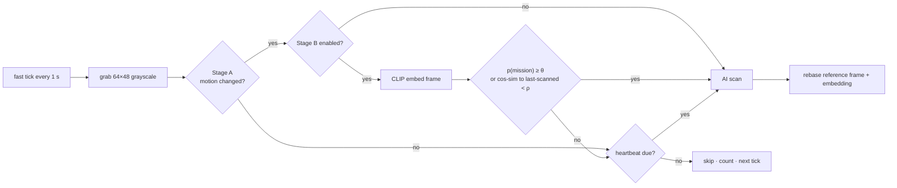

# PRD — Local pre-filters: motion gate + CLIP semantic gate

Status: draft · Owner: barakplasma · Scope: `lib/` + `src/` + `test/`
Category: **in-browser inference**
Depends on: worker + offline plumbing from `PRD-browser-engine.md` (stage B only)

## Problem

Almost every scan is wasted. A camera pointed at a door sees the same empty
hallway for 99 % of the day, and Aura pays a full vision-model call (tokens,
latency, battery, mobile data) to be told "nothing notable" each time. The
existing scan modes trade cadence against cost, but they are blind: a 5 s
interval scans an unchanged scene 720 times an hour and can still miss the
10 s a courier is actually at the door.

`PRD-scan-modes.md` already researched the fix ("Ultra-budget mode:
motion-gated scanning") and rejected every library in favour of a ~25-line
canvas diff. This PRD specifies it, and adds a second, smarter gate that runs a
tiny CLIP model locally to ask "does this frame plausibly match the mission?"
before the expensive model is called at all.

## Goals

- Send the vision model only frames that changed (stage A) and, optionally,
  only frames that look relevant to the mission (stage B).
- Cut cloud spend by an order of magnitude on static scenes with no loss of
  the alerts that matter, and *increase* effective vigilance: check cheaply
  every second, scan expensively only when something happens.
- Everything measurable: skip counts, gate scores, and a way to calibrate the
  thresholds on the operator's own labeled frames.

## Non-goals

- Replacing the vision model. Gates only decide *whether* to call it; they
  never raise an alert themselves.
- Object tracking, zones, or line-crossing rules.

## Design



### Loop shape

Two cadences replace today's single `setTimeout(tick, gapMs)`:

- **Fast tick** (`GATE_INTERVAL_MS = 1000`, ~sub-millisecond of work): grab a
  downscaled frame, run the enabled gates, decide.
- **AI scan**: unchanged — serial, fresh 640×480 capture at send time,
  `computeGapMs()` still floors the cadence between AI scans by mode. A gate
  "pass" while an AI scan is in flight or inside the mode's gap is simply
  queued: the next AI scan happens as soon as the gap allows.

With gates off the loop degenerates to today's behaviour exactly (every fast
tick passes), so the change is safe by construction.

### Stage A — motion gate (`lib/motion.js`, pure)

Per `PRD-scan-modes.md`, no library:

```text
toGray(rgba, w, h)                          → Uint8ClampedArray (w×h)
motionScore(gray, refGray, { noiseFloor })  → fraction of pixels whose |Δ| after mean-brightness subtraction > noiseFloor
isSceneChanged(score, prevScore, { minArea, persist }) → both of the last `persist` checks ≥ minArea
```

- A dedicated hidden 64×48 canvas with `getContext('2d', { willReadFrequently:
  true })` — never the GPU-backed 640×480 capture canvas.
- Subtract the mean-brightness delta before thresholding (auto-exposure and
  white-balance swings are the top false-motion source); require the change
  to persist across two consecutive checks.
- Reference frame = the last frame that was **actually AI-scanned**; rebased
  on every AI scan, camera flip, and source switch.
- **Heartbeat**: an AI scan every `heartbeatMin` minutes (default 5)
  regardless of gates, so gradual change (smoke, a pot boiling over, a light
  left on) is never missed.
- Sensitivity presets map to constants: LOW (`minArea 0.10, noiseFloor 32`),
  MEDIUM (`0.05, 24`), HIGH (`0.02, 16`).

### Stage B — CLIP semantic gate (`lib/clip-gate.js`, pure + worker task)

Runs on the shared `src/workers/ml.worker.js` from `PRD-browser-engine.md`
as task `clip`, model `Xenova/mobileclip_s0` (Apple MobileCLIP-S0, ONNX, tens
of MB, built for phones; `Xenova/clip-vit-base-patch16` as the larger option).
One image embedding per passing stage-A frame gives two signals for free:

1. **Zero-shot relevance** — cosine similarity between the frame embedding and
   text embeddings computed once per mission change:
   - positive: `a photo of {mission}` plus optional operator-supplied
     positive phrases
   - negatives: `an empty scene`, `nothing happening`, plus optional
     operator-supplied negatives
   - `pMission = softmax(sims × 100)[positive]` (CLIP's logit scale).
2. **Semantic change** — cosine similarity to the embedding of the last
   AI-scanned frame; below `ρ` counts as "the scene is different now" even
   when pixel motion was small (a parcel appeared, a door opened), and above
   `ρ` suppresses lighting-only changes that fooled stage A.

```text
buildLabelPrompts(mission, positives, negatives)  → string[]
cosine(a, b)                                      → number
gateDecision({ pMission, simToLast }, { theta, rho, heartbeatDue }) → { pass, why }
```

- Thresholds default to `θ = 0.30`, `ρ = 0.97`; both exposed as sliders, but
  the intended way to set them is the calibration below.
- The gate never *blocks* a heartbeat and never runs with the browser VLM
  engine's WASM fallback on a phone (too slow to be worth it) — it disables
  itself with a status hint.
- WebGPU cost is ~20–50 ms per frame at 224 px; on WASM ~300–600 ms, still
  under the 1 s fast tick on a laptop.

### Calibration in the eval screen

The eval store already holds labeled sample images (expected true/false).
EvalScreen gains a GATE CALIBRATION panel: embed every sample once, plot
`pMission` per image coloured by label, and report for a chosen `θ` the
**false-skip rate** (expected-true frames the gate would drop — must be 0) and
the **skip rate** (expected-false frames saved). A SET θ button writes the
value. This is the safety net that makes stage B trustworthy: the operator
sees exactly which of their own frames would never reach the model.

## Telemetry

| Row      | Meaning                                                                            |
|----------|------------------------------------------------------------------------------------|
| GATE     | last decision: `motion 0.00` / `pass motion 0.12` / `pass clip 0.41` / `heartbeat` |
| SKIPPED  | fast ticks skipped since arm (and % of ticks)                                      |
| SCANS/HR | unchanged, but now reflects actual AI calls                                        |

Missed-frame rows in History carry the gate scores so a false negative can be
traced to a gate instead of the model.

## Settings

Settings → SCAN TIMING gains a PRE-FILTERS group (applies to every mode):

| Control                     | Key                                         | Default    | UI                                                |
|-----------------------------|---------------------------------------------|------------|---------------------------------------------------|
| MOTION GATE                 | `aura.motionGate`                           | `false`    | checkbox                                          |
| SENSITIVITY                 | `aura.motionSens`                           | `'medium'` | LOW / MEDIUM / HIGH segments                      |
| HEARTBEAT EVERY             | `aura.heartbeatMin`                         | `5`        | number (minutes), applies to both gates           |
| SEMANTIC GATE               | `aura.clipGate`                             | `false`    | checkbox; needs the ML worker; shows model status |
| MATCH THRESHOLD θ           | `aura.clipTheta`                            | `0.30`     | slider 0–1, "calibrate in EVAL" link              |
| CHANGE THRESHOLD ρ          | `aura.clipRho`                              | `0.97`     | slider 0.8–1                                      |
| POSITIVE / NEGATIVE PHRASES | `aura.clipPositives` / `aura.clipNegatives` | `''`       | one per line                                      |

## Files

| Path                             | Change                                                                                                                  |
|----------------------------------|-------------------------------------------------------------------------------------------------------------------------|
| `lib/motion.js`                  | new, pure                                                                                                               |
| `lib/clip-gate.js`               | new, pure decision + label building; worker calls via facade                                                            |
| `lib/browser-engine.js`          | `embedImage()`, `embedTexts()` on the shared worker facade                                                              |
| `src/workers/ml.worker.js`       | `clip` task: `CLIPVisionModelWithProjection` / text model                                                               |
| `src/hooks/useMonitor.js`        | fast tick, gate state, reference rebase, skip telemetry                                                                 |
| `src/hooks/useMonitor.js`        | gate canvas (64×48, willReadFrequently) alongside capture canvas                                                        |
| `src/screens/SettingsScreen.jsx` | PRE-FILTERS group                                                                                                       |
| `src/screens/MonitorScreen.jsx`  | GATE / SKIPPED rows                                                                                                     |
| `src/screens/EvalScreen.jsx`     | GATE CALIBRATION panel                                                                                                  |
| `test/motion.test.js`            | fixtures: noise must not trigger; global brightness shift must not; 10 %-area block change must; persistence; heartbeat |
| `test/clip-gate.test.js`         | label prompts, cosine, softmax scale, θ/ρ decisions, heartbeat override                                                 |

## Acceptance

- Static hallway, interval 5 s, motion gate MEDIUM: AI calls drop from ~720/h
  to ≤ 12/h (heartbeats) with the camera untouched for an hour; SKIPPED rises
  accordingly.
- Walk through frame: an AI scan fires within 2 s of entering (one fast tick
  plus persistence) and the alert path is unchanged.
- Toggle the room light: no AI scan (brightness subtraction), verified by the
  GATE row staying `motion 0.0x`.
- Semantic gate with mission "a package on the doorstep": placing a box passes
  (`pass clip`), a person walking past does not; calibration panel shows
  0 false-skips on the labeled sample set at the chosen θ.
- Both gates off: behaviour and telemetry identical to today (regression
  check against `test/scheduler.test.js` expectations).
- `npm test` green; `lib/motion.js` and `lib/clip-gate.js` import nothing
  from the DOM or from Transformers.js.

## Out of scope / follow-ups

- OpenCV.js MOG2 background subtraction — the documented escalation path if
  the canvas diff proves too noisy outdoors (wind, shadows).
- Zones (only watch part of the frame): a mask over the 64×48 grid is a
  small extension once the gate exists.
- Using the CLIP embedding to dedupe *alerts* ("same scene as the last
  alert") — belongs with `PRD-alert-hygiene.md`'s incident logic.
