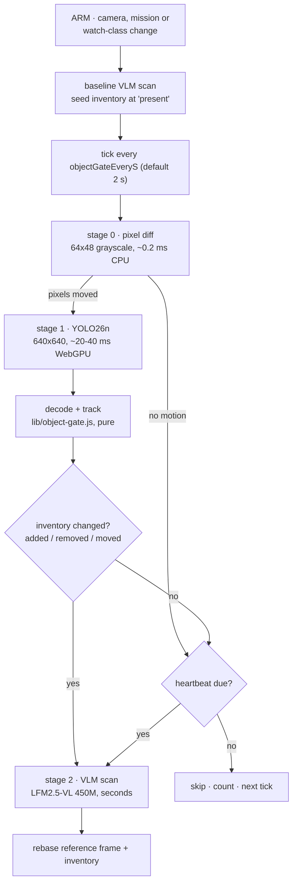
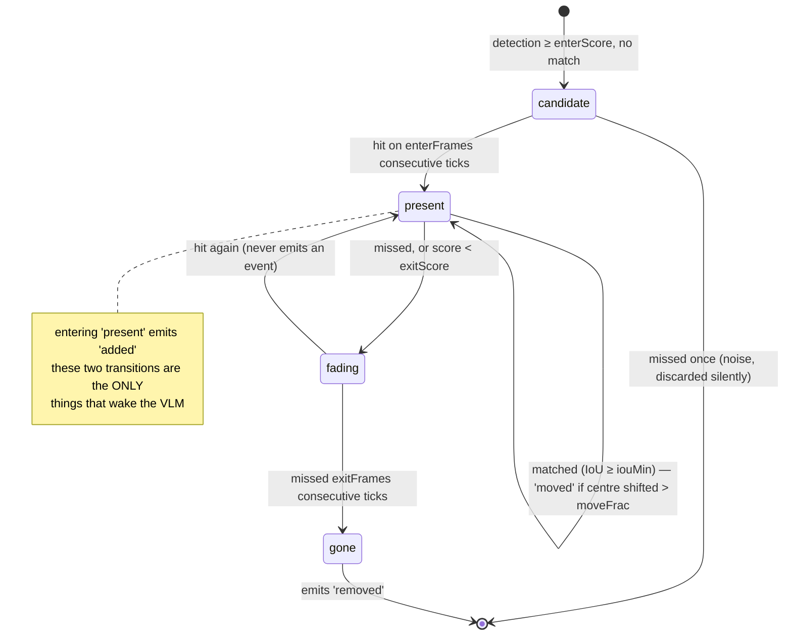
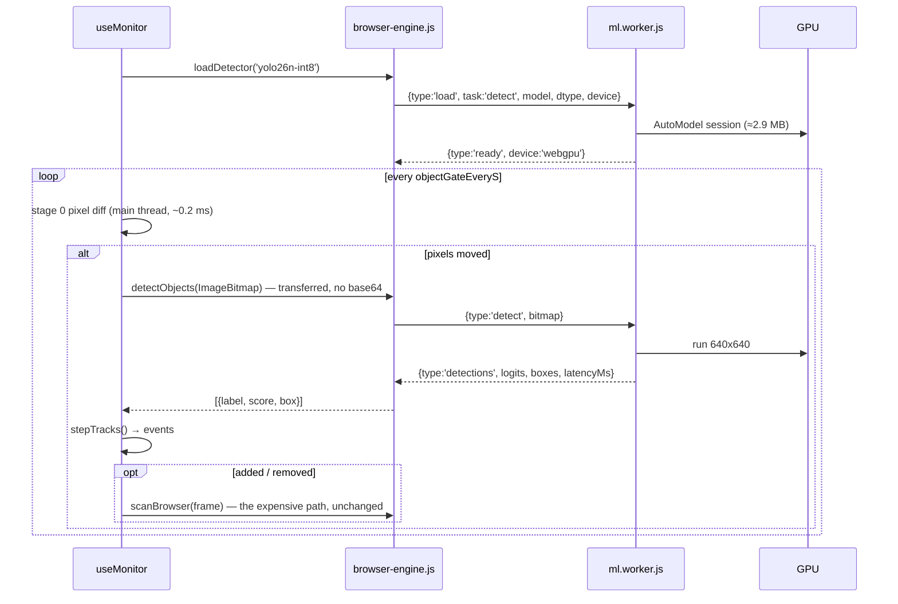

# PRD — Object-inventory gate: YOLO26 as the VLM's doorman

Status: **implemented** · Owner: barakplasma · Scope: `lib/` + `src/` + `test/`
Category: **in-browser inference**
Depends on: worker + offline plumbing from `PRD-browser-engine.md`
Supersedes: the stage-B CLIP gate in `PRD-local-prefilters.md` (stage A, the
pixel-diff motion gate, is kept and becomes stage 0 of this cascade)

## Problem

The BROWSER engine runs LFM2.5-VL 450M on WebGPU for **every** scan. On a
phone that is a multi-second, full-throttle GPU burst every few seconds,
indefinitely. Field report from the reference device: sustained scanning
produced **screen artifacts and driver errors** — the phone GPU is being
asked to do continuous batch work while it is also compositing the UI.

The cost is not tokens (BROWSER scans are free); it is **thermal**, and it is
paid on a scene that is, almost always, exactly the same scene as last time.

`PRD-local-prefilters.md` answers "did any pixels change?" (stage A, ~0.2 ms)
and "does this frame look like the mission?" (stage B, CLIP). Neither answers
the question an operator actually asks a monitor:

> **Is there something in the frame now that wasn't there before — or gone
> that was?**

That question is object detection, and a 2.4 M-parameter detector answers it
directly, in an itemized way a scalar cosine similarity never can.

## Goals

- Wake the VLM only when the **set of objects** in view changes — something
  appeared, something disappeared — not merely when pixels moved.
- Cut the VLM's GPU duty cycle by 1–2 orders of magnitude on a static scene,
  which is the actual fix for the artifacts.
- Keep every existing contract: `scanBrowser()`'s result shape, telemetry,
  history, eval. The gate decides *whether* to scan; it never alerts.
- Reuse the object list as free prompt context for the VLM when it does run.
- Stay a **row in a table, not a branch** — same convention as
  `lib/browser-models.js`.

## Non-goals

- Replacing the VLM. YOLO26 knows 80 COCO classes; it cannot tell you
  "the stove was left on" or "the toddler is climbing the bookshelf".
- Multi-object tracking with IDs across occlusion, zones, line-crossing.
- Training or fine-tuning. Stock COCO weights only.

## Design

### The cascade

Three stages, each ~100× cheaper than the next, each answering a narrower
question:



Stage 0 exists purely to keep stage 1 off the GPU on a still scene: a hallway
at 3 a.m. costs 0.2 ms per tick, not 30 ms. Stage 1 exists to keep stage 2 off
the GPU when the pixels moved but nothing arrived: shadows, wind, auto-
exposure, a cloud, the same person still standing there.

Stage 1 is also what makes stage 0 *safe to run aggressively*: today, turning
the motion gate's sensitivity up means more wasted VLM scans. With YOLO26
behind it, a stage-0 false positive costs 30 ms instead of 3 s, so stage 0 can
be tuned for recall and stage 1 does the discriminating.

#### Cold start: the first frame always goes to the big model

The cascade above describes the steady state. The **first** frame of a session
never enters it: arming runs a full VLM scan unconditionally, and the gate's
reference inventory is seeded from a YOLO pass on that same frame.

Three reasons, in order of importance:

1. **A gate with no reference has nothing to diff against.** At arm time every
   object in view is technically "new". Without a baseline the first tick
   either wakes the VLM anyway (with an arbitrary subset of the scene, two
   ticks late) or suppresses it (and misses the thing the operator armed the
   monitor for, which may already be in frame).
2. **It is what pressing ARM means.** The operator wants a verdict on what the
   camera is looking at *now*, not on the next thing to change.
3. **Pre-existing furniture must not fire `added`.** Tracks seeded from the
   baseline frame enter directly at `present`, skipping `candidate`, so the
   couch that was there when you armed never emits an event.

The same baseline rerun applies to every event that invalidates the reference:
camera flip, source or device switch, mission or watch-class change, engine
change, and a resumed session whose last scan is older than `heartbeatMin`.
`useMonitor` already rebases the motion gate's reference frame on exactly
these, so this is one shared `rebaseBaseline()` path, not a second list of
triggers to keep in sync.

Cost: one VLM scan per arm, which is also the cheapest possible way to give
the operator immediate feedback that the monitor is working.

### Why a detector rather than CLIP

|                       | CLIP gate (stage B, `PRD-local-prefilters.md`) | YOLO26 object gate                               |
|-----------------------|------------------------------------------------|--------------------------------------------------|
| Answer                | one scalar: "how mission-like is this frame"   | itemized list: `person×1, backpack×1`            |
| "New object appeared" | inferred from a similarity drop                | **directly observed**                            |
| Download              | ~30–60 MB (MobileCLIP-S0)                      | **2.9 MB** (yolo26n int8)                        |
| Thresholds            | θ, ρ — opaque, need calibration to trust       | per-class score, in the units operators think in |
| Reusable output       | an embedding nothing else consumes             | an object list the VLM prompt can use            |
| Blind spot            | fine-grained state ("stove on")                | non-COCO things ("stove on")                     |

The blind spot is identical, so the cheaper, more legible, more reusable gate
wins. CLIP stays in `PRD-local-prefilters.md` as the documented escalation for
missions with no COCO noun in them.

### The model

`Ultralytics/YOLO26` ships PyTorch `.pt` only. The browser needs ONNX, and
`onnx-community/yolo26n-ONNX` is the pre-exported, pre-quantized mirror
(verified against the real artifacts, see the I/O contract below).

| Row key        | Repo · file                                       | Bytes  | Notes                                                                     |
|----------------|---------------------------------------------------|--------|---------------------------------------------------------------------------|
| `yolo26n-int8` | `onnx-community/yolo26n-ONNX` · `model_int8.onnx` | 2.9 MB | **default**; the only row that is cheap enough to run on the WASM backend |
| `yolo26n-fp16` | same · `model_fp16.onnx`                          | 5.0 MB | WebGPU-preferred; fp16 is native there                                    |
| `yolo26n-fp32` | same · `model.onnx`                               | 9.9 MB | reference / debugging                                                     |
| `yolo26s-fp16` | `onnx-community/yolo26s-ONNX`                     | ~20 MB | opt-in, `autoSelectable: false` — better on small/distant objects         |

YOLO26n: 2.4 M params, 5.5 GFLOPs at 640², 40.9 mAP (40.1 end-to-end) on COCO.
For scale, that is **0.5 %** of the 450M VLM's parameter count, and the model
downloads in the time a single VLM scan takes.

#### I/O contract (verified against `onnx-community/yolo26n-ONNX`)

```text
input   pixel_values  float32  [batch, 3, 640, 640]   # fixed spatial dims
output  logits        float32  [batch, 300, 80]       # RAW, pre-sigmoid
output  pred_boxes    float32  [batch, 300, 4]        # normalized cx, cy, w, h
```

Four things matter and each is easy to get wrong:

1. **300 queries, no NMS.** YOLO26 has an end-to-end one-to-one head, so the
   300 rows are already deduplicated. No NMS in JavaScript — a meaningful
   simplification over every pre-YOLOv10 in-browser detector.
2. **`logits` are raw.** Traced through the graph, they come off the
   classification `Conv` with no `Sigmoid` between it and the output. Scores
   are `sigmoid(logit)` per class, **not** softmax — there is no background
   class to argmax against.
3. **Therefore do not use `post_process_object_detection()`'s default path.**
   transformers.js's non-zero-shot branch softmaxes and treats the last class
   as "no object"; both assumptions are false here. Its `is_zero_shot: true`
   branch happens to do the right thing (sigmoid + threshold), but depending
   on an unrelated flag's side effect is not a contract. Decode in
   `lib/object-gate.js` instead: ~20 lines, pure, and unit-testable in Node
   against a synthetic tensor, which the library path is not.
4. **Preprocessing is unusually plain**: `do_rescale: true` (1/255),
   `do_normalize: false`, bilinear resize to 640×640. A 640×480 capture is
   **stretched**, not letterboxed. That is deliberate: the gate only ever
   compares frames to each other, so a consistent distortion cancels out, and
   skipping letterbox removes an un-letterboxing step and a class of
   off-by-a-pad-offset bugs. Boxes stay in normalized square space and are
   never converted back to pixels.

#### Licensing

YOLO26 is **AGPL-3.0**. Aura is GPL-3.0 and ships no weights: the browser
fetches them from Hugging Face at the user's request, exactly as it already
does for the VLM rows. Nothing about that changes Aura's own licensing, but
the Settings row for this model must link Ultralytics' licensing page, since a
commercial deployment of *the operator's* monitor needs their enterprise
license. If that is a blocker for a given user, the table is the whole
mechanism for swapping in an Apache-2.0 detector (RT-DETR / RF-DETR exports)
— a row, not a branch.

### `lib/object-gate.js` — pure, Node-testable

No DOM, no Transformers.js, no Worker. Same posture as `lib/monitor.js`.

```text
decodeDetections(logits, boxes, dims, { enterScore, classFilter })
  → [{ label, classId, score, box: [x1,y1,x2,y2] }]        # normalized, no NMS

matchDetections(tracks, detections, { iouMin, moveFrac })
  → { matched, appeared, missed, moved }                   # greedy, class-aware

stepTracks(tracks, detections, opts)
  → { tracks, events: [{ kind: 'added'|'removed'|'moved', label, box }] }

summarize(tracks)          → { person: 2, chair: 1 }       # the OBJECTS row
gateDecision(events, { wakeOn, heartbeatDue })
  → { pass, why }                                          # 'added person' | 'heartbeat' | ''
```

#### Hysteresis is the whole game

A detector's score wobbles frame to frame. A chair at 0.31 / 0.29 / 0.33
without hysteresis reads as *removed, added, removed* — and each of those
would wake the 450M model. Every tracked object therefore runs a small state
machine, and **only the transitions into `present` and `gone` are events**:



Defaults: `enterScore 0.35`, `exitScore 0.25`, `enterFrames 2`, `exitFrames 3`,
`iouMin 0.3`, `moveFrac 0.15`. At a 2 s tick that is a 4 s latency floor from
"object enters frame" to "VLM wakes" — acceptable for a doorway monitor, and
`enterFrames: 1` is available for operators who want the fastest trigger and
will tolerate the extra wakes.

#### Movement is a trigger, and it is configurable

`moved` is the third event kind and gets its own checkbox in `WAKE ON`
(`aura.objectWakeOn`), off by default. Off, the gate is an *inventory* diff:
a person pacing the hallway wakes the VLM once, on arrival. On, it is an
inventory-and-position diff: the same person wakes it again each time they
cross `moveFrac` of the frame.

Two details decide whether this is useful or maddening:

- **Displacement is measured against the position at the last VLM scan, not
  the last gate tick.** Per-tick deltas would mean a slow walker never trips
  the threshold no matter how far they travel, while a jittery box on a
  stationary object trips it constantly. Cumulative-since-last-scan is the
  only version that fires once per real traversal, and it rebases for free on
  the scan that the event triggers.
- **`moveFrac` is its own setting** (`aura.objectMoveFrac`, default `0.15` of
  the frame diagonal), not a SENSITIVITY-preset side effect: an operator who
  turns MOVED on is by definition tuning it, and burying the knob inside a
  three-way preset would make it untunable.

Turning MOVED on is the right default for "watch the driveway" (a car that
arrives *and* one that repositions both matter) and wrong for "tell me when
someone comes to the door" (the courier standing still is one event, not
eight). Hence a checkbox rather than a chosen default.

Matching is greedy by IoU within a class. With ≤ 300 candidates and typically
< 10 tracks, Hungarian assignment buys nothing measurable.

#### The class filter is where the savings actually come from

`aura.objectClasses` restricts the gate to classes the mission cares about
(blank = all 80). A cat walking past a doorway camera watched for `person`
then costs 30 ms, not 3 s of VLM. Settings pre-fills it by matching COCO's 80
labels (plus a small synonym map: *parcel/package/box → suitcase, backpack,
handbag*) against the mission text, and the operator edits from there — a
suggestion, never a silent filter, because a wrong class filter is a
false-negative generator and must be visible.

### Worker protocol

The gate runs in the **existing** `src/workers/ml.worker.js`, not a second
worker: one ORT instance, one WebGPU device, one adapter-limits call, one
cache bucket that CLEAR MODEL CACHE already clears. A second worker would mean
a second WebGPU device on a phone that is already unhappy.



Two changes to `ml.worker.js`, both small but real:

- `let current = null` becomes a per-task slot map (`{ vlm, detect }`), and
  `handleLoad()` stops throwing on `task !== 'vlm'`. The protocol already
  carries `task` for exactly this reason.
- A `detect` handler: `AutoProcessor` + `AutoModel.from_pretrained` (the repo
  is a plain `onnx/model*.onnx` layout, so `AutoModel` is enough — it returns
  the graph's named outputs), then post the two raw tensors back. Decoding
  happens in `lib/object-gate.js` on the main thread so it stays pure and
  testable; 300×80 floats is 96 KB per tick, cheap to transfer and cheaper
  than duplicating the decode logic into the worker.

Gate frames cross as a **transferred `ImageBitmap`**, not a JPEG data URL: at
0.5 Hz the encode/decode round trip is pure waste, and the VLM path (which
genuinely needs a data URL) is untouched.

### Thermal budget — the actual point

Rough arithmetic for the reference device, to be replaced with measurements
(see Acceptance):

|                               | today                 | with the gate                            |
|-------------------------------|-----------------------|------------------------------------------|
| VLM scans/hour (static scene) | ~720 (5 s interval)   | ~12 (heartbeat only)                     |
| VLM GPU-seconds/hour          | ~2160 s (≈ 60 % duty) | ~36 s (≈ 1 %)                            |
| Gate GPU-seconds/hour         | —                     | ~10–60 s (≈ 0.3–1.7 %, motion-dependent) |
| **Sustained GPU duty**        | **~60 %**             | **< 3 %**                                |

Two further levers this PRD specifies because they follow directly from the
gate existing:

- **Idle VRAM eviction** (`aura.vlmIdleEvictMin`, default 10, `0` = never).
  Once the VLM runs a few times an hour, keeping ~800 MB of q4 weights and
  their KV buffers resident between scans is paying rent for nothing. Unload
  the VLM session after N idle minutes; the weights stay in the Cache API, so
  the reload is session creation (~1–3 s), not a download. Cost: the first
  alert after an idle stretch is a few seconds late. Benefit: the GPU is
  *empty* while the phone sits idle, which is precisely the state the
  artifacts appeared in. On by default, visible in telemetry, one setting to
  turn off.
- **Gate cadence, not frame cadence.** `objectGateEveryS` defaults to 2 s, not
  1 s. A 640² detector at 1 Hz on a phone is a real, if modest, continuous
  load; 0.5 Hz halves it, and the 4 s worst-case detection latency is well
  inside what a doorway monitor needs. The ONNX export has **fixed** 640×640
  spatial dims, so "just run it smaller" is not available without a re-export
  — the cadence and stage 0 are the levers.

### Free prompt context (opt-in)

When the VLM does run, the gate already knows what is in the frame. With
`aura.objectPromptContext` on, the detection prompt gains one line:

```text
A local object detector sees: person x1, backpack x1.
New since the last check: backpack.
```

For a 450M model this is disproportionately valuable — it converts an
open-ended visual question into a grounded one. It is opt-in and off by
default because it changes prompt behaviour, which would otherwise silently
invalidate saved eval runs and GEPA artifacts. When on, the OPTIMIZE screen's
few-shot examples and the eval screen both see the same prefixed prompt, or
the numbers stop meaning anything.

## Telemetry

| Row     | Meaning                                                                                                         |
|---------|-----------------------------------------------------------------------------------------------------------------|
| OBJECTS | current inventory: `person x1 · chair x2` (blank when the gate is off)                                          |
| GATE    | last decision: `still` / `motion, no object change` / `added person` / `removed backpack` / `heartbeat`         |
| SKIPPED | gate ticks that did not reach the VLM, and % of ticks                                                           |
| DETECT  | gate latency EMA + backend (`31 ms · webgpu`) — the number that says whether the gate itself became the problem |

History rows carry the inventory at scan time, so a false negative can be
traced to "the gate never woke it" versus "the VLM saw it and said no".

## Settings

Settings → SCAN TIMING gains an OBJECT GATE group (BROWSER and PROVIDER
engines both — a PROVIDER user saves tokens and money by the same mechanism,
and the detector is local either way):

| Control               | Key                        | Default           | UI                                                  |
|-----------------------|----------------------------|-------------------|-----------------------------------------------------|
| OBJECT GATE           | `aura.objectGate`          | `false`           | checkbox                                            |
| DETECTOR              | `aura.objectModel`         | `'yolo26n-int8'`  | select from the row table, with size + license link |
| CHECK EVERY           | `aura.objectGateEveryS`    | `2`               | number (seconds)                                    |
| WATCH CLASSES         | `aura.objectClasses`       | `''` (all)        | tag input, pre-filled from the mission              |
| WAKE ON               | `aura.objectWakeOn`        | `'added,removed'` | checkboxes: ADDED / REMOVED / MOVED (MOVED off)     |
| MOVEMENT THRESHOLD    | `aura.objectMoveFrac`      | `0.15`            | slider 0.02–0.5, shown only when MOVED is checked   |
| SENSITIVITY           | `aura.objectSens`          | `'medium'`        | LOW/MED/HIGH → (enter, exit, frames) triples        |
| HEARTBEAT EVERY       | `aura.heartbeatMin`        | `5`               | minutes — shared with `PRD-local-prefilters.md`     |
| ADD OBJECTS TO PROMPT | `aura.objectPromptContext` | `false`           | checkbox                                            |
| UNLOAD VLM WHEN IDLE  | `aura.vlmIdleEvictMin`     | `10`              | minutes, `0` = never                                |

## Files

| Path                             | Change                                                                                   |
|----------------------------------|------------------------------------------------------------------------------------------|
| `lib/detector-models.js`         | new — the YOLO26 row table + `pickDetectorModel()`, mirroring `browser-models.js`        |
| `lib/object-gate.js`             | new, pure — decode, match, track state machine, `summarize()`, `gateDecision()`          |
| `lib/browser-engine.js`          | `loadDetector()` / `detectObjects()` on the same worker facade                           |
| `src/workers/ml.worker.js`       | per-task model slots; `detect` load + run handler                                        |
| `src/hooks/useMonitor.js`        | gate tick, track state, inventory rebase on each VLM scan, idle eviction, skip telemetry |
| `src/screens/SettingsScreen.jsx` | OBJECT GATE group                                                                        |
| `src/screens/MonitorScreen.jsx`  | OBJECTS / GATE / SKIPPED / DETECT rows                                                   |
| `src/screens/EvalScreen.jsx`     | per-sample object list + false-skip check against a chosen reference sample              |
| `lib/monitor.js`                 | optional object-context line in `buildDetectionPrompt()`                                 |
| `test/object-gate.test.js`       | new                                                                                      |
| `test/detector-models.test.js`   | new                                                                                      |
| `CLAUDE.md`                      | file table + a note that `detect` is now a live task in the worker protocol              |

### Tests (`node --test`, no DOM, no network)

- `decodeDetections()` on a synthetic `[1,300,80]` logits array: sigmoid not
  softmax, argmax class, threshold, class filter, cxcywh → xyxy.
- Score wobble across 0.30 does **not** emit add/remove events (the
  regression this design exists to prevent).
- A genuinely new object emits exactly one `added` after `enterFrames`.
- An object leaving emits exactly one `removed` after `exitFrames`, not before.
- Same object moving across the frame emits `moved`, never `added`+`removed`.
- `moved` measures displacement since the **last scan**: a track drifting
  `moveFrac/4` per tick emits `moved` on the fourth tick, and a track
  oscillating within `moveFrac` never emits it.
- Baseline seeding puts tracks straight into `present`: the first tick after
  `rebaseBaseline()` emits no `added` for anything already in the frame.
- `gateDecision()`: `wakeOn` filtering (MOVED off ⇒ `moved` events never
  wake), heartbeat overrides everything, empty events → no wake.
- Gate disabled → every tick passes (today's behaviour, by construction).

## Acceptance

- **Thermal**: a 60-minute run on the reference device (Pixel 10, camera on a
  static scene, BROWSER engine, gate on) shows ≤ 15 VLM scans, DETECT latency
  stable to within 20 % from minute 5 to minute 60 (no thermal creep), and no
  screen artifacts. The same run with the gate off is the control.
- **Cold start**: arming with a person already in frame produces a VLM verdict
  on that person within one scan, and no `added` event on the ticks that
  follow.
- **Movement**: with MOVED on, a person crossing the frame wakes the VLM again
  after `moveFrac` of travel; with MOVED off, the same crossing produces
  exactly one wake (the arrival).
- **Recall**: a person entering the frame wakes the VLM within 5 s
  (`enterFrames × objectGateEveryS` + one VLM scan), in 10/10 trials.
- **Precision**: toggling the room light, a shadow crossing, and a curtain
  moving in a draught produce a `motion, no object change` GATE row and zero
  VLM scans.
- **Removal**: taking a parcel off the doorstep wakes the VLM within 8 s.
- **Hysteresis**: a 30-minute run on a static scene containing a borderline
  object (a chair at the edge of detection) produces zero add/remove events.
- **Bundle**: `npm run build && grep -c '@huggingface/transformers' public/assets/app.js` is still `0`.
- **Purity**: `lib/object-gate.js` and `lib/detector-models.js` import nothing
  from the DOM, ORT, or Transformers.js; `npm test` green.
- Gate off ⇒ byte-identical behaviour to today.

## Implementation notes

Built as specified, with three deviations worth recording:

- **Association is IoU *then* nearest-centre**, not IoU alone. At a 2 s cadence
  a walking person clears their own bounding-box width between ticks, and two
  non-overlapping boxes have IoU 0 — so pure IoU matching turned one person
  crossing the frame into a stream of `removed` + `added` pairs, each of which
  would have woken the VLM. Same-class boxes of comparable size (within 4x
  area) within `matchMoveFrac` of each other now associate by distance.
- **The decode threshold is `exitScore`, not `enterScore`.** The weaker
  detections are what keep an already-present track alive; `stepTracks()` is
  what refuses to open a *new* track below `enterScore`. Two-tier thresholds
  only work if the lower tier actually reaches the tracker.
- **Preprocessing is done in the worker with an OffscreenCanvas**, not through
  `AutoProcessor`. The export's own `preprocessor_config.json` asks for a
  stretch-resize and a /255 rescale with no normalization or padding — three
  lines of canvas — and going through the processor would have added a Hub
  round-trip plus a `YolosImageProcessor` whose defaults we'd only switch back
  off.

The I/O contract above was verified end to end against the real artifacts
(`AutoModel.from_pretrained` + `onnx-community/yolo26n-ONNX` int8, Ultralytics'
own `bus.jpg`): outputs `logits [1,300,80]` and `pred_boxes [1,300,4]`, raw
logit range −49.20…2.50 (pre-sigmoid, as predicted), decoding via
`lib/object-gate.js` to `person x4 · bus x1` with no NMS.

## Risks

- **COCO's closed world.** 80 classes. No parcel, no smoke, no open door, no
  "stove left on". Mitigated by the heartbeat (never skippable), by stage 0
  still forcing a YOLO look on any motion, and by the class filter being a
  visible suggestion rather than a silent default. An operator whose mission
  has no COCO noun in it should be told, in the UI, that the gate will fall
  back to heartbeat-only behaviour for them.
- **Small/distant objects** after a 640×480 → 640×640 stretch. `yolo26s` is
  the documented upgrade; the eval screen's per-sample object list is how an
  operator finds out before trusting it.
- **`AutoModel` refusing the repo.** The export declares `model_type: "yolos"`
  and a `YolosImageProcessor`, which is a wrapper of convenience, not a real
  YOLOS. If the library's registry fights it, the fallback is
  `onnxruntime-web` directly (already a transitive dependency, its WASM
  already copied to `public/ort/` by the build) with a hand-rolled
  resize-to-Float32Array — about 40 lines, and `lib/object-gate.js` does not
  change either way, which is the reason the decode lives there.
- **Two models resident.** 2.9 MB next to ~810 MB is noise, but the idle
  eviction above is what keeps the pair from being the peak.

## Out of scope / follow-ups

- Zones (only watch part of the frame): trivially a box filter over
  `decodeDetections()` output once the gate exists.
- Object-aware alert dedup ("same person still there, don't re-announce") —
  belongs with `PRD-alert-hygiene.md`'s incident logic, but the track IDs this
  PRD introduces are exactly what it needs.
- `yolo26n-seg` / `-pose` rows: segmentation masks would let the gate reason
  about *area* change (a spill, a pile growing) and pose about posture (a
  person on the floor). Both are rows, not branches.
- Adaptive cadence: back the gate off when the DETECT EMA climbs, which is a
  thermal-throttle signal the app can see without any platform API.
