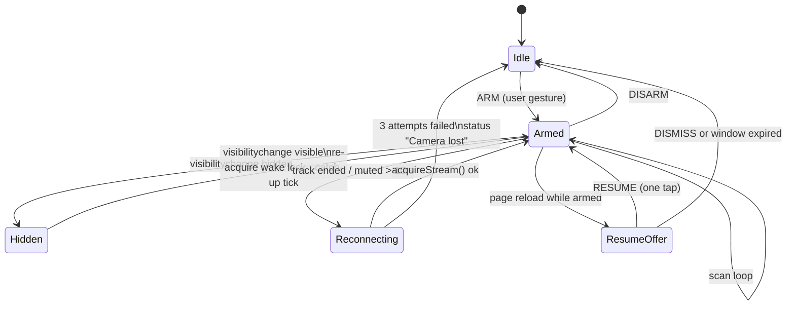

# PRD — Keep the phone session alive

Status: draft · Owner: barakplasma · Scope: `src/` + `lib/` + `scripts/sw-template.js` + `test/`
Category: **reliability**

## Problem

Aura is meant to be propped on a shelf and left running for hours. Today the
session dies in four ordinary ways, and every one of them is silent:

1. **The screen sleeps.** Nothing holds a wake lock, so the phone dims and
   locks after its normal timeout. On lock the browser pauses the camera track
   and freezes timers — monitoring stops, and the operator only finds out when
   they come back to a "Watching…" status that is an hour stale.
2. **The tab goes to the background.** Switching apps (or a phone call) hides
   the page. Chrome throttles timers on hidden pages to once a minute, and after
   five minutes hidden applies *intensive throttling*. The `setTimeout(tick,
   gapMs)` loop in `src/hooks/useMonitor.js` keeps running at whatever cadence
   the browser allows, but the camera track is usually **muted** while hidden, so
   the frames scanned are frozen copies of the last visible frame.
3. **The OS reclaims the camera.** Another app opens the camera, or the browser
   drops the track under memory pressure. The `MediaStreamTrack` fires `ended`
   and the `<video>` freezes; the loop keeps scanning the frozen frame forever.
4. **The page reloads.** A PWA killed by the OS, an accidental swipe-refresh, or
   a redeploy activating a new service worker. `running`, every alert, every
   "recent frame" and every FALSE POSITIVE mark are React state only —
   gone. The operator has to notice, reopen, and re-arm by hand.

The whole point of a monitor is that it is still running when you look away.

## Goals

- Armed means armed: the screen stays on, the camera stays live, and the loop
  recovers from every interruption it can recover from.
- What it cannot recover from (iOS backgrounding, a hard kill) is one tap away
  from resuming, with history intact.
- Alert history survives reloads and is bounded so it never fills storage.

## Non-goals

- True background monitoring on iOS. Safari suspends camera access for hidden
  pages and there is no wake lock workaround — document it, don't fight it.
- Push notifications or a backend. The app stays a static PWA.

## Design



### 1. Screen Wake Lock

- `src/hooks/useWakeLock.js`: `useWakeLock(active)` requests
  `navigator.wakeLock.request('screen')` when `active` flips true, releases on
  false and on unmount. The lock is released by the browser whenever the page
  is hidden, so the hook listens for `visibilitychange` and **re-requests** on
  `visible` while `active` — that is the documented pattern, not optional.
- Wired from `useMonitor`: active ⇔ `running && !demo`. Demo mode needs no
  lock.
- Unsupported (`!('wakeLock' in navigator)`) or request rejected (low battery
  mode, permissions policy): set a one-time status hint "Keep the screen on —
  this browser can't hold a wake lock" and continue. Never block arming on it.
- Setting `aura.keepScreenOn` (default `true`) in Settings → CAMERA so an
  operator on a plugged-in phone with its own screen policy can turn it off.
- Stage indicator: a small `☾` glyph in the `monitor-status-bar` while the lock
  is held (`MonitorStage.jsx`), so the operator can see at a glance that the
  phone will not sleep.

### 2. Background / visibility handling

Pure helpers in `lib/keepalive.js` (Node-testable, no DOM):

```text
shouldCatchUp(lastScanAt, gapMs, now)   → true when now − lastScanAt > 2 × gapMs
resumeWindowOpen(armedAt, now, maxAgeMs) → true when armedAt is within the window
nextReconnectDelayMs(attempt)            → 1 s, 3 s, 8 s (then give up)
```

In `useMonitor`:

- Track `lastScanAt` (performance.now() at each successful scan) on the
  internal ref.
- `visibilitychange → visible` while running: if `shouldCatchUp(...)`, clear
  the pending loop timer and call `tick()` immediately so the operator gets a
  fresh scan the moment they look, instead of waiting out a throttled gap.
- `visibilitychange → hidden`: no change to the loop. Do **not** stop scanning:
  on Android Chrome a hidden PWA still delivers throttled ticks, and a stale
  scan is better than none. Status shows "Background — scans throttled by the
  browser" so a later reader of the history understands the gaps.
- **Muted track** (the browser paused the camera while hidden): listen for
  `track.onmute` / `onunmute`. While muted, `tick()` skips the AI call
  (a frozen frame would burn tokens for nothing) and records a
  `skipped: 'muted'` telemetry count. Unmute resumes normally.
- **Ended track** (OS reclaimed the camera): `track.onended` while running →
  enter *Reconnecting*: reuse the `acquireStream()` path that `switchCamera()`
  already extracted, retrying with `nextReconnectDelayMs`. Three failures →
  `stop()` with status "Camera lost — tap ARM to retry". Same handling for a
  track muted longer than 10 s while the page is *visible* (some Android
  builds mute instead of ending).

### 3. Auto-resume after reload

- On `start()` write `aura.armed = true` and `aura.armedAt = Date.now()`; on
  `stop()` write `aura.armed = false`. Both plain localStorage keys through
  `useLocalStorage` like every other setting.
- On boot (`App.jsx`), if `aura.armed` and `resumeWindowOpen(armedAt, now,
  12 h)`: show a **RESUME MONITORING** banner above the monitor stage (same
  visual weight as the demo banner) with RESUME / DISMISS. RESUME calls
  `start()` from the tap — `getUserMedia` and `speechSynthesis` both want a
  user gesture on Safari and on Chrome without a stored permission, so a
  one-tap resume is the design, **not** an automatic start.
- Stretch (behind `aura.autoResume`, default off): if
  `navigator.permissions.query({ name: 'camera' })` reports `granted`, call
  `start()` automatically on boot. Speech may be blocked until the first tap
  in that path; vibration and webhooks still work. Document that trade-off in
  the setting's hint.
- The service worker's `install` handler deliberately never calls
  `skipWaiting()`, so a redeploy cannot reload an armed session mid-run. Keep
  it that way; this PRD adds nothing to `sw-template.js`.

### 4. Alert history in IndexedDB

- New `lib/alert-store.js`, same async-adapter pattern as `lib/eval-store.js`
  (real IndexedDB adapter + `createMemoryAdapter()` for tests). Database
  `aura-history`, stores `alerts`, `missed`, `marks`.
- Records are the exact objects `logAlert()` / `recordMissed()` build today
  (id, time, conf, message, reason, image data URL). Keep an ISO `at`
  timestamp too — `time` is a locale string and not sortable.
- Caps: 200 alerts, 4 missed frames (unchanged), evict oldest on insert.
  Alert JPEGs are 30–60 KB, so the ceiling is ~12 MB — well inside the
  default origin quota, and the existing `.slice(0, 20)` in-memory view stays
  as the render window. `markedIds` moves into the `marks` store so a FALSE
  POSITIVE mark survives reload alongside the training example it wrote.
- `useMonitor` hydrates the three states from the store on mount (one
  `getAll` each, newest first) and writes through on every change. Writes are
  fire-and-forget; a failed write logs and never breaks the scan loop.
- HistoryScreen gains **CLEAR HISTORY** (with confirm) and **EXPORT JSON**
  (alerts without images by default; a checkbox includes the frames).

## Telemetry

| Row       | Where         | Meaning                                          |
|-----------|---------------|--------------------------------------------------|
| `☾`       | status bar    | wake lock held                                   |
| SKIPPED   | Monitor panel | scans skipped because the camera track was muted |
| RECONNECT | status text   | "Camera lost — reconnecting (2/3)…"              |

## Settings keys (all `aura.*`, localStorage)

| Key            | Default | Notes                                    |
|----------------|---------|------------------------------------------|
| `keepScreenOn` | `true`  | request a screen wake lock while armed   |
| `armed`        | `false` | written by start()/stop(), read at boot  |
| `armedAt`      | `0`     | epoch ms; resume offer expires after 12h |
| `autoResume`   | `false` | stretch: auto-start when camera granted  |

## Files

| Path                              | Change                                                       |
|-----------------------------------|--------------------------------------------------------------|
| `src/hooks/useWakeLock.js`        | new                                                          |
| `lib/keepalive.js`                | new, pure                                                    |
| `lib/alert-store.js`              | new, IndexedDB + memory adapter                              |
| `src/hooks/useMonitor.js`         | lastScanAt, visibility/mute/ended handlers, store write-thru |
| `src/App.jsx`                     | armed/armedAt keys, resume banner                            |
| `src/components/MonitorStage.jsx` | wake-lock glyph                                              |
| `src/screens/HistoryScreen.jsx`   | clear + export                                               |
| `src/screens/SettingsScreen.jsx`  | KEEP SCREEN ON toggle (CAMERA section)                       |
| `test/keepalive.test.js`          | catch-up, resume window, reconnect delays                    |
| `test/alert-store.test.js`        | caps/eviction, ordering, marks, via memory adapter           |
| `README.md`                       | "Leaving it running" section: what survives what, iOS caveat |

## Acceptance

- Arm on an Android phone, lock nothing, walk away 30 min: screen stays on,
  scans continue at the configured cadence, no gap in history.
- Switch to another app for 2 min and come back: a scan fires within one
  second of returning; history shows the throttled period with correct times.
- Open the system camera app while armed, close it: status shows reconnecting,
  then monitoring resumes without touching the UI.
- Pull-to-refresh while armed: RESUME banner appears, one tap re-arms, alert
  history and marks are intact.
- `npm test` covers every branch in `lib/keepalive.js` and `lib/alert-store.js`.

## Out of scope / follow-ups

- **Picture-in-picture keepalive** (Android): `video.requestPictureInPicture()`
  keeps the document "visible" for throttling purposes while the operator uses
  other apps. Worth a PIP button on the stage later; needs its own gesture and
  UX pass.
- Merging with `PRD-alert-hygiene.md`'s incident grouping in the history view —
  that PRD changes the alert record shape; land this store first, then extend.
