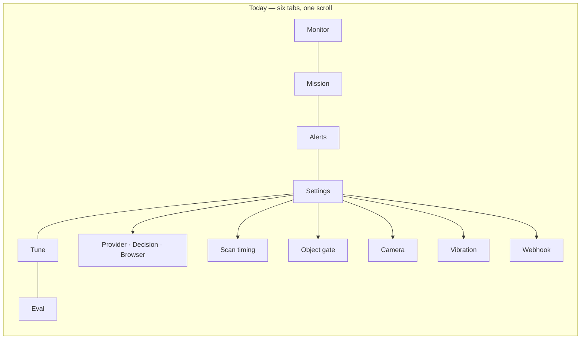
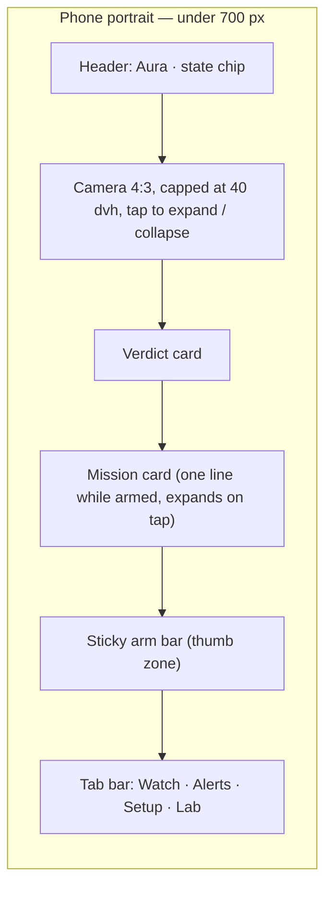
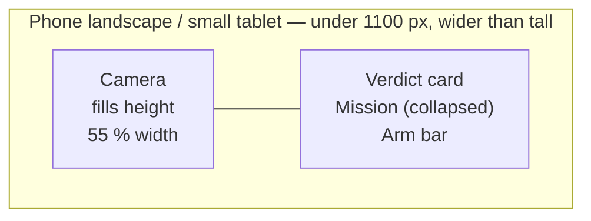
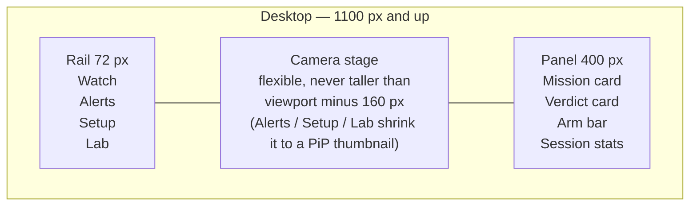
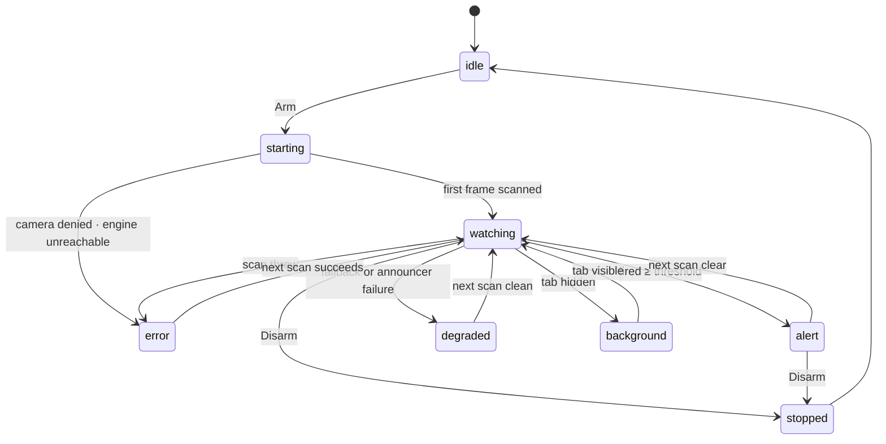
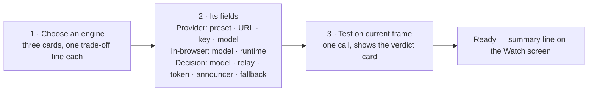

# PRD — Aura's UI, from the ground up

Status: draft · Owner: barakplasma · Scope: `src/` (shell, screens, CSS), `scripts/` (screenshot harness), `CLAUDE.md`

Nothing in `lib/` changes. Every engine, every setting and every screen's
*capability* survives; what changes is where it lives, how it is reached, and
how results are shown. The capability map at the end is the contract.

## Problem

Aura's interface is a phone tab bar stretched to every screen size, with a
1000-line settings scroll behind one of the tabs and a single 11 px status
string as the only place a result is ever shown. Evidence, taken from the
built app at 412×915 (phone) and 1440×900 (desktop) plus the operator's own
iPhone screenshot:

1. **Two design systems, one of them dead.** `src/aura.css` (1,421 lines, the
   "tactical" theme CLAUDE.md still documents) is copied to `public/aura.css`
   by the build, but `public/index.html` only loads `assets/app.css`, which is
   built from `src/ionic.css` (443 lines). Every screen except Monitor and
   Mission still speaks the dead file's `dc-*` / `section-label` /
   `form-group` vocabulary, restyled by a partial port at the bottom of
   `ionic.css`. Two commits in the last week landed CSS in the wrong file.
2. **Desktop is a scaled-up phone.** Six bottom tabs at 1440 px. On the
   Monitor screen the camera card fills the viewport and pushes the status
   strip and the ARM button below the fold: at 1440×900 the primary action is
   not on screen. Settings renders as a 720 px column with its title outside
   the column.
3. **The status line is the whole result UI.** Message, reason, engine
   degradation and errors are concatenated into one string
   (`⚠ ALERT — … · decision model failed (…); the provider answered`) and
   written into a strip inside the camera card. On the operator's iPhone that
   strip rendered as a one-word-per-line column. The reason disappears on the
   next scan, nothing is tappable, and there is no way to copy an error.
4. **One workflow, three tabs.** Point the camera, describe the mission, arm:
   that is the product, and it is split across Monitor, Mission and Settings.
   Speak/Vibrate live on Mission; sensitivity lives in Settings; the engine
   readiness notice lives on Monitor.
5. **Settings has no hierarchy.** About 40 controls in 7 sections, all the
   same weight. The engine choice, which decides which of the other 30
   controls matter, is a segmented control under the heading PROVIDER. The
   DECISION card alone is five fields plus a test button.
6. **Tune and Eval are top-level** though they are used once per mission,
   and Tune disappears when the engine changes (the nav even documents the
   renumbering problem this causes).
7. **First launch is a black rectangle** with "Configure a provider and press
   Start." The demo, the fastest way to understand Aura, is only offered when
   nothing is configured.
8. **Typography works against reading**: ALL-CAPS labels everywhere, 9–11 px
   controls, no spacing rhythm, hints longer than the fields they explain.

## Goals

- One screen holds the daily workflow: see the camera, read the mission,
  read the last verdict, arm. Everything else is one tap away, never three.
- Three layouts composed for their shape (phone portrait, phone landscape /
  small tablet, desktop), not one layout squeezed.
- A **verdict card** replaces the status string: structured, never truncated,
  keeps the last few results, shows degradation as its own element with the
  full error one tap away.
- Progressive disclosure: Watch (daily) → Setup (once) → Lab (rarely), with an
  Advanced fold in Setup for everything an operator touches once a year.
- One design system, tokens first, sentence case, 14 px minimum text, 44 px
  targets, thumb-zone placement of the arm action.
- Every current capability keeps a home (see the map).

## Non-goals

- No change to `lib/`, the scan loop's semantics, the engines or settings
  keys (`aura.*` stay so nobody's configuration is lost).
- No new capabilities beyond what the new layout needs to be honest (a
  "test on current frame" for every engine instead of only DECISION).
- No backend, no accounts, no framework migration: React 19 + esbuild stay.

## Principles

1. **The camera is the app.** One screen, *Watch*, is where you spend 95 % of
   the time. It never leaves the DOM (the stage is already always-mounted).
2. **Verdicts, not status.** A scan produces a structured result; the UI
   renders the result, not a sentence about it.
3. **Setup is a wizard, not a wall.** Choose an engine, fill its two or three
   fields, test on a frame, done. Advanced stays folded until asked for.
4. **Adaptive by composition.** Below 700 px the panels stack; above it the
   camera and the control column sit side by side; above 1100 px a rail
   replaces the tab bar and secondary screens open beside the camera.
5. **Never truncate, always offer the next action.** An error shows in full,
   with a copy button and a link to the field that fixes it.
6. **Readable first.** Sentence case, a five-step type scale, spacing on a
   4 px grid, one accent colour, semantic colours only for state.

## Information architecture

```mermaid
flowchart LR
    subgraph proposed["Proposed — three levels"]
        W["Watch (home)"]
        W --> W1[Camera stage]
        W --> W2["Mission card — watch for · announce · sensitivity · speak · vibrate"]
        W --> W3["Verdict card — last result, confidence, engine health, next scan"]
        W --> W4["Arm bar — Arm / Disarm · Demo"]
        AL[Alerts] --> AL1["Timeline of events with frames"]
        AL --> AL2["Mark false positive / missed · Export · Clear"]
        AL --> AL3["Send to Lab as example"]
        SU[Setup] --> SU1["Engine wizard — Provider · In-browser · Decision"]
        SU --> SU2["Cadence & cost — mode · every · budget · data cap"]
        SU --> SU3["Delivery — speech · vibration · webhook / ntfy"]
        SU --> SU4["Camera & device — source · lens · keep awake"]
        SU --> SU5["Advanced (folded) — object gate · capture size · pricing · model eviction"]
        LB[Lab] --> LB1["Examples & optimize (Tune)"]
        LB --> LB2["Evaluate prompts × models (Eval)"]
    end
```





Four destinations instead of six. Mission is not a destination: it is a card
on Watch. Tune and Eval are two tabs of one Lab screen, and Lab is present on
every engine (Optimize shows its "needs the PROVIDER engine" note inside the
tab instead of removing the tab from the nav).

## Layouts

Three compositions, chosen by width and orientation, not by shrinking one.







Rules that fall out of this:

- The arm action is always visible without scrolling, on every layout. The
  desktop stage is height-capped so the panel is never pushed off screen.
- On desktop, Alerts / Setup / Lab open in place of the stage + panel, and the
  stage becomes the existing PiP thumbnail (top-right), so scanning keeps its
  visible feedback. On the phone, PiP behaves as today.
- The stage's *collapsed* mode stays (a 2 px video keeps decoding); the
  toggle moves into the stage's own overflow menu with Flip and Demo.

## The verdict card

`useMonitor` currently calls `setStatus()` with fourteen different sentence
shapes. The redesign gives it one structured `verdict` next to the existing
`status` string (the string stays as the `aria-live` announcement):

```text
verdict = {
  state:      'idle' | 'starting' | 'watching' | 'alert' | 'degraded' | 'error' | 'stopped' | 'background',
  headline:   string,          // the alert message, or the reason while watching
  reason:     string | null,   // the detection reason (expandable "why")
  confidence: number | null,   // 0–100
  threshold:  number,          // the sensitivity, drawn as a marker on the bar
  latencyMs:  number | null,
  engine:     'provider' | 'browser' | 'decision',
  note:       { kind: 'fallback' | 'announcer' | 'gate', text: string } | null,
  error:      { message: string, fixField: string | null } | null,
  at:         number,          // epoch ms
}
```



What the card shows, top to bottom:

1. **State line** — a coloured dot, the state word (Watching / Alert /
   Degraded / Error), a relative time ("4 s ago") and an engine chip
   (Provider · gemma-4-31b).
2. **Headline** — the message. Full width, wraps, selectable. Never an
   11 px strip inside the video.
3. **Confidence bar** with the threshold marker, so "62 % vs. your 60 %" is a
   glance, not arithmetic.
4. **Note chip** (only when present) — "Decision model failed → provider
   answered" or "Announcer failed → template spoke". Tap opens a sheet with
   the full error text and a Copy button. This is the element the operator's
   screenshot needed.
5. **Why** — the reason, folded by default while watching, open on alert.
6. **Next scan** — the countdown / model-loading progress that `ProgressBar`
   already computes.
7. **Last five** — a row of dots (clear / alert / degraded), each tappable to
   the matching Alerts entry.

While disarmed the same card is the empty state: "Point the camera, describe
what to watch for, then arm" with a Try demo button.

## Setup as a wizard



- The three engine cards say what each costs and where the frame goes
  (cloud / this device / classifier via relay), which is the decision the
  operator is actually making.
- The Settings status message (`onStatusMsg`) becomes inline validation on
  the field that caused it; the Fetch models result populates the model
  picker in place.
- "Test on current frame" exists today only for DECISION. It becomes a step
  for every engine, reusing `scanClient` / `scanBrowser` / `scanDecision` with
  `threshold: 0`, so "configured" is proven, not inferred.
- The API key never gates readiness (CLAUDE.md rule); it is masked with a
  reveal toggle.
- Cadence & cost, Delivery, Camera & device are plain cards below the wizard.
  Advanced is a single fold holding the object gate, capture size, pricing
  override, keep-screen-on and model eviction, each with a one-line summary
  of its current value visible while folded.

## Alerts as a timeline

The list stays, drawn as a timeline: frame thumbnail, time, confidence,
message, the reason under a fold, and a two-button row (False positive ·
Send to Lab). Recent non-alert frames stay as a second lane for marking
misses. Export and Clear move to the header's overflow menu. On desktop the
list sits beside a large preview of the selected frame.

## Lab

Two tabs on one screen: **Examples** (today's Tune: the training examples and
the GEPA run) and **Evaluate** (today's Eval). Both keep their content; the
model list in Evaluate groups by engine with headings instead of one flat
checkbox list. "Send to Lab" from Alerts lands on Examples with the frame
pre-attached.

## Design system

One stylesheet, `src/app.css`, tokens first. `aura.css` and the `dc-*`
vocabulary are deleted, not ported.

| Token group | Values                                                                             |
|-------------|------------------------------------------------------------------------------------|
| Colour      | `bg-0/1/2`, `text`, `text-dim`, `border`, `accent`, `ok`, `warn`, `danger`, `info` |
| Type        | 13 / 14 / 16 / 20 / 28 px; weights 400 / 600; `tabular-nums` for numbers           |
| Space       | 4 · 8 · 12 · 16 · 24 · 32                                                          |
| Radius      | 8 (controls) · 16 (cards) · 999 (chips)                                            |
| Motion      | 150 ms ease-out; respects `prefers-reduced-motion`                                 |

Components (each a file under `src/components/`): `AppShell` (tab bar or
rail by breakpoint), `Stage`, `VerdictCard`, `MissionCard`, `ArmBar`,
`SetupCard`, `Field` (label · control · hint · error, the only way a form
control is rendered), `Segmented`, `Sheet` (bottom sheet on phone, dialog on
desktop), `Timeline`, `Chip`, `ProgressRing`.

Ionic decision: the app uses Ionic for a header, a tab bar, toggles, toasts, a
textarea and cards. Every one of those is under 40 lines as a native element
with the tokens above, and the tab bar is the thing the redesign replaces.
Recommendation: drop `@ionic/react` and `ionicons` (one dependency, one
stylesheet, smaller `app.js`), using inline SVG icons. This is a decision the
owner makes at Phase 0, and the phases below work either way.

## Capability map

Every control today and where it lives after. Keys (`aura.*`) do not change.

| Today (screen · control)                                                     | After                                                |
|------------------------------------------------------------------------------|------------------------------------------------------|
| Monitor · Arm / Disarm                                                       | Watch · Arm bar (sticky, always on screen)           |
| Monitor · Try demo                                                           | Watch · Verdict card empty state + Arm bar overflow  |
| Monitor · Flip camera, Hide cam                                              | Watch · Stage overflow menu                          |
| Monitor · Object gate notice                                                 | Watch · Verdict card note chip + Session stats       |
| Monitor · status line                                                        | Watch · Verdict card (structured)                    |
| Mission · Watch for, On alert announce                                       | Watch · Mission card                                 |
| Mission · Speak alerts, Vibrate                                              | Watch · Mission card toggles (also Setup › Delivery) |
| Mission · Deploy & arm                                                       | Watch · Arm bar                                      |
| Settings · Engine, Provider preset, Base URL, Key, Model                     | Setup · Engine wizard step 1–2                       |
| Settings · Fetch vision models                                               | Setup · Engine wizard step 2 (populates the picker)  |
| Settings · Browser model, Runtime                                            | Setup · Engine wizard step 2 (In-browser)            |
| Settings · Decision model, relay, token, announcer, fallback, Test           | Setup · Engine wizard step 2–3 (Decision)            |
| Settings · Sensitivity                                                       | Watch · Mission card slider                          |
| Settings · Mode, Scan every, Max $/hour, Max MB/hour                         | Setup · Cadence & cost                               |
| Settings · Model pricing override                                            | Setup · Advanced                                     |
| Settings · Object gate (all ten controls)                                    | Setup · Advanced › Object gate                       |
| Settings · Source, Device, Facing                                            | Setup · Camera & device                              |
| Settings · Scan image size, Custom size                                      | Setup · Advanced                                     |
| Settings · Keep screen on, Unload model when idle                            | Setup · Advanced                                     |
| Settings · Vibration                                                         | Setup · Delivery                                     |
| Settings · Webhook URL, method, headers, action, schema, include image, ntfy | Setup · Delivery › Webhook                           |
| Alerts · list, False positive, Missed, Export, Clear                         | Alerts · Timeline, row actions, header overflow      |
| Tune (all)                                                                   | Lab · Examples                                       |
| Eval (all)                                                                   | Lab · Evaluate                                       |
| Toasts: demo, resume, update                                                 | Unchanged (Sheet component on phone)                 |

## Phases

Each phase is one PR, ships on its own, and leaves the app working.

### Phase 0 — Truth

- Delete `src/aura.css` and the build's copy step; move the few `dc-*` rules
  still needed into a temporary `legacy.css` so nothing unstyles.
- Add `scripts/dev-screens.mjs`: headless Chromium screenshots of every screen
  at the three layouts, with the fake camera. Run it in CI and commit the
  images under `docs/screens/` so a UI PR shows its before/after.
- Update CLAUDE.md's architecture table (live stylesheet, screens).
- Decide the Ionic question.
- Acceptance: `npm run build` produces no `public/aura.css`; screenshots exist
  for 3 layouts × 6 screens; `npm test` and `dev-gate-e2e.mjs` unchanged.

### Phase 1 — Shell and Watch

- `AppShell` with the three breakpoints; four destinations; rail on desktop.
- `useMonitor` emits `verdict` (a pure reducer in `lib/verdict.js`, tested
  under `node --test` from the fourteen status shapes).
- `VerdictCard`, `MissionCard` (mission, action, sensitivity, speak, vibrate),
  `ArmBar`; the Mission screen is removed.
- Stage height caps per layout; overflow menu with Flip / Hide / Demo.
- Acceptance: the arm control is visible without scrolling in all three
  layouts (asserted by the screenshot script via bounding boxes); a degraded
  DECISION scan shows the note chip and the full error in a sheet.

### Phase 2 — Setup

- Engine wizard with the three cards and "Test on current frame" for every
  engine; `DecisionSettings` becomes the Decision step.
- Cadence & cost, Delivery, Camera & device cards; Advanced fold with value
  summaries.
- Inline validation replaces `statusMsg`.
- Acceptance: a fresh install reaches a passing frame test in three taps per
  engine (scripted); no control from the capability map is missing.

### Phase 3 — Alerts and Lab

- Timeline with the two lanes and row actions; desktop side preview.
- Lab with the Examples / Evaluate tabs; "Send to Lab" from Alerts; the
  grouped model list.
- Acceptance: marking an alert from the timeline creates the same training
  example as today; Eval runs unchanged against the fake provider.

### Phase 4 — Polish

- Keyboard: Space arms/disarms, `1–4` switch destinations, `Esc` closes a
  sheet.
- `prefers-color-scheme: light` variant of the tokens.
- Install prompt in the Watch empty state; the resume / update toasts as
  sheets on phone.
- Accessibility pass: every control labelled, contrast ≥ 4.5:1, focus rings.

## Open questions for the owner

1. Drop Ionic (recommended) or keep it for primitives?
2. Desktop secondary screens: replace the stage + panel (proposed, keeps the
   PiP) or open in the panel only, keeping the stage full size?
3. Light theme in Phase 4, or dark only?
4. Should `Lab` stay in the phone tab bar, or live behind Setup on phones and
   be a rail item only on desktop?
